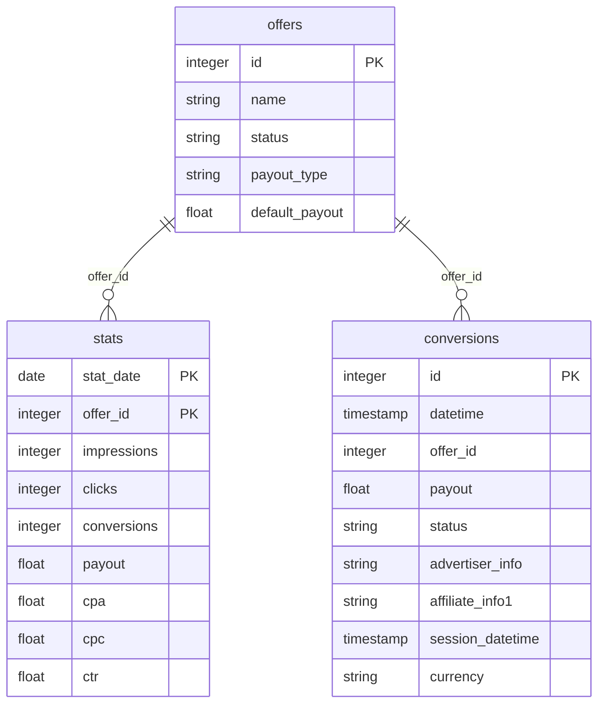

# Tune


This connector uses the [Tune (HasOffers) Affiliate API](https://developers.tune.com/affiliate/) with API key authentication. It pulls data from the **affiliate/partner point of view** within the advertiser's network.


***

## Overview

The Tune connector pulls affiliate performance data from your Tune (HasOffers) partner account into your data warehouse. It covers approved offers, daily aggregated stats, and individual conversion records.

Data is split into two types:

* **Dimension table** (`offers`) — list of approved offers for this partner account, refreshed on each run using append-only insertion.
* **Performance tables** (`stats`, `conversions`) — daily stats and individual conversion events, refreshed with a configurable lookback window using delete-insert.

***

## Prerequisites

* An active **Tune / HasOffers affiliate account**
* Your **Network ID** — the subdomain part of `NETWORKID.api.hasoffers.com`
* A **Partner API Key** — request it from your affiliate account (network admin approval may be required)

***

## Setup Instructions



**Enter your API credentials**

Provide your **Network ID** and **Partner API Key**. The network ID is the subdomain of your HasOffers instance (e.g. `mynetwork` in `mynetwork.api.hasoffers.com`).



**Select your Prebuilt reports**

Choose which prebuilt reports to activate. You can enable all reports or select only those relevant to your use case. See the [Prebuilt Reports](#prebuilt-reports) section for a description of each table.



**Name your connector**

Give the connector a unique name within your QUANTI: project, then click **Create**.



***

## Prebuilt Reports

The connector provides **3 prebuilt tables** organized into two groups: offers and performance.

### Data model

<a href="[DBDIAGRAM_URL]" class="button primary" data-icon="table-tree">Prebuilt reports and definition</a>

### Offers

| Table | Description |
|---|---|
| `offers` | List of offers approved for this partner account, with name, status, payout type, and default payout. Refreshed on each run (append-only). |

### Performance

| Table | Description |
|---|---|
| `stats` | Daily partner performance statistics grouped by offer: impressions, clicks, conversions, payout, CPA, CPC, CTR. Key: `stat_date` + `offer_id`. Refreshed by delete-insert. |
| `conversions` | Individual conversion records with offer, payout amount, status (approved / pending / rejected), custom tracking parameters, and click session timestamp. Key: `id` (unique conversion ID). Refreshed by delete-insert on `datetime`. |

***

<a href="[DBDIAGRAM_URL]" class="button primary" data-icon="table-tree">Prebuilt reports and definition</a>

***

## Scheduling

| Setting | Options |
|---|---|
| **Frequency** | Daily (recommended) or Weekly |
| **Lookback window** | 1, 3, or 5 days (default: 5) |
| **Historical load** | Up to 730 days (≈2 years) |


`stats` and `conversions` use a **delete-insert** strategy on the lookback window to account for late status changes (e.g. conversions moving from `pending` to `approved` or `rejected`). The `offers` table uses **append-only** insertion.


***

## Troubleshooting

Authentication error — invalid credentials

Double-check your **Network ID** (subdomain only, without `.api.hasoffers.com`) and your **Partner API Key**. API keys are network-scoped — a key from one network will not work on another. If the error persists, regenerate your API key from your affiliate account or contact your network admin.

conversions table only shows pending conversions

The lookback window controls how far back conversions are re-fetched. If you need to capture status changes (e.g. a pending conversion approved after several days), use a lookback of at least 5 days or trigger a historical reload covering the full expected approval window.

stats or conversions table is empty after the first run

Verify that your partner account has activity within the configured lookback window. If your account was recently approved or if the selected offers have no traffic yet, the tables will be empty. Extend the lookback window or trigger a historical load.

Need help?

Contact QUANTI: support at support@quanti.io or consult our documentation at https://docs.quanti.io

