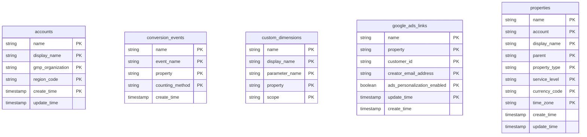
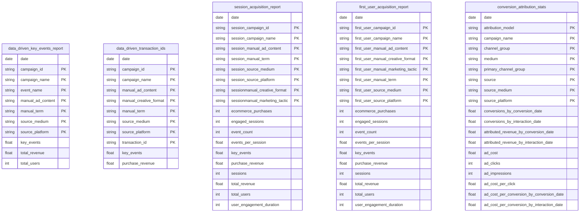
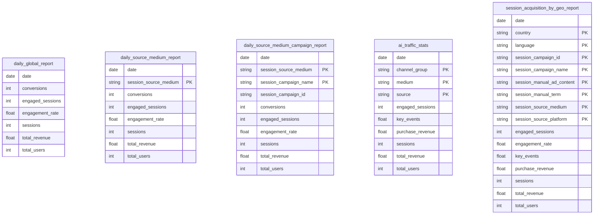
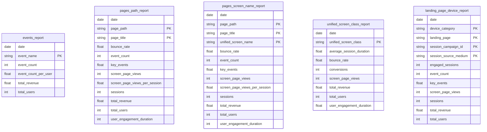
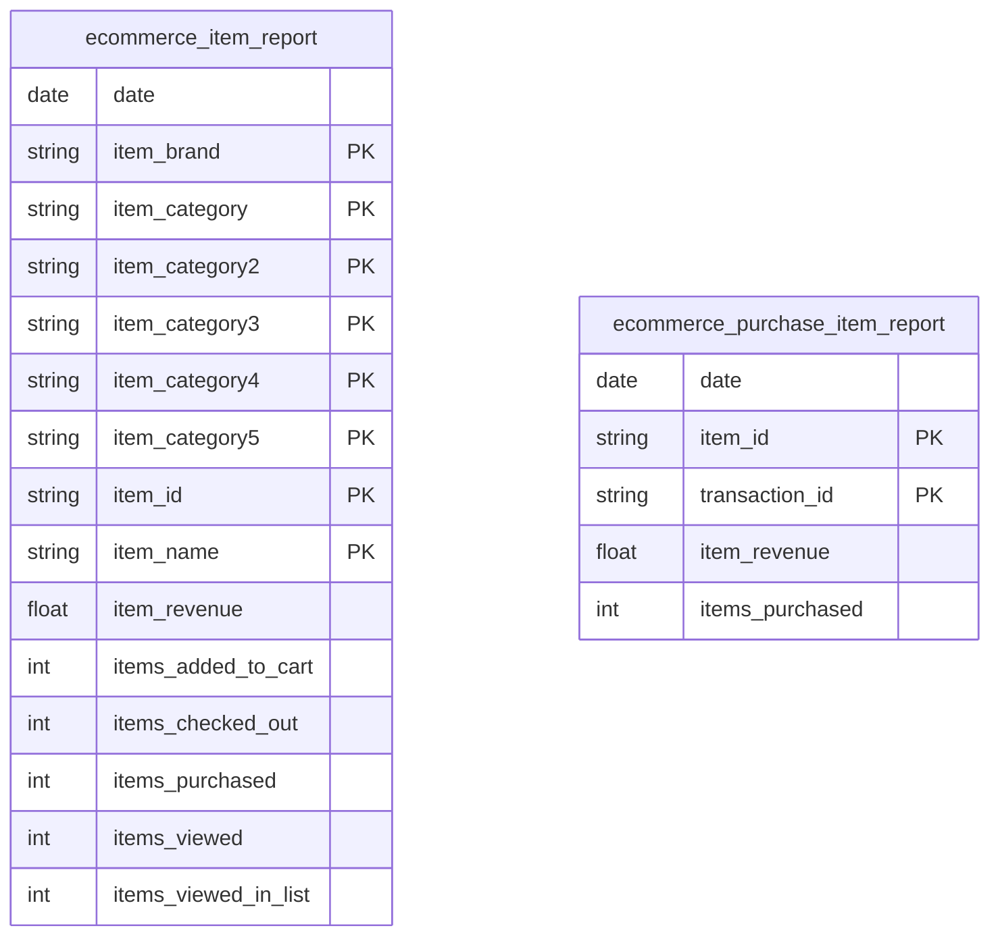
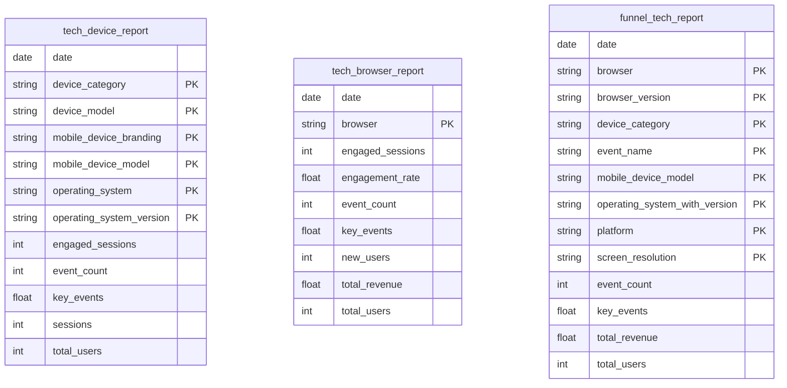

# Google Analytics 4

<a href="https://dbdiagram.io/e/67a9ceb2263d6cf9a09b868e/67a9d214263d6cf9a09c02c9" class="button primary" data-icon="table-tree">Prebuilt reports and definition</a>

***

## Prerequisites

Before connecting Google Analytics 4 to QUANTI, ensure you have:

* **Google Account**: A valid Google account with access to Google Analytics 4
* **GA4 Property Access**: At least Viewer access to the GA4 property(ies) you want to connect
* **Active GA4 Property**: Your property must have active data collection to retrieve insights

***

## Setup Instructions



#### Authorize Google Connection

* Click on **Connect to Google**
* You will be redirected to Google's authorization page
* Log in with your Google account credentials
* Review and accept the requested permissions
* Click **Allow** to grant QUANTI access to your Google Analytics 4 data



#### **Connector Information**

* **Connector Name**: Define a unique name for your connector
* **Dataset ID**: Specify the BigQuery dataset ID where tables will be created
  * The dataset will be created automatically if it doesn't exist
* Click **Next**



#### Configure Connector

* **Connector Name**: Enter a unique name for this connector
* **Dataset ID**: Define the BigQuery dataset ID where data will be stored (must not exist yet, will be created automatically)
* Click **Next**



#### Select Accounts & Properties

* You'll see a list of your accessible GA4 accounts and properties
* Select the account(s) and property(ies) you want to connect to QUANTI
* You can select multiple properties to track data from different sources
* Click **Next**



#### Select pre-built reports

* Review the available pre-built reports (see section below for details)
* All reports are selected by default — you can deselect reports you don't need
* You can also create your own custom reports by clicking **Add custom report** (refer to the **Custom reports** chapter below)
* Click **Next**



#### Finish Setup

* Define a sync period and a lookback window
* Click **Save**
* For the first sync, you have the following options:
  * **Activate auto-sync** for recurring syncs based on your sync settings by clicking the switch button
  * **Launch a historical data recovery** by choosing your desired dates in the historical data tab
  * **Launch a manual sync** immediately by clicking the **Sync now** button
* Wait for the sync to complete
* Navigate to your data warehouse to verify that tables are populated
* Check the connector dashboard for sync status and any potential errors



***

## Pre-built reports

### Dimension Tables (Configuration & History)

* **accounts**: List of accessible Google Analytics 4 accounts with basic information and settings.
* **conversion\_events**: List of conversion events configured in GA4 with counting methods.
* **custom\_dimensions**: List of custom dimensions configured in GA4 with their scope and parameter names.
* **google\_ads\_links**: List of Google Ads links configured in GA4 properties.
* **properties**: List of GA4 properties with their configuration settings.



### Attribution & Campaign Performance

* **data\_driven\_key\_events\_report**: Key events attributed to marketing campaigns with data-driven attribution model.
* **data\_driven\_transaction\_ids**: Transaction-level data with data-driven attribution to campaigns.
* **session\_acquisition\_report**: Session metrics by acquisition source, medium, and campaign.
* **first\_user\_acquisition\_report**: New user metrics by first acquisition source and campaign.
* **conversion\_attribution\_stats**: Attributed conversions and revenue compared across DATA\_DRIVEN and LAST\_CLICK models, with ad spend metrics (cost, clicks, impressions, CPA).



### Traffic & Source Analysis

* **daily\_global\_report**: Daily aggregated statistics across all traffic sources (overview).
* **daily\_source\_medium\_report**: Daily statistics by source/medium combination.
* **daily\_source\_medium\_campaign\_report**: Daily statistics by source/medium/campaign combination.
* **ai\_traffic\_stats**: Session acquisition filtered to AI assistant referral traffic (medium = ai-assistant), broken down by source (chatgpt.com, gemini.google.com, etc.).
* **session\_acquisition\_by\_geo\_report**: Session acquisition report broken down by country, language and campaign.



### Content & Engagement

* **events\_report**: Event-level metrics showing user interactions and key events.
* **pages\_path\_report**: Page-level metrics by URL path.
* **pages\_screen\_name\_report**: Page/screen metrics by title and name.
* **unified\_screen\_class\_report**: Screen class metrics for mobile apps and web pages.
* **landing\_page\_device\_report**: Daily performance metrics by landing page path and device category (desktop, mobile, tablet). Includes sessions, engaged sessions, total users, screen/page views, event count, key events, total revenue, and session source/medium and campaign ID. Useful for analyzing how entry pages perform across different devices and traffic sources.



### E-commerce

* **ecommerce\_item\_report**: Product-level metrics including views, views in list, cart additions, and purchases.
* **ecommerce\_purchase\_item\_report**: Purchase transaction details by item and transaction ID.



### Technology & Devices

* **tech\_device\_report**: User metrics by device category, model, and operating system.
* **tech\_browser\_report**: User metrics by browser type.
* **funnel\_tech\_report**: Funnel steps (event\_name) crossed with technical segments (platform, OS version, browser version, screen resolution, device model) to detect conversion drop-offs isolated to a specific technical segment.



***

<a href="https://dbdiagram.io/e/67a9ceb2263d6cf9a09b868e/67a9d214263d6cf9a09c02c9" class="button primary" data-icon="table-tree">Prebuilt reports and definition</a>

***

## Custom reports

GA4 custom reports let you query any combination of dimensions and metrics from your GA4 property via the [Google Analytics Data API](https://developers.google.com/analytics/devguides/reporting/data/v1).

#### Find available dimensions and metrics

The reference for all available dimensions and metrics is the official GA4 explorer:
👉 [ga-dev-tools.google/ga4/dimensions-metrics-explorer/](https://ga-dev-tools.google/ga4/dimensions-metrics-explorer/)

The explorer also shows **field compatibility** — not all dimensions and metrics can be combined in the same query.


**Use an AI assistant to speed up the configuration.** Rather than browsing the explorer manually, describe the report you want to reproduce — as you see it in the GA4 interface — to an AI assistant (Claude, ChatGPT…). For example:

> *"I want a custom GA4 report showing sessions, engaged sessions and total revenue by source, medium and device category. What dimensions and metrics should I use in the QUANTI JSON format `{ "dimensions": "", "metrics": "" }` ?"*

The AI will identify the correct API names and fill in the JSON for you.


#### Configure the custom report

In QUANTI, at the **Select pre-built reports** step, click **Add custom report**. Fill in the following JSON:

```json
{
  "dimensions": "",
  "metrics": ""
}
```

* **`dimensions`** *(required)*: Comma-separated list of GA4 dimension API names (e.g. `"sessionSource,sessionMedium,deviceCategory"`)
* **`metrics`** *(required)*: Comma-separated list of GA4 metric API names (e.g. `"sessions,engagedSessions,totalRevenue"`)

> ⚠️ The GA4 API limits custom reports to **9 dimensions maximum**. Not all dimension/metric combinations are compatible — refer to the explorer to verify compatibility before configuring.

#### Map your fields (Schema)

After configuring the query, the **Schema** step lets you define how fields are stored in your data warehouse:

* Adjust the **Type** (STRING, INTEGER, FLOAT…) for each field
* Check **Unique identifiers** to mark dimension fields as part of the primary key — they collectively form the unique identifier of each row

Once all fields are mapped, click **Save** to create the custom report table.

***

## Notes

* **Data Refresh**: Google Analytics 4 data is typically updated once per day
* **Historical Limitations**: GA4 API has limitations on historical data retrieval. Some metrics may only be available from the property creation date
* **Sampling**: For large datasets, GA4 may apply sampling. QUANTI automatically manages sampling thresholds
* **API Rate Limits**: Google enforces rate limits on API requests. QUANTI automatically manages these limits to ensure reliable data extraction
* **Data Processing Time**: GA4 data can take 24-48 hours to be fully processed after collection
* **Custom Dimensions**: Custom dimensions must be created in GA4 before they can be used in QUANTI queries

***

## Limits

* **Custom Query Dimensions**: The Google Analytics 4 API limits custom queries to **9 dimensions maximum**, so choose them carefully
* **API Quota**: Google Analytics 4 API has daily quotas. QUANTI automatically manages these quotas across syncs
* **Date Range**: Historical data availability depends on your GA4 property retention settings (default: 14 months for standard properties)

***

## Troubleshooting

<details>

<summary>Connection Issues</summary>

* Verify that your Google account has proper access to the GA4 property
* Ensure you've granted all required permissions during authorization
* Check that the GA4 property is active and collecting data
* Verify that API access is enabled for your GA4 property

</details>

<details>

<summary>Missing Data</summary>

* Some metrics may not be available for all dimension combinations
* Historical data older than your retention period will not be available
* Data processing can take 24-48 hours - recent data may be incomplete
* Custom dimensions must be configured in GA4 before syncing

</details>

<details>

<summary>Sync Errors</summary>

* **API Quota Exceeded**: Wait for quota reset (24 hours) or reduce sync frequency
* **Invalid Dimension/Metric Combination**: Some dimensions and metrics cannot be used together - consult GA4 documentation
* **Sampling Applied**: For very large date ranges, GA4 may apply sampling - consider splitting into smaller date ranges

</details>

<details>

<summary>Need Help?</summary>

Contact QUANTI support at [support@quanti.io](mailto:support@quanti.io) or consult our comprehensive documentation at [https://docs.quanti.io](https://docs.quanti.io/)

</details>
