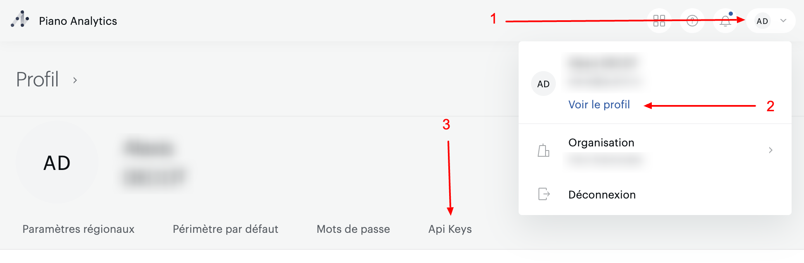
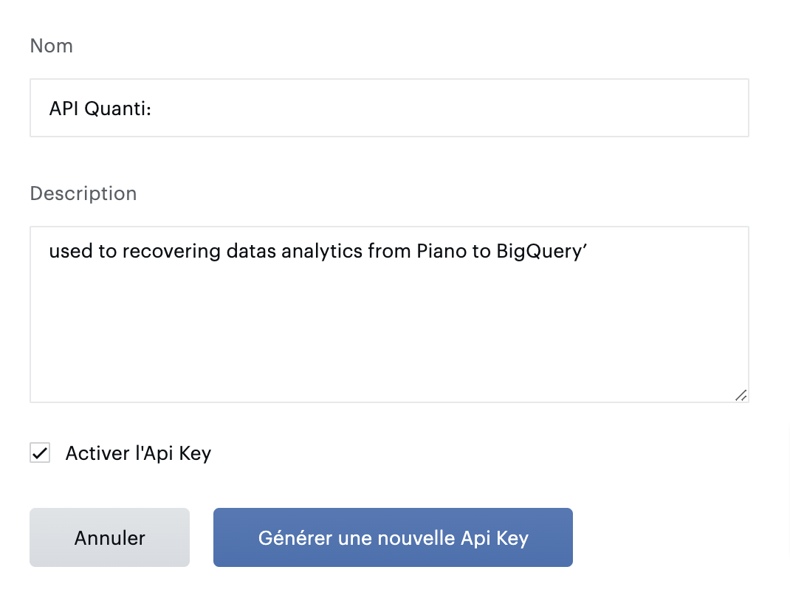
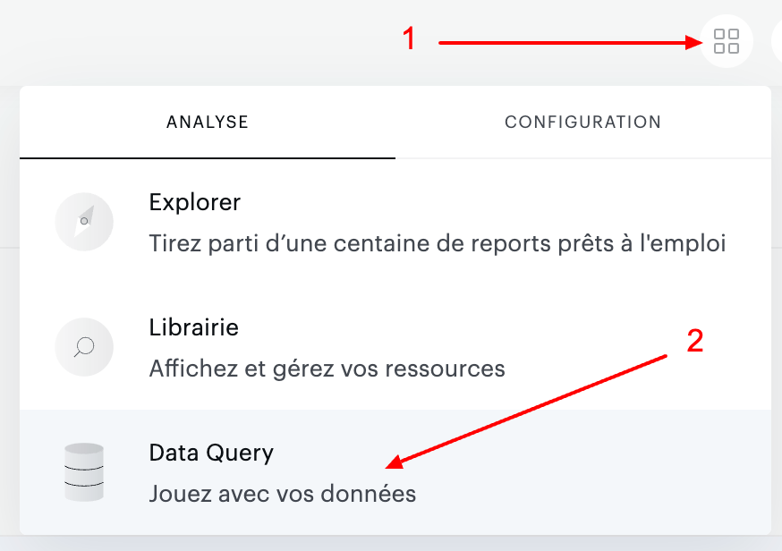
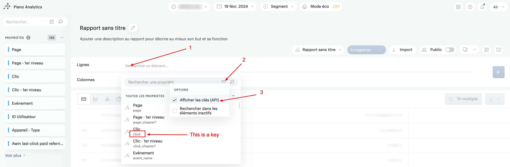

# Piano Analytics

***

## <mark style="background-color:yellow;">Prerequisites</mark>

To connect Piano to QUANTI, you need an [Piano](https://piano.io/fr/) account.

***

## <mark style="background-color:yellow;">Setup instructions</mark>

### Find your credentials

1.  Go on your profile parameters to the top-right corner : See profile < API Key\

    <figure><figcaption>
Access path to API keys on Piano interface 
</figcaption></figure>
2.  Create a new API Key clicking on the blue button "Create a new API Key".\
    \

    <figure><figcaption>
Button to generate a new API key
</figcaption></figure>

3.  Give it a name and a description. Let the box ticked and save it.\
    \

    <figure><figcaption>
Description pop-in of API key
</figcaption></figure>

4. Make a note of the API credentials. You will need it to configure QUANTI:.

### Find your Website ID

Your **Website ID** is in the url when you are connected to your Piano account. This is the value of the parameter **site**.

`https://explorer.atinternet-solutions.com/core/#/overview/overview/020202?period.shortcut=yesterday&period.granularity=3&site=`**`612329`**`&graph.options.defaultlist=minmax&graph.options.comparisonlist=nocomparison&graph.options.eventloglist=eventlog&isIgnoreNullProperties=false`

### Connector configuration

1. In the connector setup form, enter the name of your choice.
2. Enter your credentials you find on step 1
3. Enter you Website ID you find in step 2. You can add several IDs separating by commas and clicking on "+".

***

## <mark style="background-color:yellow;">Pre-built Tables</mark>

There is no pre-built queries for Piano Analytics at this moment

***

## <mark style="background-color:yellow;">Tables Diagram (ERD)</mark>

To zoom, open the ERD in a new window : [ERD](https://dbdiagram.io/e/65d4c476ac844320ae967f23/65d4c4e2ac844320ae968975)

***

## <mark style="background-color:yellow;">Custom query</mark>

Use the "Data Query" tool available on the Piano Analytics interface to help you in this process.

1.  To the top-right corner, click on button (the icon with 4 squares) < Data Query\
    \

    <figure><figcaption>
"Data Query" access
</figcaption></figure>

2. Create a report with the fields you want on your custom query. Retrieve their API key.

<figure><figcaption>
Data Query tool in piano analytics interface
</figcaption></figure>

1. Make a note of all API Keys of your fields. You will need it to configure QUANTI: with two lists : a dimensions list with all keys separated by commas without spaces and a metrics list with all keys separated by commas without spaces.
2. In QUANTI:, click on the button "Create".
3. Name your custom request.&#x20;
4. Copy / Paste your dimensions and metrics keys from your **Piano Data Query** builder. You can add multiple fields separating by commas without spaces and without clicking on "add +".


The name chosen for your custom query is the one that name your table


Click Save & Test. Quanti: will take it from here and sync your Piano datas.

***

## <mark style="background-color:yellow;">Limits</mark>

* Max 50 dimensions and metrics per Custom Query
* Max 500K rows per days
