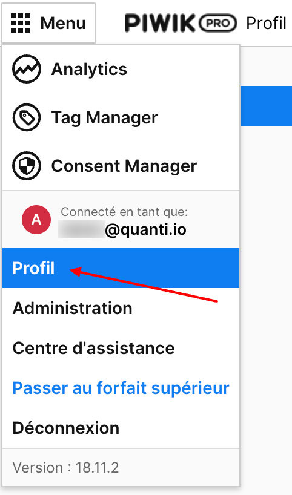
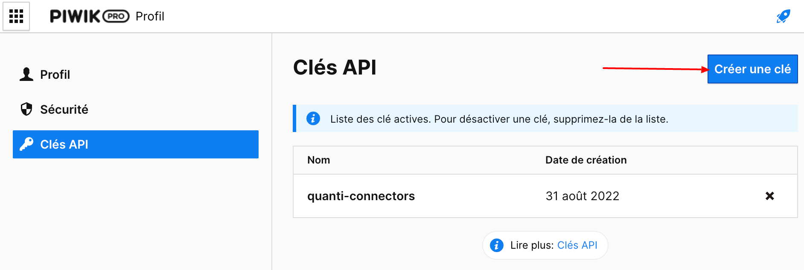
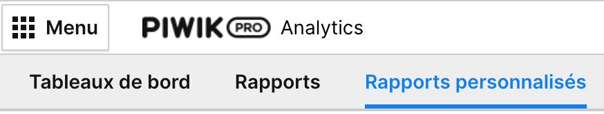
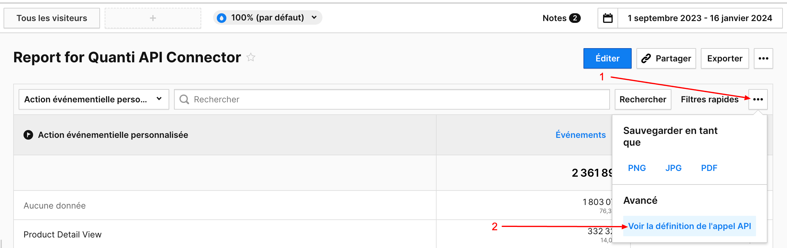
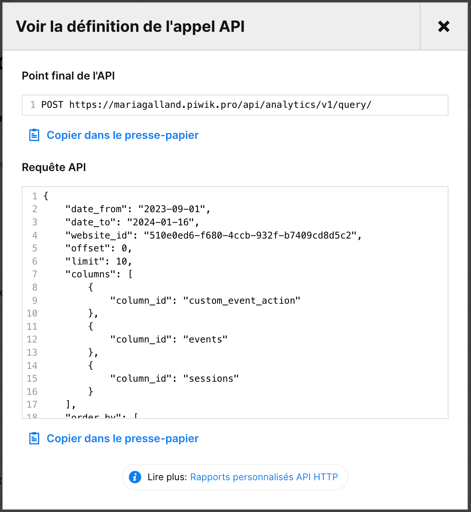

# Piwik Pro

***

## <mark style="background-color:yellow;">Pre requisites</mark> 

To connect Piwik Pro to QUANTI:, you need an [Piwik Pro](https://piwik.pro/?pk\_campaign=ecommerce-data-connector\&pk\_source=quanti.io\&pk\_medium=partnership) account.

***

## <mark style="background-color:yellow;">Setup instructions</mark>

### Find your domain

The expected information in this field is the domain displayed on your search bar when you are connected to your Piwik Account.

### Find your API credentials

1. Go on your profile parameters : **Menu** > **Profile** > **API Keys**

<figure><figcaption>
screenshot from our piwik account admin
</figcaption></figure>

2. To generate a new API Key, please click on the "Create a Key" button, which is highlighted in blue.
3. Name your instance and carefully record the API credentials. These are essential for the configuration of QUANTI.

<figure><figcaption>
API credentials from Piwik Pro analytics admin
</figcaption></figure>

### Find your Website ID

1. To locate your Website ID while using Piwik Pro Analytics, navigate to your Piwikpro account. Your Website ID is displayed in the URL during your session.
2. This is the information contained between term '/analytics/' and '/dashboard/' in the url.&#x20;

Example :  "`5678h0td6-f434-4ggt-932j-b8767cd8d5d2`".

### Connector configuration

1. In the connector setup form, enter the name of your choice.
2. Enter the domain you found in Step 1.
3. Enter the credentials you find in Step 2.
4. Enter you Website ID you find in Step 3. You can add several IDs separating by commas and clicking on "+".

## <mark style="background-color:yellow;">Custom query</mark>

You have to create your own reports. To help you in this step, we recommand to use "Personalized report" tool on Piwik Pro Analytics interface.

<figure><figcaption>
Piwik Pro > custom reports
</figcaption></figure>

* Create a new report.
* Select your fields (Dimensions and metrics).

<figure><figcaption>
Piwik Pro > custom reports > add a new report
</figcaption></figure>

* Save your report.
* In the filters bar, click on the button '...' (3 dots) and click on "See API call"

<figure><figcaption></figcaption></figure>

* A pop-in opens : make a note of the fields's name. You will need it to configure your custom request on QUANTI:

<figure><figcaption>
API call detailed
</figcaption></figure>

* On QUANTI: interface, click on the button "Create".
* Name your custom request : It will be use to name your table on your Warehouse.
* Copy/ Paste your dimensions and metrics from your Piwikpro personalized report. You can add several fields separating by commas and clicking on "add +".
* Repeat operation as many time it's necessary.

***

## <mark style="background-color:yellow;">Pre-built Queries</mark>

There is no pre-built queries for Piwik Pro at this moment

***

## <mark style="background-color:yellow;">Tables Diagram (ERD)</mark>

There is no ERD for Piwik Pro at this moment

***

## <mark style="background-color:yellow;">Quota Policy</mark>
