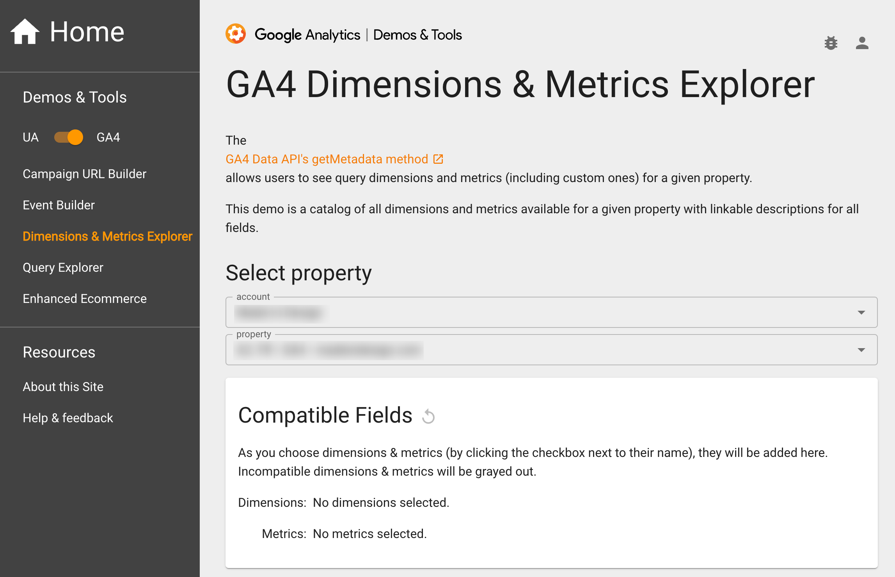

# Google Analytics 4

***

## <mark style="background-color:yellow;">Prerequisites</mark> 

To connect Google Analytics 4 to QUANTI, you need an [Google](https://www.google.com/account/about/) account and access to a [Google Analytics 4 account](https://analytics.google.com/analytics/web/).

***

## <mark style="background-color:yellow;">Setup instructions</mark>

1. Choose the google acccount you want lo log in with
2. Choose the accounts you want to sync
3. build your custom query

***

## <mark style="background-color:yellow;">Pre-built Tables</mark>

* ACCOUNTS
* CUSTOM\_DIMENSIONS
* CONVERSION\_EVENTS
* PROPERTIES
* GOOGLE\_ADS\_LINKS

***

## <mark style="background-color:yellow;">Tables Diagram (ERD)</mark>


Google Analytics 4 pre-built tables


***

## <mark style="background-color:yellow;">Custom query</mark>

To create custom Query, you need `dimensions` and `metrics`. To help you in this step, we recommend to use the [GA4 Dimensions & Metrics Explorer tool](https://ga-dev-tools.google/ga4/dimensions-metrics-explorer/).

<figure><figcaption>
GA4 Dimensions &#x26; Metrics Explorer tool
</figcaption></figure>

***

## <mark style="background-color:yellow;">Limits</mark>

The Google Analytics 4 API limits custom queries to 9 dimensions, so choose them carefully.
