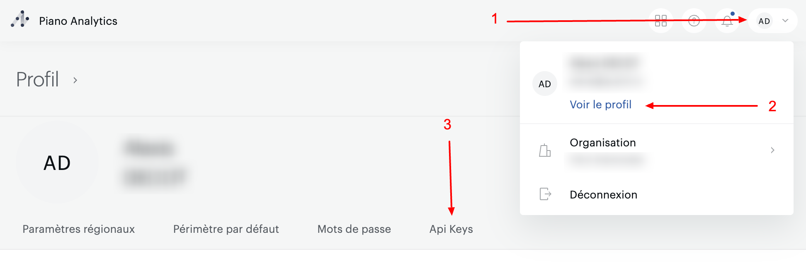
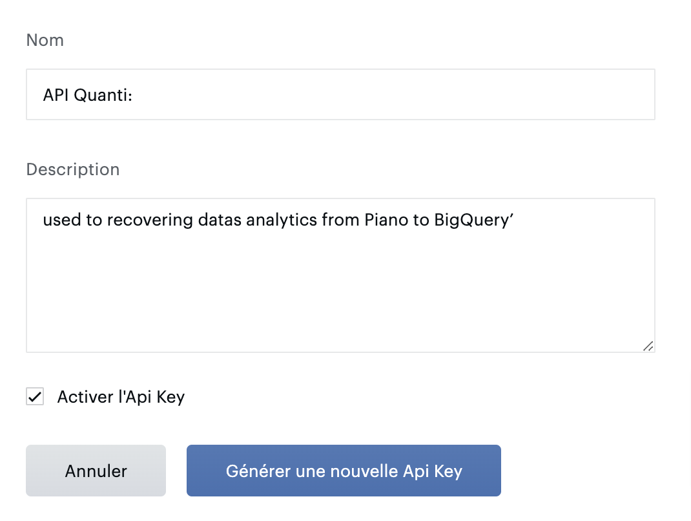
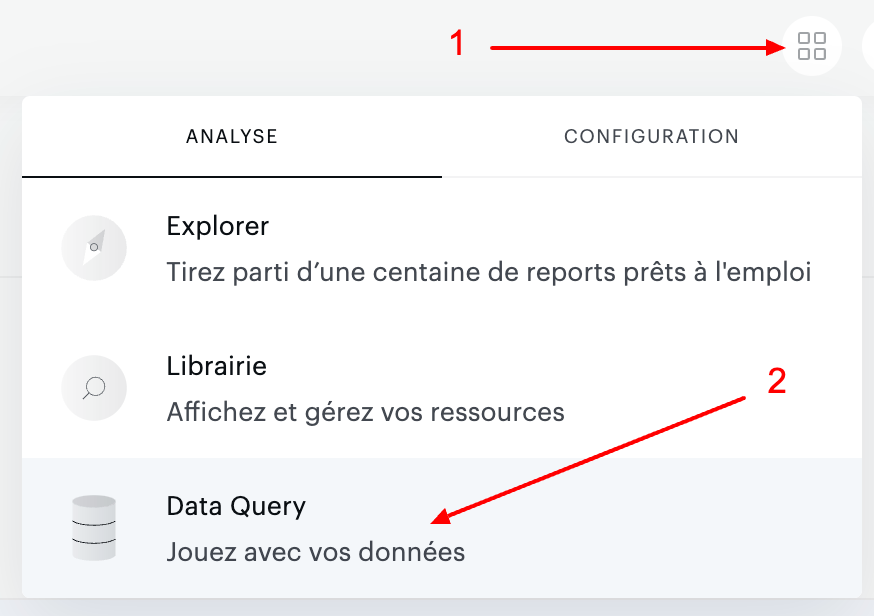

# Piano connector

***

## Prerequisites

To connect Piano to QUANTI, you need an [Piano](https://piano.io/fr/) account.

***

## <mark style="background-color:yellow;">Setup instructions</mark>

### Find your credentials

1.  Go on your profile parameters to the top-right corner : See profile < API Key\

    <figure><figcaption></figcaption></figure>
2. Create a new API Key clicking on the blue button "Create a new API Key".

<figure><figcaption></figcaption></figure>

1. Give it a name and a description. Let the box ticked and save it.

<figure><figcaption></figcaption></figure>

1. Make a note of the API credentials. You will need it to configure QUANTI:.

### Find your Website ID

You can find your Website ID in the url when you are connected to your Piano account. This is the value of the parameter site=. https://explorer.atinternet-solutions.com/core/#/overview/overview/020202?period.shortcut=yesterday\&period.granularity=3\&site=**612329**\&graph.options.defaultlist=minmax\&graph.options.comparisonlist=nocomparison\&graph.options.eventloglist=eventlog\&isIgnoreNullProperties=false

### Quanti: configuration

1. In the connector setup form, enter the name of your choice.
2. Enter your credentials you find on step 1
3. Enter you Website ID you find in step 2. You can add several IDs separating by commas and clicking on "+".

### Create a Custom request

This connector Piano don't offer standard reports. You have to create your own reports. To help you in this step, we recommand to use "Data Query" tool on Piano Analytics UI.

1.  To the top-right corner, click on the 4 squares button < Data Query\
    \
    \

    <figure><figcaption>
"Data Query" access
</figcaption></figure>

2.  Now, you are in the Data Query tool. The main idea is to create a new reporting like your next custom query wanted using the good fields in ligns and columns. You will have to recover the API keys for each field. Start by show the API Key by clicking on the option : Follow steps on the screenshot bellow.\
    \

    <figure><figcaption>
Find a field's key
</figcaption></figure>

3. Make a note of all API Keys of your fields as you compose your reporting. You will need it to configure QUANTI:. you will need two lists : a dimensions list with all keys separated by commas without spaces and a metrics list with all keys separated by commas without spaces.
4. On QUANTI: UI, click on the button "Create".
5. Name your custom request : It will be use to name your table on your Warehouse.
6. Copy/ Paste your dimensions and metrics Keys from your Piano Data Query tool. You can add several fields separating by commas without spaces and clicking on "add +".
7. Repeat operation as many time it's necessary.

### Quanti: configuration

Click Save & Test. Quanti: will take it from here and sync your Piano datas.

### Tables

To zoom, open the ERD in a new window : [ERD](https://dbdiagram.io/e/65d4c476ac844320ae967f23/65d4c4e2ac844320ae968975)
