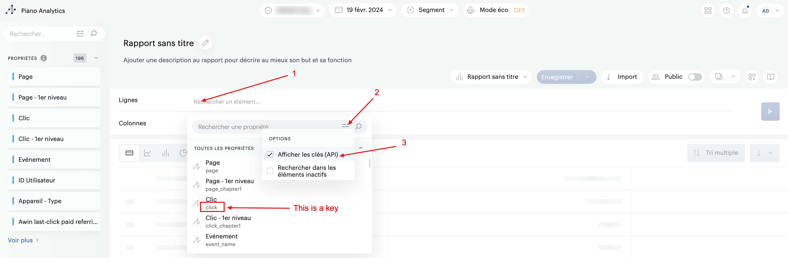

# Piano Analytics

***

## <mark style="background-color:yellow;">Prerequisites</mark>

To connect Piano to QUANTI, you need an [Piano](https://piano.io/fr/?utm_source=quanti.io\&utm_medium=partnership\&utlm_campaign=campaign=ecommerce-data-connector) account.

***

## <mark style="background-color:yellow;">Setup instructions</mark>

### Find your credentials

1.  Go on your profile parameters to the top-right corner : See profile < API Key\

    <figure><figcaption>
Access path to API keys on Piano interface 
</figcaption></figure>
2.  Create a new API Key clicking on the blue button "Create a new API Key".\
    \

    <figure><figcaption>
Button to generate a new API key
</figcaption></figure>

3.  Give it a name and a description. Let the box ticked and save it.\
    \

    <figure><figcaption>
Description pop-in of API key
</figcaption></figure>

4. Make a note of the API credentials. You will need it to configure QUANTI:.

### Find your Website ID

Your **Website ID** is in the url when you are connected to your Piano account. This is the value of the parameter **site**.

`https://explorer.atinternet-solutions.com/core/#/overview/overview/020202?period.shortcut=yesterday&period.granularity=3&site=`**`612329`**`&graph.options.defaultlist=minmax&graph.options.comparisonlist=nocomparison&graph.options.eventloglist=eventlog&isIgnoreNullProperties=false`

### Connector configuration

1. Connector information
   1. Name your connector
      1. Connector Name : Name your connector. It must be unique.
      2. Dataset ID : Define the ID of the dataset. It must not exist yet, as it will be created and data will be sent there.
   2. Connector information
      1. Access Key and Secret Key retrieved following the steps above.
   3. Site ID(s)
      1. Site ID retrieved following the steps above.
2. Create queries : Create your own custom queries. To help you, refer to the 'Custom Query' chapter below."

***

## <mark style="background-color:yellow;">Pre-built Tables</mark>

There is no pre-built queries for Piano Analytics at this moment

***

## <mark style="background-color:yellow;">Custom query</mark>

Use the "Data Query" tool available on the Piano Analytics interface to help you in this process.

1.  To the top-right corner, click on button (the icon with 4 squares) < Data Query\
    \

    <figure><figcaption>
"Data Query" access
</figcaption></figure>

2. Create a report with the fields you want on your custom query. Retrieve their API key.

<figure><figcaption>
Data Query tool in piano analytics interface
</figcaption></figure>

1. Make a note of all API Keys of your fields. You will need it to configure QUANTI: with two lists : a dimensions list with all keys separated by commas without spaces and a metrics list with all keys separated by commas without spaces.
2. At the step "Create queries", click on the button "Add custom query".
3. Name your custom request : It will be the table name.
4. Copy / Paste your dimensions and metrics keys from your **Piano Data Query** builder. You have to separate your fields with commas without spaces.


The name chosen for your custom query is the one that name your table


***

## <mark style="background-color:yellow;">Limits</mark>

* Max 50 dimensions and metrics per Custom Query
