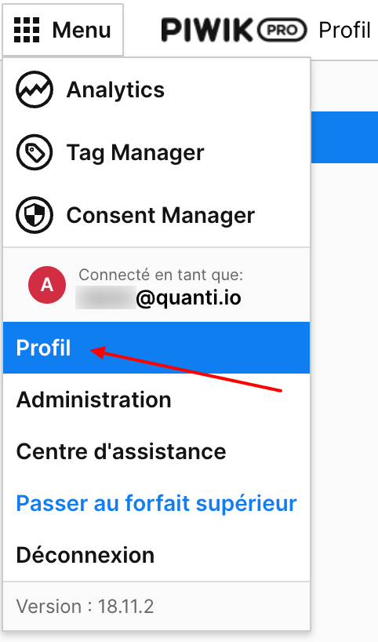
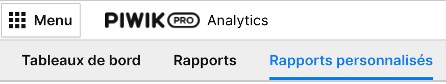
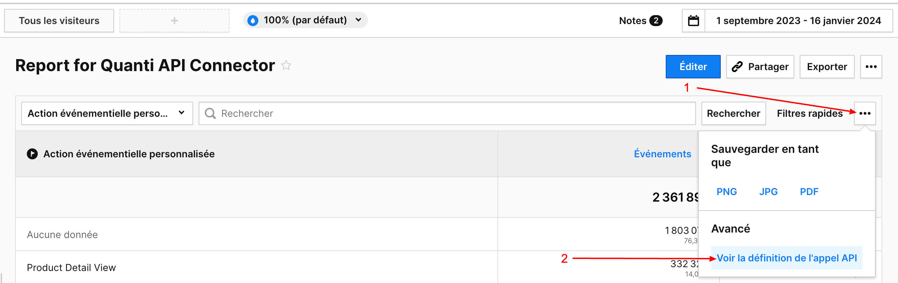

# Piwik Pro

***

## <mark style="background-color:yellow;">Prerequisites</mark> 

To connect Piwik Pro to QUANTI:, you need an [Piwik Pro](https://piwik.pro/?pk_campaign=ecommerce-data-connector\&pk_source=quanti.io\&pk_medium=partnership) account.

***

## <mark style="background-color:yellow;">Setup instructions</mark>

### Find your API credentials

1. Go on your profile parameters : **Menu** > **Profile** > **API Keys**

<figure><figcaption>
Piwik account admin access
</figcaption></figure>

2. To generate a new API Key, please click on the "Create a Key" button, which is highlighted in blue.
3. Name your instance and carefully record the API credentials. These are essential for the configuration of QUANTI.

<figure><figcaption>
API credentials from Piwik Pro analytics admin
</figcaption></figure>

### Find your Website ID

1. To locate your Website ID while using Piwik Pro Analytics, navigate to your Piwikpro account. Your Website ID is displayed in the URL during your session.
2. This is the information contained between term '/analytics/' and '/dashboard/' in the url.&#x20;

Example :  "`5678h0td6-f434-4ggt-932j-b8767cd8d5d2`".

### Connector configuration

1. Authorize your account
   1. Access Key and Secret Key retrieved following the steps above.
   2. Domain displayed on your search bar when you are connected to your Piwik Account.
   3. Website ID retrieved following the steps above.
2. Connector information
   1. Connector Name : Name your connector. It must be unique.
   2. Dataset ID : Define the ID of the dataset. It must not exist yet, as it will be created and data will be sent there.
3. Create queries : Create your own custom queries. To help you, refer to the 'Custom Query' chapter below."

***

## <mark style="background-color:yellow;">Pre-built Tables</mark>

* **acquisition\_stats**: Detailed statistics on the performance of acquisition campaigns, covering traffic sources, keywords, and user behavior (sessions, conversions, revenue, etc.).
* **audience\_browser\_device\_stats**: Statistics on audience behavior segmented by browser, device type, and language, including sessions, bounces, conversions, and revenue.
* **pages\_stats**: Page-level performance statistics, including views, time on page, bounce and exit rates.

***

[Pre-built tables and definition ](https://dbdiagram.io/e/6827015c1227bdcb4e9c1c36/6827026b1227bdcb4e9c4b5b):link:

<figure><figcaption></figcaption></figure>

<figure><figcaption>
Source : <a href="https://dbdiagram.io/e/6827015c1227bdcb4e9c1c36/6827026b1227bdcb4e9c4b5b">https://dbdiagram.io/e/6827015c1227bdcb4e9c1c36/6827026b1227bdcb4e9c4b5b</a>
</figcaption></figure>

***

***

## <mark style="background-color:yellow;">Custom query</mark>

You have to create your own reports. To help you in this step, we recommand to use "Personalized report" tool on Piwik Pro Analytics interface.

<figure> custom reports" width="375"><figcaption>
Piwik Pro > custom reports
</figcaption></figure>

* Create a new report.
* Select your fields (Dimensions and metrics).

<figure> custom reports > add a new report" width="375"><figcaption>
Piwik Pro > custom reports > add a new report
</figcaption></figure>

* Save your report.
* In the filters bar, click on the button '...' (3 dots) and click on "See API call"

<figure><figcaption></figcaption></figure>

* A pop-in opens : make a note of the fields's name. You will need it to configure your custom request on QUANTI:

<figure><figcaption>
API call detailed
</figcaption></figure>

* &#x20;At the step "Create queries", click on the button "Add custom query".
* Name your custom request : It will be the table name.
* Copy / Paste your dimensions and metrics keys from your Piwikpro personalized report. You have to separate your fields with commas without spaces.


The name chosen for your custom query is the one that name your table

