# YouTube Analytics


The YouTube Analytics connector syncs the organic performance of your YouTube channels and videos: views, watch time, engagement, audience, traffic sources, reach and playlists. It combines the **YouTube Reporting API** (daily bulk reports) with the **YouTube Data API v3** (video, channel and playlist metadata).


***

## Prerequisites

* A Google account with access to a YouTube channel or Content Owner
* YouTube Analytics & Reporting API enabled in [Google Cloud Console](https://console.cloud.google.com/)

***

## Authentication

YouTube Analytics uses **OAuth 2.0**. You will authenticate directly via your Google account during connector setup.

***

## Setup Instructions



**Connect your Google account**

Click **Connect with Google** and authorize QUANTI: to access your YouTube Analytics data. Select the Google account linked to your YouTube channel or Content Owner.



**Select your YouTube account**

Choose the channel(s) or Content Owner(s) you want to sync. Each account maps to one QUANTI: connection.



**Choose your reports**

Select which report types to include. See [Available Reports](#available-reports) for the full list. You can always add or remove reports later.



**Configure scheduling**

Set your sync frequency and lookback window, then click **Create**. See [Scheduling](#scheduling) for defaults.



***

## Data Model

The connector loads **metadata tables** (refreshed daily via the YouTube Data API v3) and **analytics tables** (daily bulk reports from the YouTube Reporting API).

The three metadata tables are the core dimension tables. Analytics tables reference them via `channel_id`, `video_id`, and `playlist_id`.

```mermaid
erDiagram
    channel {
        STRING   id PK "quantiId"
        STRING   snippet_title
        STRING   snippet_description
        STRING   snippet_country
        STRING   snippet_custom_url
        DATETIME snippet_published_at
        BOOLEAN  statistics_hidden_subscriber_count
        INTEGER  statistics_subscriber_count
        INTEGER  statistics_video_count
        INTEGER  statistics_view_count
        STRING   status
        STRING   topic_details
    }
    video {
        STRING   id PK "quantiId"
        STRING   snippet_channel_id FK
        STRING   snippet_title
        STRING   snippet_description
        DATETIME snippet_published_at
        STRING   content_details_duration
        STRING   content_details_definition
        STRING   content_details_caption
        BOOLEAN  content_details_licensed_content
        STRING   privacy_status
        STRING   upload_status
        BOOLEAN  status_made_for_kids
        BOOLEAN  status_embeddable
        INTEGER  statistics_view_count
        INTEGER  statistics_like_count
        INTEGER  statistics_dislike_count
        INTEGER  statistics_comment_count
        INTEGER  statistics_favorite_count
    }
    playlist {
        STRING   id PK "quantiId"
        STRING   snippet_channel_id FK
        STRING   snippet_title
        STRING   snippet_description
        DATETIME snippet_published_at
        INTEGER  content_details_item_count
        STRING   privacy_status
    }
    audience_retention {
        DATE   date PK
        STRING video_id PK
        FLOAT  elapsed_video_time_ratio PK
        FLOAT  audience_watch_ratio
        FLOAT  relative_retention_performance
    }
    channel_annotations_a1 {
        DATE    date PK
        STRING  channel_id PK
        STRING  video_id PK
        STRING  live_or_on_demand PK
        STRING  subscribed_status PK
        STRING  country_code PK
        STRING  annotation_type PK
        STRING  annotation_id PK
        INTEGER annotation_impressions
        INTEGER annotation_clicks
        FLOAT   annotation_click_through_rate
    }
    channel_basic_a3 {
        DATE    date PK
        STRING  channel_id PK
        STRING  video_id PK
        STRING  live_or_on_demand PK
        STRING  subscribed_status PK
        STRING  country_code PK
        INTEGER views
        FLOAT   watch_time_minutes
        INTEGER likes
        INTEGER comments
        INTEGER subscribers_gained
    }
    channel_cards_a1 {
        DATE    date PK
        STRING  channel_id PK
        STRING  video_id PK
        STRING  live_or_on_demand PK
        STRING  subscribed_status PK
        STRING  country_code PK
        STRING  card_type PK
        STRING  card_id PK
        INTEGER card_impressions
        INTEGER card_clicks
        FLOAT   card_click_rate
    }
    channel_combined_a3 {
        DATE    date PK
        STRING  channel_id PK
        STRING  video_id PK
        STRING  playback_location_type PK
        STRING  traffic_source_type PK
        STRING  device_type PK
        STRING  operating_system PK
        INTEGER views
        FLOAT   watch_time_minutes
        INTEGER engaged_views
    }
    channel_demographics_a1 {
        DATE   date PK
        STRING channel_id PK
        STRING video_id PK
        STRING live_or_on_demand PK
        STRING subscribed_status PK
        STRING country_code PK
        STRING age_group PK
        STRING gender PK
        FLOAT  views_percentage
    }
    channel_device_os_a3 {
        DATE    date PK
        STRING  channel_id PK
        STRING  video_id PK
        STRING  live_or_on_demand PK
        STRING  subscribed_status PK
        STRING  country_code PK
        STRING  device_type PK
        STRING  operating_system PK
        INTEGER views
        FLOAT   watch_time_minutes
        INTEGER engaged_views
    }
    channel_end_screens_a1 {
        DATE    date PK
        STRING  channel_id PK
        STRING  video_id PK
        STRING  live_or_on_demand PK
        STRING  subscribed_status PK
        STRING  country_code PK
        STRING  end_screen_element_type PK
        STRING  end_screen_element_id PK
        INTEGER end_screen_element_impressions
        INTEGER end_screen_element_clicks
        FLOAT   end_screen_element_click_rate
    }
    channel_playback_location_a3 {
        DATE    date PK
        STRING  channel_id PK
        STRING  video_id PK
        STRING  live_or_on_demand PK
        STRING  subscribed_status PK
        STRING  country_code PK
        STRING  playback_location_type PK
        STRING  playback_location_detail PK
        INTEGER views
        FLOAT   watch_time_minutes
        INTEGER engaged_views
    }
    channel_province_a3 {
        DATE    date PK
        STRING  channel_id PK
        STRING  video_id PK
        STRING  live_or_on_demand PK
        STRING  subscribed_status PK
        STRING  country_code PK
        STRING  province_code PK
        INTEGER views
        FLOAT   watch_time_minutes
        INTEGER subscribers_gained
    }
    channel_reach_basic_a1 {
        DATE    date PK
        STRING  channel_id PK
        STRING  video_id PK
        INTEGER video_thumbnail_impressions
        FLOAT   video_thumbnail_impressions_ctr
    }
    channel_reach_combined_a1 {
        DATE    date PK
        STRING  channel_id PK
        STRING  video_id PK
        STRING  traffic_source_type PK
        STRING  traffic_source_detail PK
        STRING  operating_system PK
        STRING  device_type PK
        INTEGER video_thumbnail_impressions
        FLOAT   video_thumbnail_impressions_ctr
    }
    channel_sharing_service_a1 {
        DATE    date PK
        STRING  channel_id PK
        STRING  video_id PK
        STRING  live_or_on_demand PK
        STRING  subscribed_status PK
        STRING  country_code PK
        STRING  sharing_service PK
        INTEGER shares
    }
    channel_subtitles_a3 {
        DATE    date PK
        STRING  channel_id PK
        STRING  video_id PK
        STRING  subtitle_language PK
        STRING  subtitle_language_autotranslated PK
        INTEGER views
        FLOAT   watch_time_minutes
        INTEGER engaged_views
    }
    channel_traffic_source_a3 {
        DATE    date PK
        STRING  channel_id PK
        STRING  video_id PK
        STRING  live_or_on_demand PK
        STRING  subscribed_status PK
        STRING  country_code PK
        STRING  traffic_source_type PK
        STRING  traffic_source_detail PK
        INTEGER views
        FLOAT   watch_time_minutes
        INTEGER engaged_views
    }
    playlist_basic_a2 {
        DATE    date PK
        STRING  channel_id PK
        STRING  playlist_id PK
        STRING  video_id PK
        INTEGER views
        INTEGER playlist_starts
    }
    playlist_combined_a2 {
        DATE    date PK
        STRING  channel_id PK
        STRING  playlist_id PK
        STRING  video_id PK
        STRING  playback_location_type PK
        STRING  traffic_source_type PK
        STRING  device_type PK
        STRING  operating_system PK
        INTEGER views
        INTEGER playlist_starts
    }
    playlist_device_os_a2 {
        DATE    date PK
        STRING  channel_id PK
        STRING  playlist_id PK
        STRING  video_id PK
        STRING  device_type PK
        STRING  operating_system PK
        INTEGER views
        INTEGER playlist_starts
    }
    playlist_playback_location_a2 {
        DATE    date PK
        STRING  channel_id PK
        STRING  playlist_id PK
        STRING  video_id PK
        STRING  playback_location_type PK
        STRING  playback_location_detail PK
        INTEGER views
        INTEGER playlist_starts
    }
    playlist_province_a2 {
        DATE    date PK
        STRING  channel_id PK
        STRING  playlist_id PK
        STRING  video_id PK
        STRING  live_or_on_demand PK
        STRING  subscribed_status PK
        STRING  country_code PK
        STRING  province_code PK
        INTEGER views
        INTEGER playlist_starts
    }
    playlist_traffic_source_a2 {
        DATE    date PK
        STRING  channel_id PK
        STRING  playlist_id PK
        STRING  video_id PK
        STRING  traffic_source_type PK
        STRING  traffic_source_detail PK
        INTEGER views
        INTEGER playlist_starts
    }

    channel  ||--o{ video                         : "id = snippet_channel_id"
    channel  ||--o{ playlist                      : "id = snippet_channel_id"
    channel  ||--o{ channel_annotations_a1        : "id = channel_id"
    channel  ||--o{ channel_basic_a3              : "id = channel_id"
    channel  ||--o{ channel_cards_a1              : "id = channel_id"
    channel  ||--o{ channel_combined_a3           : "id = channel_id"
    channel  ||--o{ channel_demographics_a1       : "id = channel_id"
    channel  ||--o{ channel_device_os_a3          : "id = channel_id"
    channel  ||--o{ channel_end_screens_a1        : "id = channel_id"
    channel  ||--o{ channel_playback_location_a3  : "id = channel_id"
    channel  ||--o{ channel_province_a3           : "id = channel_id"
    channel  ||--o{ channel_reach_basic_a1        : "id = channel_id"
    channel  ||--o{ channel_reach_combined_a1     : "id = channel_id"
    channel  ||--o{ channel_sharing_service_a1    : "id = channel_id"
    channel  ||--o{ channel_subtitles_a3          : "id = channel_id"
    channel  ||--o{ channel_traffic_source_a3     : "id = channel_id"
    channel  ||--o{ playlist_basic_a2             : "id = channel_id"
    channel  ||--o{ playlist_combined_a2          : "id = channel_id"
    channel  ||--o{ playlist_device_os_a2         : "id = channel_id"
    channel  ||--o{ playlist_playback_location_a2 : "id = channel_id"
    channel  ||--o{ playlist_province_a2          : "id = channel_id"
    channel  ||--o{ playlist_traffic_source_a2    : "id = channel_id"
    video    ||--o{ audience_retention            : "id = video_id"
    video    ||--o{ channel_annotations_a1        : "id = video_id"
    video    ||--o{ channel_basic_a3              : "id = video_id"
    video    ||--o{ channel_cards_a1              : "id = video_id"
    video    ||--o{ channel_combined_a3           : "id = video_id"
    video    ||--o{ channel_demographics_a1       : "id = video_id"
    video    ||--o{ channel_device_os_a3          : "id = video_id"
    video    ||--o{ channel_end_screens_a1        : "id = video_id"
    video    ||--o{ channel_playback_location_a3  : "id = video_id"
    video    ||--o{ channel_province_a3           : "id = video_id"
    video    ||--o{ channel_reach_basic_a1        : "id = video_id"
    video    ||--o{ channel_reach_combined_a1     : "id = video_id"
    video    ||--o{ channel_sharing_service_a1    : "id = video_id"
    video    ||--o{ channel_subtitles_a3          : "id = video_id"
    video    ||--o{ channel_traffic_source_a3     : "id = video_id"
    video    ||--o{ playlist_basic_a2             : "id = video_id"
    video    ||--o{ playlist_combined_a2          : "id = video_id"
    video    ||--o{ playlist_device_os_a2         : "id = video_id"
    video    ||--o{ playlist_playback_location_a2 : "id = video_id"
    video    ||--o{ playlist_province_a2          : "id = video_id"
    video    ||--o{ playlist_traffic_source_a2    : "id = video_id"
    playlist ||--o{ playlist_basic_a2             : "id = playlist_id"
    playlist ||--o{ playlist_combined_a2          : "id = playlist_id"
    playlist ||--o{ playlist_device_os_a2         : "id = playlist_id"
    playlist ||--o{ playlist_playback_location_a2 : "id = playlist_id"
    playlist ||--o{ playlist_province_a2          : "id = playlist_id"
    playlist ||--o{ playlist_traffic_source_a2    : "id = playlist_id"
```

<a href="https://dbdiagram.io/e/6ac360a70f25a52d018da819/6ac3b5ebabcc87fb7af6e31c" class="button primary" data-icon="table-tree">Open in dbdiagram</a>

***

## Available Reports

The name of each Reporting API table is the YouTube `reportTypeId` (for example `channel_basic_a3`). The `_aN` suffix is the version of the report on YouTube's side. The **Primary key** columns together identify a unique row.

### Channel mode — Video

#### channel\_annotations\_a1

Channel Video - Annotations. Official reference: [YouTube documentation](https://developers.google.com/youtube/reporting/v1/reports/channel_reports).

**Dimensions**

| Column | Type | Description |
|---|---|---|
| `date` | DATE | Day of the report |
| `channel_id` | STRING | YouTube channel ID |
| `video_id` | STRING | YouTube video ID |
| `annotation_type` | STRING | Type of annotation |
| `annotation_id` | STRING | Annotation ID |

**Metrics**

| Column | Type | Description |
|---|---|---|
| `annotation_impressions` | INTEGER | Annotation impressions |
| `annotation_clickable_impressions` | INTEGER | Clickable annotation impressions |
| `annotation_clicks` | INTEGER | Annotation clicks |
| `annotation_click_through_rate` | FLOAT | Click-through rate |
| `annotation_closable_impressions` | INTEGER | Closable annotation impressions |
| `annotation_closes` | INTEGER | Annotation closes |
| `annotation_close_rate` | FLOAT | Close rate |

***

#### channel\_basic\_a3

Channel Video - Basic. Official reference: [YouTube documentation](https://developers.google.com/youtube/reporting/v1/reports/channel_reports).

**Dimensions**

| Column | Type | Description |
|---|---|---|
| `date` | DATE | Day of the report |
| `channel_id` | STRING | YouTube channel ID |
| `video_id` | STRING | YouTube video ID |
| `live_or_on_demand` | STRING | `LIVE`, `ON_DEMAND`, or `ALL` |
| `subscribed_status` | STRING | `SUBSCRIBED` or `UNSUBSCRIBED` |
| `country_code` | STRING | ISO 3166-1 alpha-2 country code |

**Metrics**

| Column | Type | Description |
|---|---|---|
| `views` | INTEGER | Video views |
| `comments` | INTEGER | Comments |
| `likes` | INTEGER | Likes |
| `dislikes` | INTEGER | Dislikes |
| `videos_added_to_playlists` | INTEGER | Times video was added to a playlist |
| `videos_removed_from_playlists` | INTEGER | Times video was removed from a playlist |
| `shares` | INTEGER | Shares |
| `estimated_minutes_watched` | FLOAT | Estimated minutes watched |
| `average_view_duration` | FLOAT | Average view duration in seconds |
| `average_view_percentage` | FLOAT | Average percentage of video viewed |
| `annotation_impressions` | INTEGER | Annotation impressions |
| `annotation_clickable_impressions` | INTEGER | Clickable annotation impressions |
| `annotation_clicks` | INTEGER | Annotation clicks |
| `annotation_click_through_rate` | FLOAT | Annotation click-through rate |
| `annotation_closable_impressions` | INTEGER | Closable annotation impressions |
| `annotation_closes` | INTEGER | Annotation closes |
| `annotation_close_rate` | FLOAT | Annotation close rate |
| `card_impressions` | INTEGER | Card impressions |
| `card_clicks` | INTEGER | Card clicks |
| `card_click_rate` | FLOAT | Card click rate |
| `card_teaser_impressions` | INTEGER | Card teaser impressions |
| `card_teaser_clicks` | INTEGER | Card teaser clicks |
| `card_teaser_click_rate` | FLOAT | Card teaser click rate |
| `subscribers_gained` | INTEGER | Subscribers gained |
| `subscribers_lost` | INTEGER | Subscribers lost |

***

#### channel\_cards\_a1

Channel Video - Cards. Official reference: [YouTube documentation](https://developers.google.com/youtube/reporting/v1/reports/channel_reports).

**Dimensions**

| Column | Type | Description |
|---|---|---|
| `date` | DATE | Day of the report |
| `channel_id` | STRING | YouTube channel ID |
| `video_id` | STRING | YouTube video ID |
| `card_type` | STRING | Type of card |
| `card_id` | STRING | Card ID |

**Metrics**

| Column | Type | Description |
|---|---|---|
| `card_impressions` | INTEGER | Card impressions |
| `card_clicks` | INTEGER | Card clicks |
| `card_click_rate` | FLOAT | Card click-through rate |
| `card_teaser_impressions` | INTEGER | Card teaser impressions |
| `card_teaser_clicks` | INTEGER | Card teaser clicks |
| `card_teaser_click_rate` | FLOAT | Card teaser click-through rate |

***

#### channel\_combined\_a3

Channel Video - Combined. Official reference: [YouTube documentation](https://developers.google.com/youtube/reporting/v1/reports/channel_reports).

**Dimensions**

| Column | Type | Description |
|---|---|---|
| `date` | DATE | Day of the report |
| `channel_id` | STRING | YouTube channel ID |
| `video_id` | STRING | YouTube video ID |
| `live_or_on_demand` | STRING | `LIVE`, `ON_DEMAND`, or `ALL` |
| `subscribed_status` | STRING | `SUBSCRIBED` or `UNSUBSCRIBED` |
| `country_code` | STRING | ISO 3166-1 alpha-2 country code |
| `traffic_source_type` | STRING | Traffic source type |
| `traffic_source_detail` | STRING | Traffic source detail |
| `device_type` | STRING | Device type |
| `operating_system` | STRING | Operating system |
| `sharing_service` | STRING | Sharing service |
| `playback_location_type` | STRING | Playback location type |
| `playback_location_detail` | STRING | Playback location detail |

**Metrics**

| Column | Type | Description |
|---|---|---|
| `views` | INTEGER | Video views |
| `estimated_minutes_watched` | FLOAT | Estimated minutes watched |
| `average_view_duration` | FLOAT | Average view duration in seconds |
| `average_view_percentage` | FLOAT | Average percentage of video viewed |
| `comments` | INTEGER | Comments |
| `likes` | INTEGER | Likes |
| `dislikes` | INTEGER | Dislikes |
| `shares` | INTEGER | Shares |
| `subscribers_gained` | INTEGER | Subscribers gained |
| `subscribers_lost` | INTEGER | Subscribers lost |

***

#### channel\_demographics\_a1

Channel Video - Demographics. Official reference: [YouTube documentation](https://developers.google.com/youtube/reporting/v1/reports/channel_reports).

**Dimensions**

| Column | Type | Description |
|---|---|---|
| `date` | DATE | Day of the report |
| `channel_id` | STRING | YouTube channel ID |
| `video_id` | STRING | YouTube video ID |
| `age_group` | STRING | Age group (e.g., `age13-17`) |
| `gender` | STRING | `MALE`, `FEMALE`, or `USER_SPECIFIED` |
| `live_or_on_demand` | STRING | `LIVE`, `ON_DEMAND`, or `ALL` |
| `subscribed_status` | STRING | `SUBSCRIBED` or `UNSUBSCRIBED` |
| `country_code` | STRING | ISO 3166-1 alpha-2 country code |

**Metrics**

| Column | Type | Description |
|---|---|---|
| `views_percentage` | FLOAT | Percentage of views from this demographic |

***

#### channel\_device\_os\_a3

Channel Video - Device & OS. Official reference: [YouTube documentation](https://developers.google.com/youtube/reporting/v1/reports/channel_reports).

**Dimensions**

| Column | Type | Description |
|---|---|---|
| `date` | DATE | Day of the report |
| `channel_id` | STRING | YouTube channel ID |
| `video_id` | STRING | YouTube video ID |
| `device_type` | STRING | Device type (e.g., `MOBILE`, `DESKTOP`, `TABLET`) |
| `operating_system` | STRING | Operating system |
| `live_or_on_demand` | STRING | `LIVE`, `ON_DEMAND`, or `ALL` |
| `subscribed_status` | STRING | `SUBSCRIBED` or `UNSUBSCRIBED` |
| `country_code` | STRING | ISO 3166-1 alpha-2 country code |

**Metrics**

| Column | Type | Description |
|---|---|---|
| `views` | INTEGER | Video views |
| `estimated_minutes_watched` | FLOAT | Estimated minutes watched |

***

#### channel\_end\_screens\_a1

Channel Video - End Screens. Official reference: [YouTube documentation](https://developers.google.com/youtube/reporting/v1/reports/channel_reports).

**Dimensions**

| Column | Type | Description |
|---|---|---|
| `date` | DATE | Day of the report |
| `channel_id` | STRING | YouTube channel ID |
| `video_id` | STRING | YouTube video ID |
| `end_screen_element_type` | STRING | Type of end screen element |
| `end_screen_element_id` | STRING | End screen element ID |

**Metrics**

| Column | Type | Description |
|---|---|---|
| `end_screen_element_impressions` | INTEGER | End screen element impressions |
| `end_screen_element_clicks` | INTEGER | End screen element clicks |
| `end_screen_element_click_rate` | FLOAT | End screen element click rate |

***

#### channel\_playback\_location\_a3

Channel Video - Playback Location. Official reference: [YouTube documentation](https://developers.google.com/youtube/reporting/v1/reports/channel_reports).

**Dimensions**

| Column | Type | Description |
|---|---|---|
| `date` | DATE | Day of the report |
| `channel_id` | STRING | YouTube channel ID |
| `video_id` | STRING | YouTube video ID |
| `playback_location_type` | STRING | Playback location type |
| `playback_location_detail` | STRING | Playback location detail (URL or app) |
| `live_or_on_demand` | STRING | `LIVE`, `ON_DEMAND`, or `ALL` |
| `subscribed_status` | STRING | `SUBSCRIBED` or `UNSUBSCRIBED` |
| `country_code` | STRING | ISO 3166-1 alpha-2 country code |

**Metrics**

| Column | Type | Description |
|---|---|---|
| `views` | INTEGER | Video views |
| `estimated_minutes_watched` | FLOAT | Estimated minutes watched |

***

#### channel\_province\_a3

Channel Video - Province (US states). Official reference: [YouTube documentation](https://developers.google.com/youtube/reporting/v1/reports/channel_reports).

**Dimensions**

| Column | Type | Description |
|---|---|---|
| `date` | DATE | Day of the report |
| `channel_id` | STRING | YouTube channel ID |
| `video_id` | STRING | YouTube video ID |
| `province` | STRING | US state code (e.g., `US-CA`) |
| `live_or_on_demand` | STRING | `LIVE`, `ON_DEMAND`, or `ALL` |
| `subscribed_status` | STRING | `SUBSCRIBED` or `UNSUBSCRIBED` |

**Metrics**

| Column | Type | Description |
|---|---|---|
| `views` | INTEGER | Video views |
| `estimated_minutes_watched` | FLOAT | Estimated minutes watched |
| `average_view_duration` | FLOAT | Average view duration in seconds |
| `average_view_percentage` | FLOAT | Average percentage of video viewed |

***

#### channel\_reach\_basic\_a1

Channel Video - Reach. Official reference: [YouTube documentation](https://developers.google.com/youtube/reporting/v1/reports/channel_reports).

**Dimensions**

| Column | Type | Description |
|---|---|---|
| `date` | DATE | Day of the report |
| `channel_id` | STRING | YouTube channel ID |
| `video_id` | STRING | YouTube video ID |

**Metrics**

| Column | Type | Description |
|---|---|---|
| `video_thumbnail_impressions` | INTEGER | Thumbnail impressions |
| `video_thumbnail_impressions_ctr` | FLOAT | Thumbnail click-through rate |
| `views` | INTEGER | Video views |
| `unique_viewers` | INTEGER | Unique viewers |

***

#### channel\_reach\_combined\_a1

Channel Video - Reach Combined. Official reference: [YouTube documentation](https://developers.google.com/youtube/reporting/v1/reports/channel_reports).

**Dimensions**

| Column | Type | Description |
|---|---|---|
| `date` | DATE | Day of the report |
| `channel_id` | STRING | YouTube channel ID |
| `video_id` | STRING | YouTube video ID |
| `traffic_source_type` | STRING | Traffic source type |
| `traffic_source_detail` | STRING | Traffic source detail |

**Metrics**

| Column | Type | Description |
|---|---|---|
| `video_thumbnail_impressions` | INTEGER | Thumbnail impressions |
| `video_thumbnail_impressions_ctr` | FLOAT | Thumbnail click-through rate |
| `views` | INTEGER | Video views |
| `unique_viewers` | INTEGER | Unique viewers |

***

#### channel\_sharing\_service\_a1

Channel Video - Sharing Service. Official reference: [YouTube documentation](https://developers.google.com/youtube/reporting/v1/reports/channel_reports).

**Dimensions**

| Column | Type | Description |
|---|---|---|
| `date` | DATE | Day of the report |
| `channel_id` | STRING | YouTube channel ID |
| `video_id` | STRING | YouTube video ID |
| `sharing_service` | STRING | Sharing platform (e.g., `WHATSAPP`, `TWITTER`) |
| `live_or_on_demand` | STRING | `LIVE`, `ON_DEMAND`, or `ALL` |
| `subscribed_status` | STRING | `SUBSCRIBED` or `UNSUBSCRIBED` |
| `country_code` | STRING | ISO 3166-1 alpha-2 country code |

**Metrics**

| Column | Type | Description |
|---|---|---|
| `shares` | INTEGER | Shares via this service |

***

#### channel\_subtitles\_a3

Channel Video - Subtitles. Official reference: [YouTube documentation](https://developers.google.com/youtube/reporting/v1/reports/channel_reports).

**Dimensions**

| Column | Type | Description |
|---|---|---|
| `date` | DATE | Day of the report |
| `channel_id` | STRING | YouTube channel ID |
| `video_id` | STRING | YouTube video ID |
| `subtitle_language` | STRING | Subtitle language code |
| `live_or_on_demand` | STRING | `LIVE`, `ON_DEMAND`, or `ALL` |
| `subscribed_status` | STRING | `SUBSCRIBED` or `UNSUBSCRIBED` |
| `country_code` | STRING | ISO 3166-1 alpha-2 country code |

**Metrics**

| Column | Type | Description |
|---|---|---|
| `views` | INTEGER | Video views with subtitles |
| `estimated_minutes_watched` | FLOAT | Estimated minutes watched with subtitles |

***

#### channel\_traffic\_source\_a3

Channel Video - Traffic Source. Official reference: [YouTube documentation](https://developers.google.com/youtube/reporting/v1/reports/channel_reports).

**Dimensions**

| Column | Type | Description |
|---|---|---|
| `date` | DATE | Day of the report |
| `channel_id` | STRING | YouTube channel ID |
| `video_id` | STRING | YouTube video ID |
| `traffic_source_type` | STRING | Traffic source type |
| `traffic_source_detail` | STRING | Traffic source detail (search term, URL, etc.) |
| `live_or_on_demand` | STRING | `LIVE`, `ON_DEMAND`, or `ALL` |
| `subscribed_status` | STRING | `SUBSCRIBED` or `UNSUBSCRIBED` |
| `country_code` | STRING | ISO 3166-1 alpha-2 country code |

**Metrics**

| Column | Type | Description |
|---|---|---|
| `views` | INTEGER | Video views |
| `estimated_minutes_watched` | FLOAT | Estimated minutes watched |

***

### Channel mode — Audience Retention

#### audience\_retention

Channel Video - Audience Retention. Official reference: [YouTube documentation](https://developers.google.com/youtube/reporting/v1/reports/channel_reports).

**Dimensions**

| Column | Type | Description |
|---|---|---|
| `date` | DATE | Day of the report |
| `video_id` | STRING | YouTube video ID |
| `elapsed_video_time_ratio` | FLOAT | Point in video (0.0 = start, 1.0 = end) |

**Metrics**

| Column | Type | Description |
|---|---|---|
| `audience_watch_ratio` | FLOAT | Ratio of viewers still watching at this point |
| `relative_retention_performance` | FLOAT | Retention compared to similar videos |

***

### Channel mode — Playlist

#### playlist\_basic\_a2

Channel Playlist - Basic. Official reference: [YouTube documentation](https://developers.google.com/youtube/reporting/v1/reports/channel_reports).

**Dimensions**

| Column | Type | Description |
|---|---|---|
| `date` | DATE | Day of the report |
| `channel_id` | STRING | YouTube channel ID |
| `playlist_id` | STRING | YouTube playlist ID |
| `video_id` | STRING | YouTube video ID |
| `live_or_on_demand` | STRING | `LIVE`, `ON_DEMAND`, or `ALL` |
| `subscribed_status` | STRING | `SUBSCRIBED` or `UNSUBSCRIBED` |
| `country_code` | STRING | ISO 3166-1 alpha-2 country code |

**Metrics**

| Column | Type | Description |
|---|---|---|
| `views` | INTEGER | Video views in playlist context |
| `playlist_starts` | INTEGER | Times the playlist was started |
| `estimated_minutes_watched` | FLOAT | Estimated minutes watched |
| `average_time_in_playlist` | FLOAT | Average time spent in the playlist |
| `average_view_duration` | FLOAT | Average view duration in seconds |
| `average_view_percentage` | FLOAT | Average percentage of video viewed |

***

#### playlist\_combined\_a2

Channel Playlist - Combined. Official reference: [YouTube documentation](https://developers.google.com/youtube/reporting/v1/reports/channel_reports).

**Dimensions**

| Column | Type | Description |
|---|---|---|
| `date` | DATE | Day of the report |
| `channel_id` | STRING | YouTube channel ID |
| `playlist_id` | STRING | YouTube playlist ID |
| `video_id` | STRING | YouTube video ID |
| `live_or_on_demand` | STRING | `LIVE`, `ON_DEMAND`, or `ALL` |
| `subscribed_status` | STRING | `SUBSCRIBED` or `UNSUBSCRIBED` |
| `country_code` | STRING | ISO 3166-1 alpha-2 country code |
| `traffic_source_type` | STRING | Traffic source type |
| `traffic_source_detail` | STRING | Traffic source detail |
| `device_type` | STRING | Device type |
| `operating_system` | STRING | Operating system |

**Metrics**

| Column | Type | Description |
|---|---|---|
| `views` | INTEGER | Video views in playlist context |
| `playlist_starts` | INTEGER | Times the playlist was started |
| `estimated_minutes_watched` | FLOAT | Estimated minutes watched |
| `average_time_in_playlist` | FLOAT | Average time spent in the playlist |

***

#### playlist\_device\_os\_a2

Channel Playlist - Device & OS. Official reference: [YouTube documentation](https://developers.google.com/youtube/reporting/v1/reports/channel_reports).

**Dimensions**

| Column | Type | Description |
|---|---|---|
| `date` | DATE | Day of the report |
| `channel_id` | STRING | YouTube channel ID |
| `playlist_id` | STRING | YouTube playlist ID |
| `video_id` | STRING | YouTube video ID |
| `device_type` | STRING | Device type |
| `operating_system` | STRING | Operating system |
| `live_or_on_demand` | STRING | `LIVE`, `ON_DEMAND`, or `ALL` |
| `subscribed_status` | STRING | `SUBSCRIBED` or `UNSUBSCRIBED` |
| `country_code` | STRING | ISO 3166-1 alpha-2 country code |

**Metrics**

| Column | Type | Description |
|---|---|---|
| `views` | INTEGER | Video views in playlist context |
| `playlist_starts` | INTEGER | Times the playlist was started |
| `estimated_minutes_watched` | FLOAT | Estimated minutes watched |

***

#### playlist\_playback\_location\_a2

Channel Playlist - Playback Location. Official reference: [YouTube documentation](https://developers.google.com/youtube/reporting/v1/reports/channel_reports).

**Dimensions**

| Column | Type | Description |
|---|---|---|
| `date` | DATE | Day of the report |
| `channel_id` | STRING | YouTube channel ID |
| `playlist_id` | STRING | YouTube playlist ID |
| `video_id` | STRING | YouTube video ID |
| `playback_location_type` | STRING | Playback location type |
| `playback_location_detail` | STRING | Playback location detail |
| `live_or_on_demand` | STRING | `LIVE`, `ON_DEMAND`, or `ALL` |
| `subscribed_status` | STRING | `SUBSCRIBED` or `UNSUBSCRIBED` |
| `country_code` | STRING | ISO 3166-1 alpha-2 country code |

**Metrics**

| Column | Type | Description |
|---|---|---|
| `views` | INTEGER | Video views in playlist context |
| `playlist_starts` | INTEGER | Times the playlist was started |
| `estimated_minutes_watched` | FLOAT | Estimated minutes watched |

***

#### playlist\_province\_a2

Channel Playlist - Province (US states). Official reference: [YouTube documentation](https://developers.google.com/youtube/reporting/v1/reports/channel_reports).

**Dimensions**

| Column | Type | Description |
|---|---|---|
| `date` | DATE | Day of the report |
| `channel_id` | STRING | YouTube channel ID |
| `playlist_id` | STRING | YouTube playlist ID |
| `video_id` | STRING | YouTube video ID |
| `province` | STRING | US state code (e.g., `US-CA`) |
| `live_or_on_demand` | STRING | `LIVE`, `ON_DEMAND`, or `ALL` |
| `subscribed_status` | STRING | `SUBSCRIBED` or `UNSUBSCRIBED` |

**Metrics**

| Column | Type | Description |
|---|---|---|
| `views` | INTEGER | Video views in playlist context |
| `playlist_starts` | INTEGER | Times the playlist was started |
| `estimated_minutes_watched` | FLOAT | Estimated minutes watched |

***

#### playlist\_traffic\_source\_a2

Channel Playlist - Traffic Source. Official reference: [YouTube documentation](https://developers.google.com/youtube/reporting/v1/reports/channel_reports).

**Dimensions**

| Column | Type | Description |
|---|---|---|
| `date` | DATE | Day of the report |
| `channel_id` | STRING | YouTube channel ID |
| `playlist_id` | STRING | YouTube playlist ID |
| `video_id` | STRING | YouTube video ID |
| `traffic_source_type` | STRING | Traffic source type |
| `traffic_source_detail` | STRING | Traffic source detail |
| `live_or_on_demand` | STRING | `LIVE`, `ON_DEMAND`, or `ALL` |
| `subscribed_status` | STRING | `SUBSCRIBED` or `UNSUBSCRIBED` |
| `country_code` | STRING | ISO 3166-1 alpha-2 country code |

**Metrics**

| Column | Type | Description |
|---|---|---|
| `views` | INTEGER | Video views in playlist context |
| `playlist_starts` | INTEGER | Times the playlist was started |
| `estimated_minutes_watched` | FLOAT | Estimated minutes watched |

***

### Metadata tables (YouTube Data API v3)

#### channel

YouTube channel metadata. Refreshed daily.

| Column | Type | Description |
|---|---|---|
| `id` | STRING | Channel ID (quantiId) |
| `snippet_title` | STRING | Channel title |
| `snippet_description` | STRING | Channel description |
| `snippet_published_at` | DATETIME | Channel creation date |
| `snippet_country` | STRING | Country code |
| `snippet_custom_url` | STRING | Custom channel URL handle |
| `snippet_default_language` | STRING | Default language |
| `snippet_thumbnails` | STRING | Thumbnail URLs (JSON) |
| `snippet_localized` | STRING | Localized title and description (JSON) |
| `statistics_subscriber_count` | INTEGER | Total subscribers |
| `statistics_hidden_subscriber_count` | BOOLEAN | Whether subscriber count is hidden |
| `statistics_video_count` | INTEGER | Total public videos |
| `statistics_view_count` | INTEGER | Total lifetime views |
| `status` | STRING | Channel status (JSON) |
| `content_details_uploads` | STRING | Uploads playlist ID |
| `content_details_likes` | STRING | Likes playlist ID |
| `branding_settings` | STRING | Branding settings (JSON) |
| `topic_details` | STRING | Topic categories (JSON) |
| `content_owner_details` | STRING | Content owner info (JSON) |
| `localizations` | STRING | Localization map (JSON) |
| `etag` | STRING | Resource ETag |
| `kind` | STRING | Resource kind (`youtube#channel`) |

***

#### video

YouTube video metadata. Refreshed daily.

| Column | Type | Description |
|---|---|---|
| `id` | STRING | Video ID (quantiId) |
| `snippet_channel_id` | STRING | Parent channel ID |
| `snippet_title` | STRING | Video title |
| `snippet_description` | STRING | Video description |
| `snippet_published_at` | DATETIME | Video publication date |
| `snippet_channel_title` | STRING | Channel title |
| `snippet_category_id` | STRING | Video category ID |
| `snippet_tags` | STRING | Tags (JSON array) |
| `snippet_thumbnails` | STRING | Thumbnail URLs (JSON) |
| `snippet_default_language` | STRING | Default language |
| `snippet_default_audio_language` | STRING | Default audio language |
| `snippet_localized` | STRING | Localized title and description (JSON) |
| `snippet_live_broadcast_content` | STRING | `live`, `upcoming`, or `none` |
| `content_details_duration` | STRING | ISO 8601 duration (e.g., `PT4M13S`) |
| `content_details_dimension` | STRING | `2d` or `3d` |
| `content_details_definition` | STRING | `hd` or `sd` |
| `content_details_caption` | STRING | `true` or `false` |
| `content_details_licensed_content` | BOOLEAN | Whether content is licensed |
| `content_details_projection` | STRING | `rectangular` or `360` |
| `content_details_region_restriction` | STRING | Region restriction (JSON) |
| `content_details_has_custom_thumbnail` | BOOLEAN | Whether a custom thumbnail is set |
| `privacy_status` | STRING | `public`, `private`, or `unlisted` |
| `upload_status` | STRING | Upload status |
| `status_embeddable` | BOOLEAN | Whether the video can be embedded |
| `status_made_for_kids` | BOOLEAN | Whether the video is made for kids |
| `status_self_declared_made_for_kids` | BOOLEAN | Self-declared made-for-kids setting |
| `status_public_stats_viewable` | BOOLEAN | Whether stats are publicly visible |
| `status_license` | STRING | License type |
| `status_publish_at` | DATETIME | Scheduled publish date (if any) |
| `status_failure_reason` | STRING | Upload failure reason (if any) |
| `status_rejection_reason` | STRING | Upload rejection reason (if any) |
| `statistics_view_count` | INTEGER | Total views |
| `statistics_like_count` | INTEGER | Total likes |
| `statistics_dislike_count` | INTEGER | Total dislikes |
| `statistics_favorite_count` | INTEGER | Total favorites |
| `statistics_comment_count` | INTEGER | Total comments |
| `player_embed_html` | STRING | Embed HTML snippet |
| `player_embed_height` | INTEGER | Embed player height |
| `player_embed_width` | INTEGER | Embed player width |
| `etag` | STRING | Resource ETag |
| `kind` | STRING | Resource kind (`youtube#video`) |

***

#### playlist

YouTube playlist metadata. Refreshed daily.

| Column | Type | Description |
|---|---|---|
| `id` | STRING | Playlist ID (quantiId) |
| `snippet_channel_id` | STRING | Parent channel ID |
| `snippet_title` | STRING | Playlist title |
| `snippet_description` | STRING | Playlist description |
| `snippet_published_at` | DATETIME | Playlist creation date |
| `snippet_channel_title` | STRING | Channel title |
| `snippet_default_language` | STRING | Default language |
| `snippet_thumbnails` | STRING | Thumbnail URLs (JSON) |
| `snippet_localized` | STRING | Localized title and description (JSON) |
| `content_details_item_count` | INTEGER | Number of videos in the playlist |
| `privacy_status` | STRING | `public`, `private`, or `unlisted` |
| `player_embed_html` | STRING | Embed HTML snippet |
| `localizations` | STRING | Localization map (JSON) |
| `etag` | STRING | Resource ETag |
| `kind` | STRING | Resource kind (`youtube#playlist`) |

***

## Scheduling

| Setting | Default | Options |
|---|---|---|
| **Frequency** | Daily | Daily |
| **Sync time** | 3:00 AM | — |
| **Lookback window** | 7 days | 3, 7, 14, 30 days |
| **Historical load** | Up to 2 years | 3, 6, 12, 24 months or custom dates |


YouTube Reporting API data is typically available with a 2–3 day delay. The lookback window ensures recent days are backfilled on each sync.


***

## Notes

* **Reporting API vs Data API**: Analytics tables (`channel_basic_a3`, `playlist_basic_a2`, etc.) come from the YouTube Reporting API and contain daily aggregated metrics. Metadata tables (`channel`, `video`, `playlist`) come from the YouTube Data API v3 and are refreshed daily.
* **Content Owner mode**: If you have access to a YouTube Content Owner (MCN), you can also sync `content_owner_*` report variants which aggregate data across all managed channels.
* **Data delay**: YouTube Reporting API reports are typically finalized 2–3 days after the reporting date.
* **Quota limits**: The YouTube Data API v3 has a daily quota of 10,000 units per project. Large channels with many videos may approach this limit.

Need help?

For additional assistance, please consult our comprehensive documentation at [https://docs.quanti.io](https://docs.quanti.io/)

