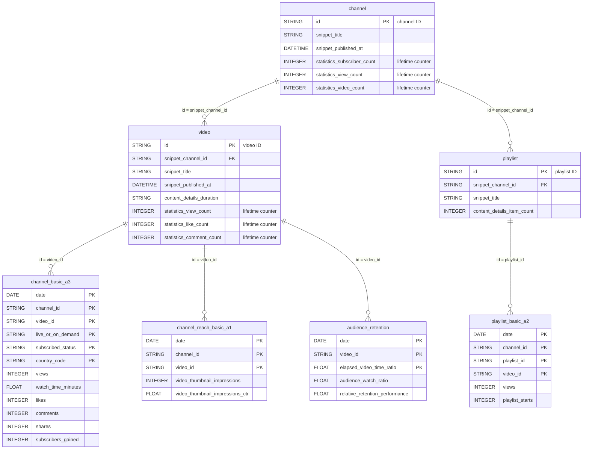

# YouTube Analytics


The YouTube Analytics connector syncs the organic performance of your YouTube channels and videos: views, watch time, engagement, audience, traffic sources, reach and playlists. It combines the **YouTube Reporting API** (daily bulk reports) with the **YouTube Data API v3** (video, channel and playlist metadata).


***

## Prerequisites

Before connecting YouTube Analytics to QUANTI, ensure you have:

* **A Google account with access to the YouTube channel(s)** you want to sync.
* **(Optional) A Content Owner ID**: only if you manage channels through a YouTube Content Owner (CMS) account and want multi-channel, asset and revenue reports. Leave it empty for a standard channel setup.

***

## Authentication

The connector uses **Google OAuth 2.0**. You sign in with your Google account and grant QUANTI read-only access to your YouTube data. No password or API key is stored.

The requested permissions are:

| Scope | Access |
|---|---|
| `yt-analytics.readonly` | YouTube Analytics reports (views, engagement, audience, traffic) |
| `yt-analytics-monetary.readonly` | Revenue reports (Content Owner mode) |
| `youtube.readonly` | Channel, video and playlist metadata |
| `youtubepartner` | Content Owner reports |
| `userinfo.email` | Email address of the connected account |

***

## Setup Instructions



#### Authorize your Google account

* Click **Continue with Google**
* Log in with the Google account that has access to your YouTube channel(s)
* Review and approve the requested permissions
* You will be redirected back to QUANTI automatically



#### Content Owner (optional)

* **Leave the field empty** for a standard setup: the connector syncs channel and playlist reports for the channel(s) you select.
* **Enter your Content Owner ID** to switch to Content Owner mode: the connector syncs Content Owner reports (all channels of the Content Owner), asset, revenue and system-managed financial reports.


The two modes are mutually exclusive. In Content Owner mode, channel-level reports are hidden and skipped: a Content Owner report already covers every channel of the Content Owner. You can change this value later in the connector **Settings**.




#### Select your channel(s)

* QUANTI lists the YouTube channels available to the authorized account
* All channels are selected by default — deselect any you don't need
* Click **Continue**



#### Select pre-built reports

* Review the available pre-built reports (see section below for details)
* Select the reports you need
* Click **Continue**



#### Connector Information

* **Connector Name**: A unique name for this connector
* **Dataset ID**: The dataset where tables will be created
* Click **Save** to create the connector



#### Finish setup

* For the first sync, you have the following options:
  * Activate auto-sync for recurring syncs (daily or weekly) by clicking the switch button
  * Launch a historical data recovery — maximum **60 days** of history available
  * Launch a manual sync immediately by clicking the **Sync now** button
* Wait for the sync to complete. Then navigate to your data warehouse to verify that tables are populated



***

## Data Model

The diagram shows the main Channel mode tables. Every Reporting API table joins the metadata tables the same way, through `channel_id`, `video_id` and `playlist_id`.

<a href="https://dbdiagram.io/d/6ac360a70f25a52d018da819" class="button primary" data-icon="table-tree">Open in dbdiagram</a>

***

## Available Reports

The name of each Reporting API table is the YouTube `reportTypeId` (for example `channel_basic_a3`). The `_aN` suffix is the version of the report on YouTube's side. The **Primary key** columns together identify a unique row.

### Channel mode — Video

#### channel\_annotations\_a1

Channel Video - Annotations. Official reference: [YouTube documentation](https://developers.google.com/youtube/reporting/v1/reports/channel_reports).

**Dimensions**

| Column | Type | Primary key |
|---|---|---|
| `date` | DATE | ✓ |
| `channel_id` | STRING | ✓ |
| `video_id` | STRING | ✓ |
| `live_or_on_demand` | STRING | ✓ |
| `subscribed_status` | STRING | ✓ |
| `country_code` | STRING | ✓ |
| `annotation_type` | STRING | ✓ |
| `annotation_id` | STRING | ✓ |

**Metrics**

| Column | Type |
|---|---|
| `annotation_click_through_rate` | FLOAT |
| `annotation_close_rate` | FLOAT |
| `annotation_impressions` | INTEGER |
| `annotation_clickable_impressions` | INTEGER |
| `annotation_closable_impressions` | INTEGER |
| `annotation_clicks` | INTEGER |
| `annotation_closes` | INTEGER |

#### channel\_basic\_a3

Channel Video - User Activity. Official reference: [YouTube documentation](https://developers.google.com/youtube/reporting/v1/reports/channel_reports).

**Dimensions**

| Column | Type | Primary key |
|---|---|---|
| `date` | DATE | ✓ |
| `channel_id` | STRING | ✓ |
| `video_id` | STRING | ✓ |
| `live_or_on_demand` | STRING | ✓ |
| `subscribed_status` | STRING | ✓ |
| `country_code` | STRING | ✓ |

**Metrics**

| Column | Type |
|---|---|
| `engaged_views` | INTEGER |
| `views` | INTEGER |
| `comments` | INTEGER |
| `likes` | INTEGER |
| `dislikes` | INTEGER |
| `shares` | INTEGER |
| `watch_time_minutes` | FLOAT |
| `average_view_duration_seconds` | FLOAT |
| `average_view_duration_percentage` | FLOAT |
| `subscribers_gained` | INTEGER |
| `subscribers_lost` | INTEGER |
| `red_views` | INTEGER |
| `red_watch_time_minutes` | FLOAT |

#### channel\_cards\_a1

Channel Video - Cards. Official reference: [YouTube documentation](https://developers.google.com/youtube/reporting/v1/reports/channel_reports).

**Dimensions**

| Column | Type | Primary key |
|---|---|---|
| `date` | DATE | ✓ |
| `channel_id` | STRING | ✓ |
| `video_id` | STRING | ✓ |
| `live_or_on_demand` | STRING | ✓ |
| `subscribed_status` | STRING | ✓ |
| `country_code` | STRING | ✓ |
| `card_type` | STRING | ✓ |
| `card_id` | STRING | ✓ |

**Metrics**

| Column | Type |
|---|---|
| `card_click_rate` | FLOAT |
| `card_teaser_click_rate` | FLOAT |
| `card_impressions` | INTEGER |
| `card_teaser_impressions` | INTEGER |
| `card_clicks` | INTEGER |
| `card_teaser_clicks` | INTEGER |

#### channel\_combined\_a3

Channel Video - Combined. Official reference: [YouTube documentation](https://developers.google.com/youtube/reporting/v1/reports/channel_reports).

**Dimensions**

| Column | Type | Primary key |
|---|---|---|
| `date` | DATE | ✓ |
| `channel_id` | STRING | ✓ |
| `video_id` | STRING | ✓ |
| `live_or_on_demand` | STRING |  |
| `subscribed_status` | STRING |  |
| `country_code` | STRING |  |
| `playback_location_type` | STRING | ✓ |
| `traffic_source_type` | STRING | ✓ |
| `device_type` | STRING | ✓ |
| `operating_system` | STRING | ✓ |

**Metrics**

| Column | Type |
|---|---|
| `engaged_views` | INTEGER |
| `views` | INTEGER |
| `watch_time_minutes` | FLOAT |
| `average_view_duration_seconds` | FLOAT |
| `average_view_duration_percentage` | FLOAT |
| `red_views` | INTEGER |
| `red_watch_time_minutes` | FLOAT |

#### channel\_demographics\_a1

Channel Video - Viewer Demographics. Official reference: [YouTube documentation](https://developers.google.com/youtube/reporting/v1/reports/channel_reports).

**Dimensions**

| Column | Type | Primary key |
|---|---|---|
| `date` | DATE | ✓ |
| `channel_id` | STRING | ✓ |
| `video_id` | STRING | ✓ |
| `live_or_on_demand` | STRING | ✓ |
| `subscribed_status` | STRING | ✓ |
| `country_code` | STRING | ✓ |
| `age_group` | STRING | ✓ |
| `gender` | STRING | ✓ |

**Metrics**

| Column | Type |
|---|---|
| `views_percentage` | FLOAT |

#### channel\_device\_os\_a3

Channel Video - Device Type and OS. Official reference: [YouTube documentation](https://developers.google.com/youtube/reporting/v1/reports/channel_reports).

**Dimensions**

| Column | Type | Primary key |
|---|---|---|
| `date` | DATE | ✓ |
| `channel_id` | STRING | ✓ |
| `video_id` | STRING | ✓ |
| `live_or_on_demand` | STRING | ✓ |
| `subscribed_status` | STRING | ✓ |
| `country_code` | STRING | ✓ |
| `device_type` | STRING | ✓ |
| `operating_system` | STRING | ✓ |

**Metrics**

| Column | Type |
|---|---|
| `engaged_views` | INTEGER |
| `views` | INTEGER |
| `watch_time_minutes` | FLOAT |
| `average_view_duration_seconds` | FLOAT |
| `average_view_duration_percentage` | FLOAT |
| `red_views` | INTEGER |
| `red_watch_time_minutes` | FLOAT |

#### channel\_end\_screens\_a1

Channel Video - End Screens. Official reference: [YouTube documentation](https://developers.google.com/youtube/reporting/v1/reports/channel_reports).

**Dimensions**

| Column | Type | Primary key |
|---|---|---|
| `date` | DATE | ✓ |
| `channel_id` | STRING | ✓ |
| `video_id` | STRING | ✓ |
| `live_or_on_demand` | STRING | ✓ |
| `subscribed_status` | STRING | ✓ |
| `country_code` | STRING | ✓ |
| `end_screen_element_type` | STRING | ✓ |
| `end_screen_element_id` | STRING | ✓ |

**Metrics**

| Column | Type |
|---|---|
| `end_screen_element_clicks` | INTEGER |
| `end_screen_element_impressions` | INTEGER |
| `end_screen_element_click_rate` | FLOAT |

#### channel\_playback\_location\_a3

Channel Video - Playback Locations. Official reference: [YouTube documentation](https://developers.google.com/youtube/reporting/v1/reports/channel_reports).

**Dimensions**

| Column | Type | Primary key |
|---|---|---|
| `date` | DATE | ✓ |
| `channel_id` | STRING | ✓ |
| `video_id` | STRING | ✓ |
| `live_or_on_demand` | STRING | ✓ |
| `subscribed_status` | STRING | ✓ |
| `country_code` | STRING | ✓ |
| `playback_location_type` | STRING | ✓ |
| `playback_location_detail` | STRING | ✓ |

**Metrics**

| Column | Type |
|---|---|
| `engaged_views` | INTEGER |
| `views` | INTEGER |
| `watch_time_minutes` | FLOAT |
| `average_view_duration_seconds` | FLOAT |
| `average_view_duration_percentage` | FLOAT |
| `red_views` | INTEGER |
| `red_watch_time_minutes` | FLOAT |

#### channel\_province\_a3

Channel Video - User Activity by Province. Official reference: [YouTube documentation](https://developers.google.com/youtube/reporting/v1/reports/channel_reports).

**Dimensions**

| Column | Type | Primary key |
|---|---|---|
| `date` | DATE | ✓ |
| `channel_id` | STRING | ✓ |
| `video_id` | STRING | ✓ |
| `live_or_on_demand` | STRING | ✓ |
| `subscribed_status` | STRING | ✓ |
| `country_code` | STRING | ✓ |
| `province_code` | STRING | ✓ |

**Metrics**

| Column | Type |
|---|---|
| `engaged_views` | INTEGER |
| `views` | INTEGER |
| `comments` | INTEGER |
| `likes` | INTEGER |
| `dislikes` | INTEGER |
| `shares` | INTEGER |
| `watch_time_minutes` | FLOAT |
| `average_view_duration_seconds` | FLOAT |
| `average_view_duration_percentage` | FLOAT |
| `subscribers_gained` | INTEGER |
| `subscribers_lost` | INTEGER |
| `red_views` | INTEGER |
| `red_watch_time_minutes` | FLOAT |

#### channel\_sharing\_service\_a1

Channel Video - Content Sharing by Platform. Official reference: [YouTube documentation](https://developers.google.com/youtube/reporting/v1/reports/channel_reports).

**Dimensions**

| Column | Type | Primary key |
|---|---|---|
| `date` | DATE | ✓ |
| `channel_id` | STRING | ✓ |
| `video_id` | STRING | ✓ |
| `live_or_on_demand` | STRING | ✓ |
| `subscribed_status` | STRING | ✓ |
| `country_code` | STRING | ✓ |
| `sharing_service` | STRING | ✓ |

**Metrics**

| Column | Type |
|---|---|
| `shares` | INTEGER |

#### channel\_subtitles\_a3

Channel Video - Subtitles. Official reference: [YouTube documentation](https://developers.google.com/youtube/reporting/v1/reports/channel_reports).

**Dimensions**

| Column | Type | Primary key |
|---|---|---|
| `date` | DATE | ✓ |
| `channel_id` | STRING | ✓ |
| `video_id` | STRING | ✓ |
| `live_or_on_demand` | STRING |  |
| `subscribed_status` | STRING |  |
| `country_code` | STRING |  |
| `subtitle_language` | STRING | ✓ |
| `subtitle_language_autotranslated` | STRING | ✓ |

**Metrics**

| Column | Type |
|---|---|
| `engaged_views` | INTEGER |
| `views` | INTEGER |
| `watch_time_minutes` | FLOAT |
| `average_view_duration_seconds` | FLOAT |
| `average_view_duration_percentage` | FLOAT |
| `red_views` | INTEGER |
| `red_watch_time_minutes` | FLOAT |

#### channel\_traffic\_source\_a3

Channel Video - Traffic Sources. Official reference: [YouTube documentation](https://developers.google.com/youtube/reporting/v1/reports/channel_reports).

**Dimensions**

| Column | Type | Primary key |
|---|---|---|
| `date` | DATE | ✓ |
| `channel_id` | STRING | ✓ |
| `video_id` | STRING | ✓ |
| `live_or_on_demand` | STRING | ✓ |
| `subscribed_status` | STRING | ✓ |
| `country_code` | STRING | ✓ |
| `traffic_source_type` | STRING | ✓ |
| `traffic_source_detail` | STRING | ✓ |

**Metrics**

| Column | Type |
|---|---|
| `engaged_views` | INTEGER |
| `views` | INTEGER |
| `watch_time_minutes` | FLOAT |
| `average_view_duration_seconds` | FLOAT |
| `average_view_duration_percentage` | FLOAT |
| `red_views` | INTEGER |
| `red_watch_time_minutes` | FLOAT |

### Channel mode — Reach

#### channel\_reach\_basic\_a1

Channel Reach - Basic. Official reference: [YouTube documentation](https://developers.google.com/youtube/reporting/v1/reports/channel_reports).

**Dimensions**

| Column | Type | Primary key |
|---|---|---|
| `date` | DATE | ✓ |
| `channel_id` | STRING | ✓ |
| `video_id` | STRING | ✓ |

**Metrics**

| Column | Type |
|---|---|
| `video_thumbnail_impressions` | INTEGER |
| `video_thumbnail_impressions_ctr` | FLOAT |

#### channel\_reach\_combined\_a1

Channel Reach - Combined. Official reference: [YouTube documentation](https://developers.google.com/youtube/reporting/v1/reports/channel_reports).

**Dimensions**

| Column | Type | Primary key |
|---|---|---|
| `date` | DATE | ✓ |
| `channel_id` | STRING | ✓ |
| `video_id` | STRING | ✓ |
| `traffic_source_type` | STRING | ✓ |
| `traffic_source_detail` | STRING | ✓ |
| `operating_system` | STRING | ✓ |
| `device_type` | STRING | ✓ |

**Metrics**

| Column | Type |
|---|---|
| `video_thumbnail_impressions` | INTEGER |
| `video_thumbnail_impressions_ctr` | FLOAT |

### Channel mode — Playlist

#### playlist\_basic\_a2

Channel Playlist - User Activity. Official reference: [YouTube documentation](https://developers.google.com/youtube/reporting/v1/reports/channel_reports).

**Dimensions**

| Column | Type | Primary key |
|---|---|---|
| `date` | DATE | ✓ |
| `channel_id` | STRING | ✓ |
| `playlist_id` | STRING | ✓ |
| `video_id` | STRING | ✓ |
| `live_or_on_demand` | STRING | ✓ |
| `subscribed_status` | STRING | ✓ |
| `country_code` | STRING | ✓ |

**Metrics**

| Column | Type |
|---|---|
| `engaged_views` | INTEGER |
| `views` | INTEGER |
| `watch_time_minutes` | FLOAT |
| `average_view_duration_seconds` | FLOAT |
| `playlist_starts` | INTEGER |
| `playlist_saves_added` | INTEGER |
| `playlist_saves_removed` | INTEGER |

#### playlist\_combined\_a2

Channel Playlist - Combined. Official reference: [YouTube documentation](https://developers.google.com/youtube/reporting/v1/reports/channel_reports).

**Dimensions**

| Column | Type | Primary key |
|---|---|---|
| `date` | DATE | ✓ |
| `channel_id` | STRING | ✓ |
| `playlist_id` | STRING | ✓ |
| `video_id` | STRING | ✓ |
| `live_or_on_demand` | STRING |  |
| `subscribed_status` | STRING |  |
| `country_code` | STRING |  |
| `playback_location_type` | STRING | ✓ |
| `traffic_source_type` | STRING | ✓ |
| `device_type` | STRING | ✓ |
| `operating_system` | STRING | ✓ |

**Metrics**

| Column | Type |
|---|---|
| `engaged_views` | INTEGER |
| `views` | INTEGER |
| `watch_time_minutes` | FLOAT |
| `average_view_duration_seconds` | FLOAT |
| `playlist_starts` | INTEGER |
| `playlist_saves_added` | INTEGER |
| `playlist_saves_removed` | INTEGER |

#### playlist\_device\_os\_a2

Channel Playlist - Device Type and OS. Official reference: [YouTube documentation](https://developers.google.com/youtube/reporting/v1/reports/channel_reports).

**Dimensions**

| Column | Type | Primary key |
|---|---|---|
| `date` | DATE | ✓ |
| `channel_id` | STRING | ✓ |
| `playlist_id` | STRING | ✓ |
| `video_id` | STRING | ✓ |
| `live_or_on_demand` | STRING |  |
| `subscribed_status` | STRING |  |
| `country_code` | STRING |  |
| `device_type` | STRING | ✓ |
| `operating_system` | STRING | ✓ |

**Metrics**

| Column | Type |
|---|---|
| `engaged_views` | INTEGER |
| `views` | INTEGER |
| `watch_time_minutes` | FLOAT |
| `average_view_duration_seconds` | FLOAT |
| `playlist_starts` | INTEGER |
| `playlist_saves_added` | INTEGER |
| `playlist_saves_removed` | INTEGER |

#### playlist\_playback\_location\_a2

Channel Playlist - Playback Locations. Official reference: [YouTube documentation](https://developers.google.com/youtube/reporting/v1/reports/channel_reports).

**Dimensions**

| Column | Type | Primary key |
|---|---|---|
| `date` | DATE | ✓ |
| `channel_id` | STRING | ✓ |
| `playlist_id` | STRING | ✓ |
| `video_id` | STRING | ✓ |
| `live_or_on_demand` | STRING |  |
| `subscribed_status` | STRING |  |
| `country_code` | STRING |  |
| `playback_location_type` | STRING | ✓ |
| `playback_location_detail` | STRING | ✓ |

**Metrics**

| Column | Type |
|---|---|
| `engaged_views` | INTEGER |
| `views` | INTEGER |
| `watch_time_minutes` | FLOAT |
| `average_view_duration_seconds` | FLOAT |
| `playlist_starts` | INTEGER |
| `playlist_saves_added` | INTEGER |
| `playlist_saves_removed` | INTEGER |

#### playlist\_province\_a2

Channel Playlist - User Activity by Province. Official reference: [YouTube documentation](https://developers.google.com/youtube/reporting/v1/reports/channel_reports).

**Dimensions**

| Column | Type | Primary key |
|---|---|---|
| `date` | DATE | ✓ |
| `channel_id` | STRING | ✓ |
| `playlist_id` | STRING | ✓ |
| `video_id` | STRING | ✓ |
| `live_or_on_demand` | STRING | ✓ |
| `subscribed_status` | STRING | ✓ |
| `country_code` | STRING | ✓ |
| `province_code` | STRING | ✓ |

**Metrics**

| Column | Type |
|---|---|
| `engaged_views` | INTEGER |
| `views` | INTEGER |
| `watch_time_minutes` | FLOAT |
| `average_view_duration_seconds` | FLOAT |
| `playlist_starts` | INTEGER |
| `playlist_saves_added` | INTEGER |
| `playlist_saves_removed` | INTEGER |

#### playlist\_traffic\_source\_a2

Channel Playlist - Traffic Sources. Official reference: [YouTube documentation](https://developers.google.com/youtube/reporting/v1/reports/channel_reports).

**Dimensions**

| Column | Type | Primary key |
|---|---|---|
| `date` | DATE | ✓ |
| `channel_id` | STRING | ✓ |
| `playlist_id` | STRING | ✓ |
| `video_id` | STRING | ✓ |
| `live_or_on_demand` | STRING |  |
| `subscribed_status` | STRING |  |
| `country_code` | STRING |  |
| `traffic_source_type` | STRING | ✓ |
| `traffic_source_detail` | STRING | ✓ |

**Metrics**

| Column | Type |
|---|---|
| `engaged_views` | INTEGER |
| `views` | INTEGER |
| `watch_time_minutes` | FLOAT |
| `average_view_duration_seconds` | FLOAT |
| `playlist_starts` | INTEGER |
| `playlist_saves_added` | INTEGER |
| `playlist_saves_removed` | INTEGER |

### Metadata and retention (both modes)

#### video

YouTube video metadata (Data API v3). Official reference: [YouTube documentation](https://developers.google.com/youtube/v3/docs).

| Column | Type | Primary key |
|---|---|---|
| `id` | STRING | ✓ |
| `snippet_channel_id` | STRING |  |
| `content_details_caption` | STRING |  |
| `content_details_definition` | STRING |  |
| `content_details_dimension` | STRING |  |
| `content_details_duration` | STRING |  |
| `content_details_has_custom_thumbnail` | BOOLEAN |  |
| `content_details_licensed_content` | BOOLEAN |  |
| `content_details_projection` | STRING |  |
| `content_details_region_restriction` | STRING |  |
| `etag` | STRING |  |
| `kind` | STRING |  |
| `player_embed_height` | INTEGER |  |
| `player_embed_html` | STRING |  |
| `player_embed_width` | INTEGER |  |
| `privacy_status` | STRING |  |
| `snippet_category_id` | STRING |  |
| `snippet_channel_title` | STRING |  |
| `snippet_default_audio_language` | STRING |  |
| `snippet_default_language` | STRING |  |
| `snippet_description` | STRING |  |
| `snippet_live_broadcast_content` | STRING |  |
| `snippet_localized` | STRING |  |
| `snippet_published_at` | DATETIME |  |
| `snippet_tags` | STRING |  |
| `snippet_thumbnails` | STRING |  |
| `snippet_title` | STRING |  |
| `statistics_comment_count` | INTEGER |  |
| `statistics_dislike_count` | INTEGER |  |
| `statistics_favorite_count` | INTEGER |  |
| `statistics_like_count` | INTEGER |  |
| `statistics_view_count` | INTEGER |  |
| `status_embeddable` | BOOLEAN |  |
| `status_failure_reason` | STRING |  |
| `status_license` | STRING |  |
| `status_made_for_kids` | BOOLEAN |  |
| `status_public_stats_viewable` | BOOLEAN |  |
| `status_publish_at` | DATETIME |  |
| `status_rejection_reason` | STRING |  |
| `status_self_declared_made_for_kids` | BOOLEAN |  |
| `upload_status` | STRING |  |

#### channel

YouTube channel metadata (Data API v3). Official reference: [YouTube documentation](https://developers.google.com/youtube/v3/docs).

| Column | Type | Primary key |
|---|---|---|
| `id` | STRING | ✓ |
| `branding_settings` | STRING |  |
| `content_details_likes` | STRING |  |
| `content_details_uploads` | STRING |  |
| `content_owner_details` | STRING |  |
| `etag` | STRING |  |
| `kind` | STRING |  |
| `localizations` | STRING |  |
| `snippet_country` | STRING |  |
| `snippet_custom_url` | STRING |  |
| `snippet_default_language` | STRING |  |
| `snippet_description` | STRING |  |
| `snippet_localized` | STRING |  |
| `snippet_published_at` | DATETIME |  |
| `snippet_thumbnails` | STRING |  |
| `snippet_title` | STRING |  |
| `statistics_hidden_subscriber_count` | BOOLEAN |  |
| `statistics_subscriber_count` | INTEGER |  |
| `statistics_video_count` | INTEGER |  |
| `statistics_view_count` | INTEGER |  |
| `status` | STRING |  |
| `topic_details` | STRING |  |

#### playlist

YouTube playlist metadata (Data API v3). Official reference: [YouTube documentation](https://developers.google.com/youtube/v3/docs).

| Column | Type | Primary key |
|---|---|---|
| `id` | STRING | ✓ |
| `snippet_channel_id` | STRING |  |
| `content_details_item_count` | INTEGER |  |
| `etag` | STRING |  |
| `kind` | STRING |  |
| `localizations` | STRING |  |
| `player_embed_html` | STRING |  |
| `privacy_status` | STRING |  |
| `snippet_channel_title` | STRING |  |
| `snippet_default_language` | STRING |  |
| `snippet_description` | STRING |  |
| `snippet_localized` | STRING |  |
| `snippet_published_at` | DATETIME |  |
| `snippet_thumbnails` | STRING |  |
| `snippet_title` | STRING |  |

#### audience\_retention

Per-video audience retention curve by elapsed video time ratio (YouTube Analytics API targeted query). Lifetime curve, snapshotted per run. Official reference: [YouTube documentation](https://developers.google.com/youtube/analytics/reference/reports/query).

**Dimensions**

| Column | Type | Primary key |
|---|---|---|
| `date` | DATE | ✓ |
| `video_id` | STRING | ✓ |
| `elapsed_video_time_ratio` | FLOAT | ✓ |

**Metrics**

| Column | Type |
|---|---|
| `audience_watch_ratio` | FLOAT |
| `relative_retention_performance` | FLOAT |

### Content Owner mode — Video


Synced only when a **Content Owner ID** is set. These tables cover every channel of the Content Owner.


#### content\_owner\_annotations\_a1

Content Owner Video - Annotations. Official reference: [YouTube documentation](https://developers.google.com/youtube/reporting/v1/reports/content_owner_reports).

**Dimensions**

| Column | Type | Primary key |
|---|---|---|
| `date` | DATE | ✓ |
| `channel_id` | STRING | ✓ |
| `video_id` | STRING | ✓ |
| `claimed_status` | STRING | ✓ |
| `uploader_type` | STRING | ✓ |
| `live_or_on_demand` | STRING | ✓ |
| `subscribed_status` | STRING | ✓ |
| `country_code` | STRING | ✓ |
| `annotation_type` | STRING | ✓ |
| `annotation_id` | STRING | ✓ |

**Metrics**

| Column | Type |
|---|---|
| `annotation_click_through_rate` | FLOAT |
| `annotation_close_rate` | FLOAT |
| `annotation_impressions` | INTEGER |
| `annotation_clickable_impressions` | INTEGER |
| `annotation_closable_impressions` | INTEGER |
| `annotation_clicks` | INTEGER |
| `annotation_closes` | INTEGER |

#### content\_owner\_basic\_a4

Content Owner Video - User Activity. Official reference: [YouTube documentation](https://developers.google.com/youtube/reporting/v1/reports/content_owner_reports).

**Dimensions**

| Column | Type | Primary key |
|---|---|---|
| `date` | DATE | ✓ |
| `channel_id` | STRING | ✓ |
| `video_id` | STRING | ✓ |
| `claimed_status` | STRING | ✓ |
| `uploader_type` | STRING | ✓ |
| `live_or_on_demand` | STRING | ✓ |
| `subscribed_status` | STRING | ✓ |
| `country_code` | STRING | ✓ |

**Metrics**

| Column | Type |
|---|---|
| `engaged_views` | INTEGER |
| `views` | INTEGER |
| `comments` | INTEGER |
| `likes` | INTEGER |
| `dislikes` | INTEGER |
| `shares` | INTEGER |
| `watch_time_minutes` | FLOAT |
| `average_view_duration_seconds` | FLOAT |
| `average_view_duration_percentage` | FLOAT |
| `subscribers_gained` | INTEGER |
| `subscribers_lost` | INTEGER |
| `videos_added_to_playlists` | INTEGER |
| `videos_removed_from_playlists` | INTEGER |
| `red_views` | INTEGER |
| `red_watch_time_minutes` | FLOAT |

#### content\_owner\_cards\_a1

Content Owner Video - Cards. Official reference: [YouTube documentation](https://developers.google.com/youtube/reporting/v1/reports/content_owner_reports).

**Dimensions**

| Column | Type | Primary key |
|---|---|---|
| `date` | DATE | ✓ |
| `channel_id` | STRING | ✓ |
| `video_id` | STRING | ✓ |
| `claimed_status` | STRING | ✓ |
| `uploader_type` | STRING | ✓ |
| `live_or_on_demand` | STRING | ✓ |
| `subscribed_status` | STRING | ✓ |
| `country_code` | STRING | ✓ |
| `card_type` | STRING | ✓ |
| `card_id` | STRING | ✓ |

**Metrics**

| Column | Type |
|---|---|
| `card_click_rate` | FLOAT |
| `card_teaser_click_rate` | FLOAT |
| `card_impressions` | INTEGER |
| `card_teaser_impressions` | INTEGER |
| `card_clicks` | INTEGER |
| `card_teaser_clicks` | INTEGER |

#### content\_owner\_combined\_a3

Content Owner Video - Combined. Official reference: [YouTube documentation](https://developers.google.com/youtube/reporting/v1/reports/content_owner_reports).

**Dimensions**

| Column | Type | Primary key |
|---|---|---|
| `date` | DATE | ✓ |
| `channel_id` | STRING | ✓ |
| `video_id` | STRING | ✓ |
| `claimed_status` | STRING |  |
| `uploader_type` | STRING |  |
| `live_or_on_demand` | STRING |  |
| `subscribed_status` | STRING |  |
| `country_code` | STRING |  |
| `playback_location_type` | STRING | ✓ |
| `traffic_source_type` | STRING | ✓ |
| `device_type` | STRING | ✓ |
| `operating_system` | STRING | ✓ |

**Metrics**

| Column | Type |
|---|---|
| `engaged_views` | INTEGER |
| `views` | INTEGER |
| `watch_time_minutes` | FLOAT |
| `average_view_duration_seconds` | FLOAT |
| `average_view_duration_percentage` | FLOAT |
| `red_views` | INTEGER |
| `red_watch_time_minutes` | FLOAT |

#### content\_owner\_demographics\_a1

Content Owner Video - Viewer Demographics. Official reference: [YouTube documentation](https://developers.google.com/youtube/reporting/v1/reports/content_owner_reports).

**Dimensions**

| Column | Type | Primary key |
|---|---|---|
| `date` | DATE | ✓ |
| `channel_id` | STRING | ✓ |
| `video_id` | STRING | ✓ |
| `claimed_status` | STRING | ✓ |
| `uploader_type` | STRING | ✓ |
| `live_or_on_demand` | STRING |  |
| `subscribed_status` | STRING |  |
| `country_code` | STRING |  |
| `age_group` | STRING | ✓ |
| `gender` | STRING | ✓ |

**Metrics**

| Column | Type |
|---|---|
| `views_percentage` | FLOAT |

#### content\_owner\_device\_os\_a3

Content Owner Video - Device Type and OS. Official reference: [YouTube documentation](https://developers.google.com/youtube/reporting/v1/reports/content_owner_reports).

**Dimensions**

| Column | Type | Primary key |
|---|---|---|
| `date` | DATE | ✓ |
| `channel_id` | STRING | ✓ |
| `video_id` | STRING | ✓ |
| `claimed_status` | STRING | ✓ |
| `uploader_type` | STRING | ✓ |
| `live_or_on_demand` | STRING |  |
| `subscribed_status` | STRING |  |
| `country_code` | STRING |  |
| `device_type` | STRING | ✓ |
| `operating_system` | STRING | ✓ |

**Metrics**

| Column | Type |
|---|---|
| `engaged_views` | INTEGER |
| `views` | INTEGER |
| `watch_time_minutes` | FLOAT |
| `average_view_duration_seconds` | FLOAT |
| `average_view_duration_percentage` | FLOAT |
| `red_views` | INTEGER |
| `red_watch_time_minutes` | FLOAT |

#### content\_owner\_end\_screens\_a1

Content Owner Video - End Screens. Official reference: [YouTube documentation](https://developers.google.com/youtube/reporting/v1/reports/content_owner_reports).

**Dimensions**

| Column | Type | Primary key |
|---|---|---|
| `date` | DATE | ✓ |
| `channel_id` | STRING | ✓ |
| `video_id` | STRING | ✓ |
| `claimed_status` | STRING | ✓ |
| `uploader_type` | STRING | ✓ |
| `live_or_on_demand` | STRING | ✓ |
| `subscribed_status` | STRING | ✓ |
| `country_code` | STRING | ✓ |
| `end_screen_element_type` | STRING | ✓ |
| `end_screen_element_id` | STRING | ✓ |

**Metrics**

| Column | Type |
|---|---|
| `end_screen_element_clicks` | INTEGER |
| `end_screen_element_impressions` | INTEGER |
| `end_screen_element_click_rate` | FLOAT |

#### content\_owner\_playback\_location\_a3

Content Owner Video - Playback Locations. Official reference: [YouTube documentation](https://developers.google.com/youtube/reporting/v1/reports/content_owner_reports).

**Dimensions**

| Column | Type | Primary key |
|---|---|---|
| `date` | DATE | ✓ |
| `channel_id` | STRING | ✓ |
| `video_id` | STRING | ✓ |
| `claimed_status` | STRING | ✓ |
| `uploader_type` | STRING | ✓ |
| `live_or_on_demand` | STRING |  |
| `subscribed_status` | STRING |  |
| `country_code` | STRING |  |
| `playback_location_type` | STRING | ✓ |
| `playback_location_detail` | STRING | ✓ |

**Metrics**

| Column | Type |
|---|---|
| `engaged_views` | INTEGER |
| `views` | INTEGER |
| `watch_time_minutes` | FLOAT |
| `average_view_duration_seconds` | FLOAT |
| `average_view_duration_percentage` | FLOAT |
| `red_views` | INTEGER |
| `red_watch_time_minutes` | FLOAT |

#### content\_owner\_province\_a3

Content Owner Video - User Activity by Province. Official reference: [YouTube documentation](https://developers.google.com/youtube/reporting/v1/reports/content_owner_reports).

**Dimensions**

| Column | Type | Primary key |
|---|---|---|
| `date` | DATE | ✓ |
| `channel_id` | STRING | ✓ |
| `video_id` | STRING | ✓ |
| `claimed_status` | STRING | ✓ |
| `uploader_type` | STRING | ✓ |
| `live_or_on_demand` | STRING | ✓ |
| `subscribed_status` | STRING | ✓ |
| `country_code` | STRING | ✓ |
| `province_code` | STRING | ✓ |

**Metrics**

| Column | Type |
|---|---|
| `engaged_views` | INTEGER |
| `views` | INTEGER |
| `comments` | INTEGER |
| `likes` | INTEGER |
| `dislikes` | INTEGER |
| `shares` | INTEGER |
| `watch_time_minutes` | FLOAT |
| `average_view_duration_seconds` | FLOAT |
| `average_view_duration_percentage` | FLOAT |
| `subscribers_gained` | INTEGER |
| `subscribers_lost` | INTEGER |
| `videos_added_to_playlists` | INTEGER |
| `videos_removed_from_playlists` | INTEGER |
| `red_views` | INTEGER |
| `red_watch_time_minutes` | FLOAT |

#### content\_owner\_sharing\_service\_a1

Content Owner Video - Content Sharing by Platform. Official reference: [YouTube documentation](https://developers.google.com/youtube/reporting/v1/reports/content_owner_reports).

**Dimensions**

| Column | Type | Primary key |
|---|---|---|
| `date` | DATE | ✓ |
| `channel_id` | STRING | ✓ |
| `video_id` | STRING | ✓ |
| `claimed_status` | STRING |  |
| `uploader_type` | STRING |  |
| `live_or_on_demand` | STRING |  |
| `subscribed_status` | STRING |  |
| `country_code` | STRING |  |
| `sharing_service` | STRING | ✓ |

**Metrics**

| Column | Type |
|---|---|
| `shares` | INTEGER |

#### content\_owner\_subtitles\_a3

Content Owner Video - Subtitles. Official reference: [YouTube documentation](https://developers.google.com/youtube/reporting/v1/reports/content_owner_reports).

**Dimensions**

| Column | Type | Primary key |
|---|---|---|
| `date` | DATE | ✓ |
| `channel_id` | STRING | ✓ |
| `video_id` | STRING | ✓ |
| `claimed_status` | STRING |  |
| `uploader_type` | STRING |  |
| `live_or_on_demand` | STRING |  |
| `subscribed_status` | STRING |  |
| `country_code` | STRING |  |
| `subtitle_language` | STRING | ✓ |
| `subtitle_language_autotranslated` | STRING | ✓ |

**Metrics**

| Column | Type |
|---|---|
| `engaged_views` | INTEGER |
| `views` | INTEGER |
| `watch_time_minutes` | FLOAT |
| `average_view_duration_seconds` | FLOAT |
| `average_view_duration_percentage` | FLOAT |
| `red_views` | INTEGER |
| `red_watch_time_minutes` | FLOAT |

#### content\_owner\_traffic\_source\_a3

Content Owner Video - Traffic Sources. Official reference: [YouTube documentation](https://developers.google.com/youtube/reporting/v1/reports/content_owner_reports).

**Dimensions**

| Column | Type | Primary key |
|---|---|---|
| `date` | DATE | ✓ |
| `channel_id` | STRING | ✓ |
| `video_id` | STRING | ✓ |
| `claimed_status` | STRING | ✓ |
| `uploader_type` | STRING | ✓ |
| `live_or_on_demand` | STRING |  |
| `subscribed_status` | STRING |  |
| `country_code` | STRING |  |
| `traffic_source_type` | STRING | ✓ |
| `traffic_source_detail` | STRING | ✓ |

**Metrics**

| Column | Type |
|---|---|
| `engaged_views` | INTEGER |
| `views` | INTEGER |
| `watch_time_minutes` | FLOAT |
| `average_view_duration_seconds` | FLOAT |
| `average_view_duration_percentage` | FLOAT |
| `red_views` | INTEGER |
| `red_watch_time_minutes` | FLOAT |

### Content Owner mode — Reach


Synced only when a **Content Owner ID** is set. These tables cover every channel of the Content Owner.


#### content\_owner\_reach\_basic\_a1

Content Owner Reach - Basic. Official reference: [YouTube documentation](https://developers.google.com/youtube/reporting/v1/reports/content_owner_reports).

**Dimensions**

| Column | Type | Primary key |
|---|---|---|
| `date` | DATE | ✓ |
| `channel_id` | STRING | ✓ |
| `video_id` | STRING | ✓ |

**Metrics**

| Column | Type |
|---|---|
| `video_thumbnail_impressions` | INTEGER |
| `video_thumbnail_impressions_ctr` | FLOAT |

#### content\_owner\_reach\_combined\_a1

Content Owner Reach - Combined. Official reference: [YouTube documentation](https://developers.google.com/youtube/reporting/v1/reports/content_owner_reports).

**Dimensions**

| Column | Type | Primary key |
|---|---|---|
| `date` | DATE | ✓ |
| `channel_id` | STRING | ✓ |
| `video_id` | STRING | ✓ |
| `traffic_source_type` | STRING | ✓ |
| `traffic_source_detail` | STRING | ✓ |
| `operating_system` | STRING | ✓ |
| `device_type` | STRING | ✓ |

**Metrics**

| Column | Type |
|---|---|
| `video_thumbnail_impressions` | INTEGER |
| `video_thumbnail_impressions_ctr` | FLOAT |

### Content Owner mode — Playlist


Synced only when a **Content Owner ID** is set. These tables cover every channel of the Content Owner.


#### content\_owner\_playlist\_basic\_a2

Content Owner Playlist - User Activity. Official reference: [YouTube documentation](https://developers.google.com/youtube/reporting/v1/reports/content_owner_reports).

**Dimensions**

| Column | Type | Primary key |
|---|---|---|
| `date` | DATE | ✓ |
| `channel_id` | STRING | ✓ |
| `playlist_id` | STRING | ✓ |
| `video_id` | STRING | ✓ |
| `live_or_on_demand` | STRING |  |
| `subscribed_status` | STRING |  |
| `country_code` | STRING |  |

**Metrics**

| Column | Type |
|---|---|
| `engaged_views` | INTEGER |
| `views` | INTEGER |
| `watch_time_minutes` | FLOAT |
| `average_view_duration_seconds` | FLOAT |
| `playlist_starts` | INTEGER |
| `playlist_saves_added` | INTEGER |
| `playlist_saves_removed` | INTEGER |

#### content\_owner\_playlist\_combined\_a2

Content Owner Playlist - Combined. Official reference: [YouTube documentation](https://developers.google.com/youtube/reporting/v1/reports/content_owner_reports).

**Dimensions**

| Column | Type | Primary key |
|---|---|---|
| `date` | DATE | ✓ |
| `channel_id` | STRING | ✓ |
| `playlist_id` | STRING | ✓ |
| `video_id` | STRING | ✓ |
| `live_or_on_demand` | STRING |  |
| `subscribed_status` | STRING |  |
| `country_code` | STRING |  |
| `playback_location_type` | STRING | ✓ |
| `traffic_source_type` | STRING | ✓ |
| `device_type` | STRING | ✓ |
| `operating_system` | STRING | ✓ |

**Metrics**

| Column | Type |
|---|---|
| `engaged_views` | INTEGER |
| `views` | INTEGER |
| `watch_time_minutes` | FLOAT |
| `average_view_duration_seconds` | FLOAT |
| `playlist_starts` | INTEGER |
| `playlist_saves_added` | INTEGER |
| `playlist_saves_removed` | INTEGER |

#### content\_owner\_playlist\_device\_os\_a2

Content Owner Playlist - Device Type and OS. Official reference: [YouTube documentation](https://developers.google.com/youtube/reporting/v1/reports/content_owner_reports).

**Dimensions**

| Column | Type | Primary key |
|---|---|---|
| `date` | DATE | ✓ |
| `channel_id` | STRING | ✓ |
| `playlist_id` | STRING | ✓ |
| `video_id` | STRING | ✓ |
| `live_or_on_demand` | STRING |  |
| `subscribed_status` | STRING |  |
| `country_code` | STRING |  |
| `device_type` | STRING | ✓ |
| `operating_system` | STRING | ✓ |

**Metrics**

| Column | Type |
|---|---|
| `engaged_views` | INTEGER |
| `views` | INTEGER |
| `watch_time_minutes` | FLOAT |
| `average_view_duration_seconds` | FLOAT |
| `playlist_starts` | INTEGER |
| `playlist_saves_added` | INTEGER |
| `playlist_saves_removed` | INTEGER |

#### content\_owner\_playlist\_playback\_location\_a2

Content Owner Playlist - Playback Locations. Official reference: [YouTube documentation](https://developers.google.com/youtube/reporting/v1/reports/content_owner_reports).

**Dimensions**

| Column | Type | Primary key |
|---|---|---|
| `date` | DATE | ✓ |
| `channel_id` | STRING | ✓ |
| `playlist_id` | STRING | ✓ |
| `video_id` | STRING | ✓ |
| `live_or_on_demand` | STRING |  |
| `subscribed_status` | STRING |  |
| `country_code` | STRING |  |
| `playback_location_type` | STRING | ✓ |
| `playback_location_detail` | STRING | ✓ |

**Metrics**

| Column | Type |
|---|---|
| `engaged_views` | INTEGER |
| `views` | INTEGER |
| `watch_time_minutes` | FLOAT |
| `average_view_duration_seconds` | FLOAT |
| `playlist_starts` | INTEGER |
| `playlist_saves_added` | INTEGER |
| `playlist_saves_removed` | INTEGER |

#### content\_owner\_playlist\_province\_a2

Content Owner Playlist - User Activity by Province. Official reference: [YouTube documentation](https://developers.google.com/youtube/reporting/v1/reports/content_owner_reports).

**Dimensions**

| Column | Type | Primary key |
|---|---|---|
| `date` | DATE | ✓ |
| `channel_id` | STRING | ✓ |
| `playlist_id` | STRING | ✓ |
| `video_id` | STRING | ✓ |
| `live_or_on_demand` | STRING |  |
| `subscribed_status` | STRING |  |
| `country_code` | STRING |  |
| `province_code` | STRING | ✓ |

**Metrics**

| Column | Type |
|---|---|
| `engaged_views` | INTEGER |
| `views` | INTEGER |
| `watch_time_minutes` | FLOAT |
| `average_view_duration_seconds` | FLOAT |
| `playlist_starts` | INTEGER |
| `playlist_saves_added` | INTEGER |
| `playlist_saves_removed` | INTEGER |

#### content\_owner\_playlist\_traffic\_source\_a2

Content Owner Playlist - Traffic Sources. Official reference: [YouTube documentation](https://developers.google.com/youtube/reporting/v1/reports/content_owner_reports).

**Dimensions**

| Column | Type | Primary key |
|---|---|---|
| `date` | DATE | ✓ |
| `channel_id` | STRING | ✓ |
| `playlist_id` | STRING | ✓ |
| `video_id` | STRING | ✓ |
| `live_or_on_demand` | STRING |  |
| `subscribed_status` | STRING |  |
| `country_code` | STRING |  |
| `traffic_source_type` | STRING | ✓ |
| `traffic_source_detail` | STRING | ✓ |

**Metrics**

| Column | Type |
|---|---|
| `engaged_views` | INTEGER |
| `views` | INTEGER |
| `watch_time_minutes` | FLOAT |
| `average_view_duration_seconds` | FLOAT |
| `playlist_starts` | INTEGER |
| `playlist_saves_added` | INTEGER |
| `playlist_saves_removed` | INTEGER |

### Content Owner mode — Assets


Synced only when a **Content Owner ID** is set. These tables cover every channel of the Content Owner.


#### content\_owner\_asset\_annotations\_a1

Content Owner Asset - Annotations. Official reference: [YouTube documentation](https://developers.google.com/youtube/reporting/v1/reports/content_owner_reports).

**Dimensions**

| Column | Type | Primary key |
|---|---|---|
| `date` | DATE | ✓ |
| `channel_id` | STRING | ✓ |
| `video_id` | STRING | ✓ |
| `asset_id` | STRING | ✓ |
| `claimed_status` | STRING | ✓ |
| `uploader_type` | STRING | ✓ |
| `live_or_on_demand` | STRING | ✓ |
| `subscribed_status` | STRING | ✓ |
| `country_code` | STRING | ✓ |
| `annotation_type` | STRING | ✓ |
| `annotation_title` | STRING | ✓ |

**Metrics**

| Column | Type |
|---|---|
| `annotation_click_through_rate` | FLOAT |
| `annotation_close_rate` | FLOAT |
| `annotation_impressions` | INTEGER |
| `annotation_clickable_impressions` | INTEGER |
| `annotation_closable_impressions` | INTEGER |
| `annotation_clicks` | INTEGER |
| `annotation_closes` | INTEGER |

#### content\_owner\_asset\_basic\_a3

Content Owner Asset - User Activity. Official reference: [YouTube documentation](https://developers.google.com/youtube/reporting/v1/reports/content_owner_reports).

**Dimensions**

| Column | Type | Primary key |
|---|---|---|
| `date` | DATE | ✓ |
| `channel_id` | STRING | ✓ |
| `video_id` | STRING | ✓ |
| `asset_id` | STRING | ✓ |
| `claimed_status` | STRING | ✓ |
| `uploader_type` | STRING | ✓ |
| `live_or_on_demand` | STRING | ✓ |
| `subscribed_status` | STRING | ✓ |
| `country_code` | STRING | ✓ |

**Metrics**

| Column | Type |
|---|---|
| `engaged_views` | INTEGER |
| `views` | INTEGER |
| `comments` | INTEGER |
| `likes` | INTEGER |
| `dislikes` | INTEGER |
| `shares` | INTEGER |
| `watch_time_minutes` | FLOAT |
| `average_view_duration_seconds` | FLOAT |
| `average_view_duration_percentage` | FLOAT |
| `subscribers_gained` | INTEGER |
| `subscribers_lost` | INTEGER |
| `videos_added_to_playlists` | INTEGER |
| `videos_removed_from_playlists` | INTEGER |
| `red_views` | INTEGER |
| `red_watch_time_minutes` | FLOAT |

#### content\_owner\_asset\_cards\_a1

Content Owner Asset - Cards. Official reference: [YouTube documentation](https://developers.google.com/youtube/reporting/v1/reports/content_owner_reports).

**Dimensions**

| Column | Type | Primary key |
|---|---|---|
| `date` | DATE | ✓ |
| `channel_id` | STRING | ✓ |
| `video_id` | STRING | ✓ |
| `asset_id` | STRING | ✓ |
| `claimed_status` | STRING | ✓ |
| `uploader_type` | STRING | ✓ |
| `live_or_on_demand` | STRING | ✓ |
| `subscribed_status` | STRING | ✓ |
| `country_code` | STRING | ✓ |
| `card_type` | STRING | ✓ |
| `card_id` | STRING | ✓ |

**Metrics**

| Column | Type |
|---|---|
| `card_click_rate` | FLOAT |
| `card_teaser_click_rate` | FLOAT |
| `card_impressions` | INTEGER |
| `card_teaser_impressions` | INTEGER |
| `card_clicks` | INTEGER |
| `card_teaser_clicks` | INTEGER |

#### content\_owner\_asset\_combined\_a3

Content Owner Asset - Combined. Official reference: [YouTube documentation](https://developers.google.com/youtube/reporting/v1/reports/content_owner_reports).

**Dimensions**

| Column | Type | Primary key |
|---|---|---|
| `date` | DATE | ✓ |
| `channel_id` | STRING | ✓ |
| `video_id` | STRING | ✓ |
| `asset_id` | STRING | ✓ |
| `claimed_status` | STRING |  |
| `uploader_type` | STRING |  |
| `live_or_on_demand` | STRING |  |
| `subscribed_status` | STRING |  |
| `country_code` | STRING |  |
| `playback_location_type` | STRING | ✓ |
| `traffic_source_type` | STRING | ✓ |
| `device_type` | STRING | ✓ |
| `operating_system` | STRING | ✓ |

**Metrics**

| Column | Type |
|---|---|
| `engaged_views` | INTEGER |
| `views` | INTEGER |
| `comments` | INTEGER |
| `likes` | INTEGER |
| `dislikes` | INTEGER |
| `shares` | INTEGER |
| `watch_time_minutes` | FLOAT |
| `average_view_duration_seconds` | FLOAT |
| `average_view_duration_percentage` | FLOAT |
| `subscribers_gained` | INTEGER |
| `subscribers_lost` | INTEGER |
| `videos_added_to_playlists` | INTEGER |
| `videos_removed_from_playlists` | INTEGER |
| `red_views` | INTEGER |
| `red_watch_time_minutes` | FLOAT |

#### content\_owner\_asset\_demographics\_a1

Content Owner Asset - Viewer Demographics. Official reference: [YouTube documentation](https://developers.google.com/youtube/reporting/v1/reports/content_owner_reports).

**Dimensions**

| Column | Type | Primary key |
|---|---|---|
| `date` | DATE | ✓ |
| `channel_id` | STRING | ✓ |
| `video_id` | STRING | ✓ |
| `asset_id` | STRING | ✓ |
| `claimed_status` | STRING |  |
| `uploader_type` | STRING |  |
| `live_or_on_demand` | STRING |  |
| `subscribed_status` | STRING |  |
| `country_code` | STRING |  |
| `age_group` | STRING | ✓ |
| `gender` | STRING | ✓ |

**Metrics**

| Column | Type |
|---|---|
| `views_percentage` | FLOAT |

#### content\_owner\_asset\_device\_os\_a3

Content Owner Asset - Device Type and OS. Official reference: [YouTube documentation](https://developers.google.com/youtube/reporting/v1/reports/content_owner_reports).

**Dimensions**

| Column | Type | Primary key |
|---|---|---|
| `date` | DATE | ✓ |
| `channel_id` | STRING | ✓ |
| `video_id` | STRING | ✓ |
| `asset_id` | STRING | ✓ |
| `claimed_status` | STRING |  |
| `uploader_type` | STRING |  |
| `live_or_on_demand` | STRING |  |
| `subscribed_status` | STRING |  |
| `country_code` | STRING |  |
| `device_type` | STRING | ✓ |
| `operating_system` | STRING | ✓ |

**Metrics**

| Column | Type |
|---|---|
| `engaged_views` | INTEGER |
| `views` | INTEGER |
| `comments` | INTEGER |
| `likes` | INTEGER |
| `dislikes` | INTEGER |
| `shares` | INTEGER |
| `watch_time_minutes` | FLOAT |
| `average_view_duration_seconds` | FLOAT |
| `average_view_duration_percentage` | FLOAT |
| `subscribers_gained` | INTEGER |
| `subscribers_lost` | INTEGER |
| `videos_added_to_playlists` | INTEGER |
| `videos_removed_from_playlists` | INTEGER |
| `red_views` | INTEGER |
| `red_watch_time_minutes` | FLOAT |

#### content\_owner\_asset\_end\_screens\_a1

Content Owner Asset - End Screens. Official reference: [YouTube documentation](https://developers.google.com/youtube/reporting/v1/reports/content_owner_reports).

**Dimensions**

| Column | Type | Primary key |
|---|---|---|
| `date` | DATE | ✓ |
| `channel_id` | STRING | ✓ |
| `video_id` | STRING | ✓ |
| `asset_id` | STRING | ✓ |
| `claimed_status` | STRING | ✓ |
| `uploader_type` | STRING | ✓ |
| `live_or_on_demand` | STRING | ✓ |
| `subscribed_status` | STRING | ✓ |
| `country_code` | STRING | ✓ |
| `end_screen_element_type` | STRING | ✓ |
| `end_screen_element_id` | STRING | ✓ |

**Metrics**

| Column | Type |
|---|---|
| `end_screen_element_clicks` | INTEGER |
| `end_screen_element_impressions` | INTEGER |
| `end_screen_element_click_rate` | FLOAT |

#### content\_owner\_asset\_playback\_location\_a3

Content Owner Asset - Video Playback Locations. Official reference: [YouTube documentation](https://developers.google.com/youtube/reporting/v1/reports/content_owner_reports).

**Dimensions**

| Column | Type | Primary key |
|---|---|---|
| `date` | DATE | ✓ |
| `channel_id` | STRING | ✓ |
| `video_id` | STRING | ✓ |
| `asset_id` | STRING | ✓ |
| `claimed_status` | STRING |  |
| `uploader_type` | STRING |  |
| `live_or_on_demand` | STRING |  |
| `subscribed_status` | STRING |  |
| `country_code` | STRING |  |
| `playback_location_type` | STRING | ✓ |
| `playback_location_detail` | STRING | ✓ |

**Metrics**

| Column | Type |
|---|---|
| `engaged_views` | INTEGER |
| `views` | INTEGER |
| `comments` | INTEGER |
| `likes` | INTEGER |
| `dislikes` | INTEGER |
| `shares` | INTEGER |
| `watch_time_minutes` | FLOAT |
| `average_view_duration_seconds` | FLOAT |
| `average_view_duration_percentage` | FLOAT |
| `subscribers_gained` | INTEGER |
| `subscribers_lost` | INTEGER |
| `videos_added_to_playlists` | INTEGER |
| `videos_removed_from_playlists` | INTEGER |
| `red_views` | INTEGER |
| `red_watch_time_minutes` | FLOAT |

#### content\_owner\_asset\_province\_a3

Content Owner Asset - User Activity by Province. Official reference: [YouTube documentation](https://developers.google.com/youtube/reporting/v1/reports/content_owner_reports).

**Dimensions**

| Column | Type | Primary key |
|---|---|---|
| `date` | DATE | ✓ |
| `channel_id` | STRING | ✓ |
| `video_id` | STRING | ✓ |
| `asset_id` | STRING | ✓ |
| `claimed_status` | STRING |  |
| `uploader_type` | STRING |  |
| `live_or_on_demand` | STRING |  |
| `subscribed_status` | STRING |  |
| `country_code` | STRING |  |
| `province_code` | STRING | ✓ |

**Metrics**

| Column | Type |
|---|---|
| `engaged_views` | INTEGER |
| `views` | INTEGER |
| `comments` | INTEGER |
| `likes` | INTEGER |
| `dislikes` | INTEGER |
| `shares` | INTEGER |
| `watch_time_minutes` | FLOAT |
| `average_view_duration_seconds` | FLOAT |
| `average_view_duration_percentage` | FLOAT |
| `subscribers_gained` | INTEGER |
| `subscribers_lost` | INTEGER |
| `videos_added_to_playlists` | INTEGER |
| `videos_removed_from_playlists` | INTEGER |
| `red_views` | INTEGER |
| `red_watch_time_minutes` | FLOAT |

#### content\_owner\_asset\_sharing\_service\_a1

Content Owner Asset - Content Sharing by Platform. Official reference: [YouTube documentation](https://developers.google.com/youtube/reporting/v1/reports/content_owner_reports).

**Dimensions**

| Column | Type | Primary key |
|---|---|---|
| `date` | DATE | ✓ |
| `channel_id` | STRING | ✓ |
| `video_id` | STRING | ✓ |
| `asset_id` | STRING | ✓ |
| `claimed_status` | STRING |  |
| `uploader_type` | STRING |  |
| `live_or_on_demand` | STRING |  |
| `subscribed_status` | STRING |  |
| `country_code` | STRING |  |
| `sharing_service` | STRING | ✓ |

**Metrics**

| Column | Type |
|---|---|
| `shares` | INTEGER |

#### content\_owner\_asset\_traffic\_source\_a3

Content Owner Asset - Traffic Sources. Official reference: [YouTube documentation](https://developers.google.com/youtube/reporting/v1/reports/content_owner_reports).

**Dimensions**

| Column | Type | Primary key |
|---|---|---|
| `date` | DATE | ✓ |
| `channel_id` | STRING | ✓ |
| `video_id` | STRING | ✓ |
| `asset_id` | STRING | ✓ |
| `claimed_status` | STRING |  |
| `uploader_type` | STRING |  |
| `live_or_on_demand` | STRING |  |
| `subscribed_status` | STRING |  |
| `country_code` | STRING |  |
| `traffic_source_type` | STRING | ✓ |
| `traffic_source_detail` | STRING | ✓ |

**Metrics**

| Column | Type |
|---|---|
| `engaged_views` | INTEGER |
| `views` | INTEGER |
| `comments` | INTEGER |
| `likes` | INTEGER |
| `dislikes` | INTEGER |
| `shares` | INTEGER |
| `watch_time_minutes` | FLOAT |
| `average_view_duration_seconds` | FLOAT |
| `average_view_duration_percentage` | FLOAT |
| `subscribers_gained` | INTEGER |
| `subscribers_lost` | INTEGER |
| `videos_added_to_playlists` | INTEGER |
| `videos_removed_from_playlists` | INTEGER |
| `red_views` | INTEGER |
| `red_watch_time_minutes` | FLOAT |

### Content Owner mode — Revenue


Synced only when a **Content Owner ID** is set. These tables cover every channel of the Content Owner.


#### content\_owner\_ad\_rates\_a1

Content Owner - Ad Rates. Official reference: [YouTube documentation](https://developers.google.com/youtube/reporting/v1/reports/content_owner_reports).

**Dimensions**

| Column | Type | Primary key |
|---|---|---|
| `date` | DATE | ✓ |
| `channel_id` | STRING | ✓ |
| `video_id` | STRING | ✓ |
| `claimed_status` | STRING | ✓ |
| `uploader_type` | STRING | ✓ |
| `country_code` | STRING | ✓ |
| `ad_type` | STRING | ✓ |

**Metrics**

| Column | Type |
|---|---|
| `estimated_youtube_ad_revenue` | FLOAT |
| `ad_impressions` | INTEGER |
| `estimated_cpm` | FLOAT |

#### content\_owner\_asset\_estimated\_revenue\_a1

Content Owner - Estimated Asset Revenue. Official reference: [YouTube documentation](https://developers.google.com/youtube/reporting/v1/reports/content_owner_reports).

**Dimensions**

| Column | Type | Primary key |
|---|---|---|
| `date` | DATE | ✓ |
| `channel_id` | STRING | ✓ |
| `video_id` | STRING | ✓ |
| `asset_id` | STRING | ✓ |
| `claimed_status` | STRING | ✓ |
| `uploader_type` | STRING | ✓ |
| `country_code` | STRING | ✓ |

**Metrics**

| Column | Type |
|---|---|
| `estimated_partner_revenue` | FLOAT |
| `estimated_partner_ad_revenue` | FLOAT |
| `estimated_partner_ad_auction_revenue` | FLOAT |
| `estimated_partner_ad_reserved_revenue` | FLOAT |
| `estimated_partner_red_revenue` | FLOAT |
| `estimated_partner_transaction_revenue` | FLOAT |

#### content\_owner\_estimated\_revenue\_a1

Content Owner - Estimated Video Revenue. Official reference: [YouTube documentation](https://developers.google.com/youtube/reporting/v1/reports/content_owner_reports).

**Dimensions**

| Column | Type | Primary key |
|---|---|---|
| `date` | DATE | ✓ |
| `channel_id` | STRING | ✓ |
| `video_id` | STRING | ✓ |
| `claimed_status` | STRING | ✓ |
| `uploader_type` | STRING | ✓ |
| `country_code` | STRING | ✓ |

**Metrics**

| Column | Type |
|---|---|
| `estimated_partner_revenue` | FLOAT |
| `estimated_partner_ad_revenue` | FLOAT |
| `estimated_partner_ad_auction_revenue` | FLOAT |
| `estimated_partner_ad_reserved_revenue` | FLOAT |
| `estimated_youtube_ad_revenue` | FLOAT |
| `estimated_monetized_playbacks` | INTEGER |
| `estimated_playback_based_cpm` | FLOAT |
| `ad_impressions` | INTEGER |
| `estimated_cpm` | FLOAT |
| `estimated_partner_red_revenue` | FLOAT |
| `estimated_partner_transaction_revenue` | FLOAT |

### Content Owner mode — System-managed


Synced only when a **Content Owner ID** is set. These tables cover every channel of the Content Owner.



These reports are generated automatically by YouTube for Content Owners. Their schema has not yet been validated on a live Content Owner account: a column may be missing or empty.


#### content\_owner\_active\_claims\_a3

Daily active claims for a Content Owner. Official reference: [YouTube documentation](https://developers.google.com/youtube/reporting/v1/reports/system-managed/reports).

| Column | Type | Primary key |
|---|---|---|
| `channel_id` | STRING | ✓ |
| `video_id` | STRING | ✓ |
| `asset_id` | STRING | ✓ |
| `claim_id` | STRING | ✓ |
| `custom_id` | STRING | ✓ |
| `reference_id` | STRING |  |
| `reference_video_id` | STRING |  |
| `asset_policy_id` | STRING |  |
| `claim_policy_id` | STRING |  |
| `report_start_time` | STRING |  |
| `album` | STRING |  |
| `artist` | STRING |  |
| `asset_labels` | STRING |  |
| `asset_policy_block` | STRING |  |
| `asset_policy_monetize` | STRING |  |
| `asset_policy_track` | STRING |  |
| `asset_title` | STRING |  |
| `channel_display_name` | STRING |  |
| `claim_created_date` | STRING |  |
| `claim_origin` | STRING |  |
| `claim_policy_block` | STRING |  |
| `claim_policy_monetize` | STRING |  |
| `claim_policy_track` | STRING |  |
| `claim_status` | STRING |  |
| `claim_status_detail` | STRING |  |
| `claim_type` | STRING |  |
| `content_type` | STRING |  |
| `director` | STRING |  |
| `engaged_views` | INTEGER |  |
| `episode_number` | INTEGER |  |
| `episode_title` | STRING |  |
| `grid` | STRING |  |
| `hfa_song_code` | STRING |  |
| `is_shorts_eligible` | BOOLEAN |  |
| `isrc` | STRING |  |
| `iswc` | STRING |  |
| `longest_match` | STRING |  |
| `matching_duration` | INTEGER |  |
| `record_label` | STRING |  |
| `release_date` | STRING |  |
| `season` | STRING |  |
| `tms` | STRING |  |
| `upc` | STRING |  |
| `uploader` | STRING |  |
| `video_duration_sec` | INTEGER |  |
| `video_matching_length` | INTEGER |  |
| `video_title` | STRING |  |
| `video_upload_date` | STRING |  |

#### content\_owner\_ad\_revenue\_raw\_a1

Daily ad revenue per video for a Content Owner. Official reference: [YouTube documentation](https://developers.google.com/youtube/reporting/v1/reports/system-managed/reports).

**Dimensions**

| Column | Type | Primary key |
|---|---|---|
| `date` | DATE | ✓ |
| `channel_id` | STRING | ✓ |
| `video_id` | STRING | ✓ |
| `country_code` | STRING | ✓ |
| `category` | STRING |  |
| `channel_display_name` | STRING |  |
| `content_type` | STRING |  |
| `uploader` | STRING |  |
| `video_duration_sec` | INTEGER |  |
| `video_title` | STRING |  |
| `policy` | STRING |  |

**Metrics**

| Column | Type |
|---|---|
| `owned_views` | INTEGER |
| `partner_revenue` | FLOAT |
| `partner_revenue_auction` | FLOAT |
| `partner_revenue_partner_sold_partner_served` | FLOAT |
| `partner_revenue_partner_sold_youtube_served` | FLOAT |
| `partner_revenue_reserved` | FLOAT |
| `youtube_revenue_split` | FLOAT |
| `youtube_revenue_split_auction` | FLOAT |
| `youtube_revenue_split_partner_sold_partner_served` | FLOAT |
| `youtube_revenue_split_partner_sold_youtube_served` | FLOAT |
| `youtube_revenue_split_reserved` | FLOAT |

#### content\_owner\_asset\_a3

Daily asset report for a Content Owner. Official reference: [YouTube documentation](https://developers.google.com/youtube/reporting/v1/reports/system-managed/reports).

| Column | Type | Primary key |
|---|---|---|
| `asset_id` | STRING | ✓ |
| `custom_id` | STRING | ✓ |
| `active_reference_id` | STRING |  |
| `constituent_asset_id` | STRING |  |
| `inactive_reference_id` | STRING |  |
| `report_start_time` | STRING |  |
| `active_claims` | STRING |  |
| `approx_daily_engaged_views` | INTEGER |  |
| `approx_daily_views` | INTEGER |  |
| `asset_labels` | STRING |  |
| `asset_type` | STRING |  |
| `conflicting_country_code` | STRING |  |
| `conflicting_owner` | STRING |  |
| `display_isrc` | STRING |  |
| `episode_title` | STRING |  |
| `is_merged` | BOOLEAN |  |
| `match_policy` | STRING |  |
| `metadata_origination` | STRING |  |
| `other_isrc` | STRING |  |
| `ownership` | STRING |  |
| `season` | STRING |  |
| `sr_approx_daily_engaged_views` | INTEGER |  |
| `tms` | STRING |  |
| `your_isrc` | STRING |  |

#### content\_owner\_asset\_ad\_revenue\_raw\_a1

Daily ad revenue per asset for a Content Owner. Official reference: [YouTube documentation](https://developers.google.com/youtube/reporting/v1/reports/system-managed/reports).

**Dimensions**

| Column | Type | Primary key |
|---|---|---|
| `date` | DATE | ✓ |
| `asset_id` | STRING | ✓ |
| `country_code` | STRING | ✓ |
| `asset_channel_id` | STRING |  |
| `administer_publish_rights` | STRING |  |
| `album` | STRING |  |
| `artist` | STRING |  |
| `asset_labels` | STRING |  |
| `asset_title` | STRING |  |
| `asset_type` | STRING |  |
| `custom_id` | STRING |  |
| `director` | STRING |  |
| `eidr` | STRING |  |
| `episode_number` | INTEGER |  |
| `episode_title` | STRING |  |
| `grid` | STRING |  |
| `hfa_song_code` | STRING |  |
| `isrc` | STRING |  |
| `iswc` | STRING |  |
| `label` | STRING |  |
| `season` | STRING |  |
| `studio` | STRING |  |
| `tms` | STRING |  |
| `upc` | STRING |  |
| `writers` | STRING |  |

**Metrics**

| Column | Type |
|---|---|
| `owned_views` | INTEGER |
| `partner_revenue` | FLOAT |
| `partner_revenue_auction` | FLOAT |
| `partner_revenue_partner_sold_partner_served` | FLOAT |
| `partner_revenue_partner_sold_youtube_served` | FLOAT |
| `partner_revenue_reserved` | FLOAT |
| `youtube_revenue_split` | FLOAT |
| `youtube_revenue_split_auction` | FLOAT |
| `youtube_revenue_split_partner_sold_partner_served` | FLOAT |
| `youtube_revenue_split_partner_sold_youtube_served` | FLOAT |
| `youtube_revenue_split_reserved` | FLOAT |

#### content\_owner\_non\_music\_asset\_red\_revenue\_raw\_a1

Monthly subscription (YouTube Premium) revenue for non-music assets of a Content Owner. Official reference: [YouTube documentation](https://developers.google.com/youtube/reporting/v1/reports/system-managed/reports).

**Dimensions**

| Column | Type | Primary key |
|---|---|---|
| `date` | DATE | ✓ |
| `channel_id` | STRING | ✓ |
| `asset_id` | STRING | ✓ |
| `country` | STRING | ✓ |
| `custom_id` | STRING |  |
| `asset_labels` | STRING |  |
| `asset_title` | STRING |  |

**Metrics**

| Column | Type |
|---|---|
| `owned_watchtime` | FLOAT |
| `partner_revenue` | FLOAT |

#### content\_owner\_video\_metadata\_a4

Daily video metadata for a Content Owner. Official reference: [YouTube documentation](https://developers.google.com/youtube/reporting/v1/reports/system-managed/reports).

| Column | Type | Primary key |
|---|---|---|
| `channel_id` | STRING | ✓ |
| `video_id` | STRING | ✓ |
| `asset_id` | STRING | ✓ |
| `claim_id` | STRING | ✓ |
| `custom_id` | STRING | ✓ |
| `report_start_time` | STRING |  |
| `category` | STRING |  |
| `channel_display_name` | STRING |  |
| `claim_origin` | STRING |  |
| `claimed_by_this_owner` | BOOLEAN |  |
| `comments` | STRING |  |
| `comments_allowed` | BOOLEAN |  |
| `content_type` | STRING |  |
| `display_ads_enabled` | BOOLEAN |  |
| `effective_policy` | STRING |  |
| `eidr` | STRING |  |
| `embedding_allowed` | BOOLEAN |  |
| `engaged_views` | INTEGER |  |
| `in_video_ads_enabled` | BOOLEAN |  |
| `is_made_for_kids_effective_setting` | BOOLEAN |  |
| `is_made_for_kids_modifiable` | BOOLEAN |  |
| `is_made_for_kids_user_selection` | BOOLEAN |  |
| `isrc` | STRING |  |
| `long_nonskippable_video_ads_enabled` | BOOLEAN |  |
| `midrolls_enabled` | BOOLEAN |  |
| `nonskippable_video_ads_enabled` | BOOLEAN |  |
| `offweb_syndicatable` | BOOLEAN |  |
| `other_owners_claiming` | STRING |  |
| `overlay_ads_enabled` | BOOLEAN |  |
| `postrolls_enabled` | BOOLEAN |  |
| `prerolls_enabled` | BOOLEAN |  |
| `ratings_allowed` | BOOLEAN |  |
| `skippable_video_ads_enabled` | BOOLEAN |  |
| `sponsored_cards_enabled` | BOOLEAN |  |
| `third_party_ads_enabled` | BOOLEAN |  |
| `third_party_video_id` | STRING |  |
| `time_published` | STRING |  |
| `time_uploaded` | STRING |  |
| `upload_source` | STRING |  |
| `video_length` | INTEGER |  |
| `video_privacy_status` | STRING |  |
| `video_title` | STRING |  |
| `video_url` | STRING |  |
| `views` | INTEGER |  |


The `statistics_*_count` columns of the **video** and **channel** tables are **lifetime cumulative counters** at sync time. They are not daily metrics: use the Reporting API tables for daily figures.


***

## Unavailable reports

### Comments and captions

The **comment** and **caption** reports were removed from the connector in September 2026.

Both reports require one YouTube Data API v3 call per video. The Data API has a daily quota of **10,000 units**, shared by all QUANTI customers. On a channel with 2,050 videos, the caption report alone needed **512,000 units** (250 units per video), more than 50 times the daily quota. YouTube rejected the requests within seconds, so the sync could never complete and the tables ended up partially filled without any error.

Removing these reports keeps the quota available for the other reports, so every sync completes. Comment counts remain available: daily per video in the `comments` column of **channel\_basic\_a3**, and as a lifetime total in the `statistics_comment_count` column of the **video** table. The comment text itself is no longer synced.

***

## Scheduling

| Setting | Default | Options |
|---|---|---|
| **Frequency** | Daily | Daily, Weekly |
| **Sync time** | 6:00 AM | — |
| **Lookback window** | 7 days | 3, 7, 14, 30, 60 days |
| **Historical load** | Up to 60 days | 1 month or custom dates |

***

## Notes

* **First data availability**: YouTube generates the first reports about **48 hours** after the first sync, and only covers the **30 days** before that sync.
* **Custom reports**: This connector does not support custom queries. Only the pre-built reports above are available.

***

## Troubleshooting

No data after the first sync

* YouTube needs about 48 hours after the first sync to generate the first reports. Wait two days, then launch a new sync.

Content Owner reports are empty

* Check that the Content Owner ID is set in the connector **Settings**.
* Check that the authorized Google account has access to this Content Owner.

Need Help?

Contact QUANTI support at [support@quanti.io](mailto:support@quanti.io) or consult our comprehensive documentation at [https://docs.quanti.io](https://docs.quanti.io/)

