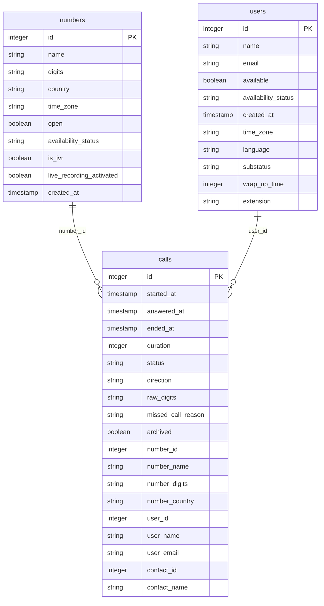

# Aircall


This connector uses the [Aircall API v1](https://developer.aircall.io/api-references/) with API ID + API Token authentication (HTTP Basic Auth). It pulls call center data from your Aircall account.


***

## Overview

The Aircall connector centralizes your telephony data into your data warehouse, covering individual call records, phone line configurations, and agent profiles.

Data is split into two types:

* **Dimension tables** (`numbers`, `users`) — list of phone lines and agents, refreshed on each run using append-only insertion.
* **Call records** (`calls`) — individual call events refreshed with a configurable lookback window using delete-insert.

***

## Prerequisites

* An active **Aircall account** with admin access
* An **API ID** and **API Token** — generate them in your Aircall Dashboard under **Integrations > API Keys**


The API Token is only displayed once at creation time. Store it securely before closing the dialog.


***

## Setup Instructions



**Enter your API credentials**

Provide your **API ID** and **API Token**. Both are available in your Aircall Dashboard under **Integrations > API Keys**.



**Select your Prebuilt reports**

Choose which prebuilt reports to activate. You can enable all reports or select only those relevant to your use case. See the [Prebuilt Reports](#prebuilt-reports) section for a description of each table.



**Name your connector**

Give the connector a unique name within your QUANTI: project, then click **Create**.



***

## Prebuilt Reports

The connector provides **3 prebuilt tables** organized into two groups: call records and directory.

### Data model

<a href="[DBDIAGRAM_URL]" class="button primary" data-icon="table-tree">Prebuilt reports and definition</a>

### Call Records

| Table | Description |
|---|---|
| `calls` | Individual call records filtered by start date. One row per call, with direction (inbound/outbound), status (answered, missed, done, voicemail, blocked), duration, handling agent, phone number, and linked contact. Key: `id`. Refreshed by delete-insert on `started_at`. |

### Directory

| Table | Description |
|---|---|
| `numbers` | All Aircall phone lines configured in the account: name, E.164 number, country, timezone, IVR flag, recording setting, and current availability status. Refreshed on each run (append-only). |
| `users` | All Aircall agents (users): name, email, availability, sub-status, wrap-up time, extension, and timezone. Refreshed on each run (append-only). |

***

<a href="[DBDIAGRAM_URL]" class="button primary" data-icon="table-tree">Prebuilt reports and definition</a>

***

## Scheduling

| Setting | Options |
|---|---|
| **Frequency** | Daily (recommended) or Weekly |
| **Lookback window** | 1, 3, or 5 days (default: 5) |
| **Historical load** | Up to 365 days (3, 6, or 12 month quick options) |


`calls` uses a **delete-insert** strategy on `started_at` to capture any updates to call status or duration within the lookback window. `numbers` and `users` use **append-only** insertion.


***

## Troubleshooting

Authentication error — 401 Unauthorized

Double-check your **API ID** and **API Token**. Both values are available in Aircall Dashboard > Integrations > API Keys. Make sure there are no trailing spaces. If the error persists, regenerate your API key pair — the token is only shown once at creation, so if you've lost it you'll need a new pair.

calls table is missing recent calls

The lookback window controls how far back calls are re-fetched. If calls are appearing in Aircall but not in your warehouse, extend the lookback to 5 days and trigger a manual sync. Calls are indexed by `started_at`, so calls that started outside the window will not be re-fetched.

user_id is null on some call records

`user_id` is null for missed calls where no agent answered. This is expected API behavior — missed calls have no handling agent.

Need help?

Contact QUANTI: support at support@quanti.io or consult our documentation at https://docs.quanti.io

