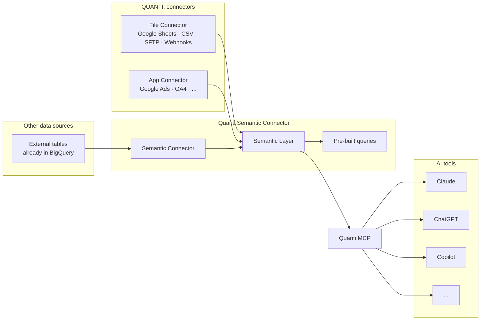

# Semantic Connector

The **Semantic Connector** is a custom connector that lets you expose external tables already present in your BigQuery project to QUANTI:'s Semantic Layer — without moving or syncing any data.

***

## How it fits in the architecture

QUANTI: connectors (File Connectors, App Connectors) feed into the Semantic Layer automatically. The Semantic Connector fills the gap for data that already lives in your BigQuery project but was not loaded by QUANTI: — for example an e-commerce order export, a CRM dataset, a custom analytics table, or any third-party feed loaded outside of QUANTI:.

Once exposed via the Semantic Connector, these external tables become part of the Semantic Layer alongside your QUANTI: data. The Semantic Layer is then made available to the **QUANTI: MCP**, which allows AI tools (Claude, ChatGPT, Copilot and others) to intelligently query and cross-reference your data.

***

## Prerequisites

* A QUANTI: project connected to a BigQuery dataset
* The external tables you want to expose must already exist in that BigQuery project
* You must have the necessary BigQuery permissions to read those tables

***

## Setup

In the QUANTI: app, go to **Custom Connectors**, click **Add custom connector** and select **Semantic Connector** from the list.

* **Connector Name**: Name your connector. It must be unique.
* **Dataset**: Select the BigQuery dataset that contains the external tables you want to expose.

Click **Create** to confirm. The connector is created in a single step — no authentication or scheduling is required.

***

## Adding tables

Once the connector is created, go to the **Reports** tab.

* Click **Add table**
* Select the table you want to expose from the dataset
* Choose the fields to include

You can add multiple tables to the same Semantic Connector, and expose as many fields as needed per table.

***

## Configuring field descriptions

Field descriptions are the most important part of the setup. They tell the MCP what each field means, how it relates to other data, and how it should be used in queries.

Open the **Semantic** panel for any added table and add a description for each field. Good descriptions should cover:

* What the field represents in business terms (e.g. "Net revenue after returns, excluding VAT")
* The unit or format when relevant (e.g. "Amount in euros", "Date in YYYY-MM-DD format")
* Any join keys that link this table to your QUANTI: connector data (e.g. "Can be joined with Meta Ads data on `date` and `country`")

The richer the descriptions, the more accurately the MCP can cross-reference your external data with your QUANTI: connector data.
