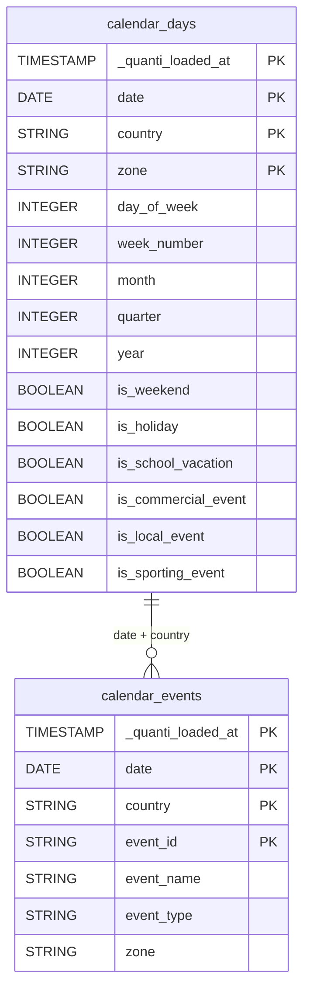

# Calendar

<a href="https://dbdiagram.io/e/6a0c7e16697f99c167b3ae47/6a0c7e2e697f99c167b3afaa" class="button primary" data-icon="table-tree">Prebuilt reports and definition</a>

***

## Overview

The Calendar connector enriches your data warehouse with daily calendar context by country — public holidays, school vacations, commercial events (Black Friday, sales periods), local events, and major sporting events. It is designed to be joined with your marketing and sales data for **marketing mix modeling (MMM)** and seasonality analysis.

No authentication is required. Simply select the countries you want to cover.

***

## Setup instructions



#### Select countries

Choose the countries you want to include. Each selected country generates one row per day in the output tables.

Available countries: **France**, **Germany**, **United Kingdom**, **Spain**, **Italy**, **Belgium**.



#### Select prebuilt reports

Review the available prebuilt reports and select the ones you want to activate.



#### Connector information

* **Connector Name**: Name your connector. It must be unique.
* **Dataset ID**: Define the ID of the dataset. It must not exist yet, as it will be created and data will be sent there.



***

## Prebuilt reports

**calendar\_days**: Daily calendar flags by country and zone. One row per day per country per zone. Each row contains a set of boolean flags indicating the nature of the day — ideal for direct JOIN with marketing data on `date` and `country`. Dimensions: date, country, zone. Additional fields: day\_of\_week, week\_number, month, quarter, year. Flags: is\_weekend, is\_holiday, is\_school\_vacation, is\_commercial\_event, is\_local\_event, is\_sporting\_event.

**calendar\_events**: Detailed calendar events — one row per event per day. Contains the event name, type (holiday, school\_vacation, commercial, local, sporting) and zone. Use for detailed event-level analysis or to join with `calendar_days` for enriched context. Dimensions: date, country, event\_id, event\_name, event\_type, zone.

***

<a href="https://dbdiagram.io/e/6a0c7e16697f99c167b3ae47/6a0c7e2e697f99c167b3afaa" class="button primary" data-icon="table-tree">Prebuilt reports and definition</a>

***

## Notes

* **No authentication required**: The connector uses public data sources — no API key or OAuth is needed.
* **Sync frequency**: Data is refreshed **monthly**. Calendar data is stable by nature — events rarely change once published for the year.
* **Zone dimension**: For some countries, events are regional. In France, the `zone` field maps to school vacation zones (A, B, C). For countries without zones, `zone` contains the country code.
* **Joining with marketing data**: Use `calendar_days` as a dimension table — join on `date` and `country` to enrich any daily performance table with contextual flags.
* **Supported countries**: France, Germany, United Kingdom, Spain, Italy, Belgium. Additional countries can be added upon request.
