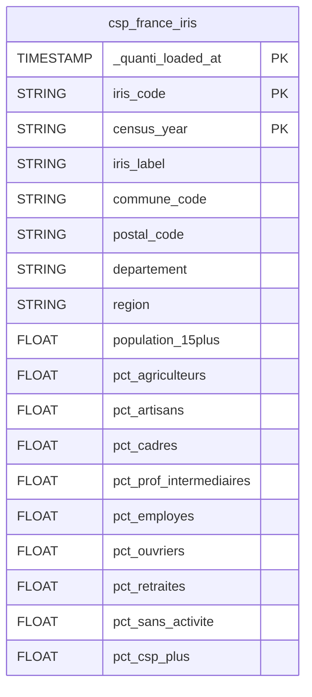

# CSP


This connector is currently in **beta**.


<a href="https://dbdiagram.io/e/6a0c7eb1697f99c167b3b678/6a0c7ec5697f99c167b3b7ba" class="button primary" data-icon="table-tree">Prebuilt reports and definition</a>

***

## Overview

The CSP connector loads socio-professional category (CSP/PCS) distribution data by territory into your data warehouse. It is designed to enrich your customer and order data with socio-demographic context — enabling you to cross-reference postal codes with population profiles to better understand your audience and optimize targeting.

Currently supports **France** at the **IRIS level** (the smallest INSEE geographic unit, corresponding to neighbourhoods of ~2,000 inhabitants).

No authentication is required.

***

## Setup instructions



#### Select country

Select the country for which you want to load CSP data. Currently only **France** is available.



#### Select prebuilt reports

Review the available prebuilt reports and select the ones you want to activate.



#### Connector information

* **Connector Name**: Name your connector. It must be unique.
* **Dataset ID**: Define the ID of the dataset. It must not exist yet, as it will be created and data will be sent there.



***

## Prebuilt reports

**csp\_france\_iris**: Socio-professional category distribution at IRIS level from the French INSEE census. One row per IRIS territory per census year. Includes the postal code of the commune for easy JOIN with order and customer data.

Fields: `iris_code` (9-character code: 5-digit commune + 4-digit IRIS number), `iris_label` (neighbourhood name), `commune_code`, `postal_code`, `departement`, `region`, `census_year`.

Population metrics (percentage of population aged 15+):

| Field | CSP category |
|---|---|
| `pct_agriculteurs` | PCS 1 — Farmers |
| `pct_artisans` | PCS 2 — Craftsmen, shopkeepers, business owners |
| `pct_cadres` | PCS 3 — Executives & senior professionals |
| `pct_prof_intermediaires` | PCS 4 — Intermediate professions |
| `pct_employes` | PCS 5 — Employees |
| `pct_ouvriers` | PCS 6 — Workers |
| `pct_retraites` | PCS 7 — Retirees |
| `pct_sans_activite` | PCS 8 — Inactive persons |
| `pct_csp_plus` | CSP+ aggregate (PCS 2+3+4) |

***

<a href="https://dbdiagram.io/e/6a0c7eb1697f99c167b3b678/6a0c7ec5697f99c167b3b7ba" class="button primary" data-icon="table-tree">Prebuilt reports and definition</a>

***

## Notes

* **No authentication required**: The connector uses public INSEE census data — no API key or OAuth is needed.
* **Sync frequency**: Data is refreshed **monthly**. The underlying census data changes only when INSEE publishes a new census vintage.
* **Full replace sync**: Each sync fully replaces the table — the data is static by nature.
* **Joining with order data**: Use `postal_code` to join `csp_france_iris` with your order or customer tables. Note that one postal code can correspond to multiple IRIS — aggregate CSP metrics across IRIS for a given postal code to get a representative profile.
* **IRIS granularity**: IRIS is the smallest statistical unit in France (~2,000 inhabitants per zone). It provides more precise socio-demographic targeting than postal codes or departments alone.
* **Additional countries**: Only France is currently supported. Other countries may be added in future versions.
