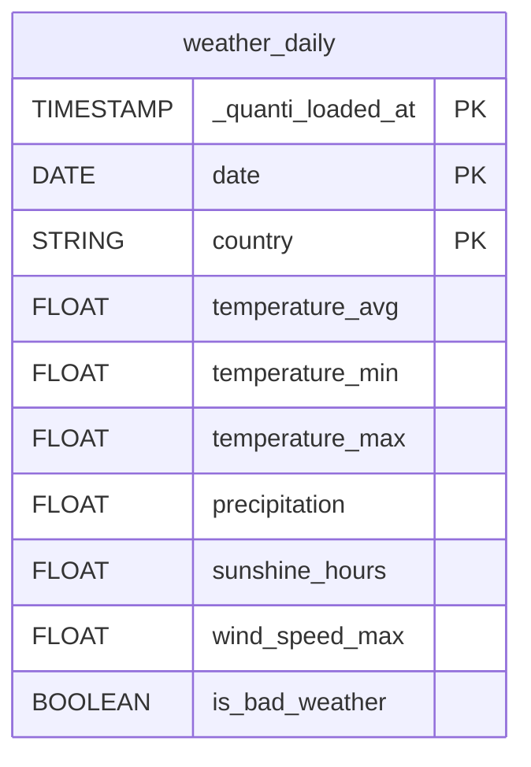

# Weather


This connector is currently in **beta**.


<a href="https://dbdiagram.io/e/6a0c7f169f1f8ec47b538ce9/6a0c7f22697f99c167b3bdab" class="button primary" data-icon="table-tree">Prebuilt reports and definition</a>

***

## Overview

The Weather connector loads daily weather data from [Open-Meteo](https://open-meteo.com) into your data warehouse — temperature, precipitation, sunshine hours, wind speed and a pre-computed bad weather indicator by country. It is designed to be joined with your marketing and sales data for **marketing mix modeling (MMM)** and climate impact analysis.

No authentication is required.

***

## Setup instructions



#### Select countries

Choose the countries for which you want to load weather data. Each selected country generates one row per day in the output table.

Available countries: **France**, **Germany**, **United Kingdom**, **Spain**, **Italy**, **Belgium**.



#### Select prebuilt reports

Review the available prebuilt reports and select the ones you want to activate.



#### Connector information

* **Connector Name**: Name your connector. It must be unique.
* **Dataset ID**: Define the ID of the dataset. It must not exist yet, as it will be created and data will be sent there.



***

## Prebuilt reports

**weather\_daily**: Daily weather metrics by country. One row per day per country — designed for direct JOIN with marketing data on `date` and `country`. Dimensions: date, country. Metrics: temperature\_avg, temperature\_min, temperature\_max (°C), precipitation (mm), sunshine\_hours, wind\_speed\_max (km/h). Also includes `is_bad_weather` — a pre-computed boolean flag set to `true` when at least one of the following conditions is met: precipitation > 10 mm, sunshine < 2 hours, or wind speed > 50 km/h.

***

<a href="https://dbdiagram.io/e/6a0c7f169f1f8ec47b538ce9/6a0c7f22697f99c167b3bdab" class="button primary" data-icon="table-tree">Prebuilt reports and definition</a>

***

## Notes

* **No authentication required**: The connector uses [Open-Meteo](https://open-meteo.com), a free and open weather API — no API key is needed.
* **Sync frequency**: Daily (default) or weekly. Weather data is updated daily as new observations become available.
* **Historical data**: Up to **36 months** of history can be loaded on initial setup, or a custom date range can be defined.
* **`is_bad_weather` flag**: Pre-computed convenience indicator — `true` if precipitation > 10 mm **or** sunshine < 2 hours **or** wind speed > 50 km/h. Useful for quick segmentation in MMM models without manually combining conditions.
* **Geographic aggregation**: Weather data is aggregated at country level using a representative station. For country-level MMM analysis this provides a reliable signal; for highly regional use cases, granularity may be limited.
* **Joining with marketing data**: Join `weather_daily` on `date` and `country` to enrich any daily performance table with climate context.
* **Supported countries**: France, Germany, United Kingdom, Spain, Italy, Belgium. Additional countries can be added upon request.
