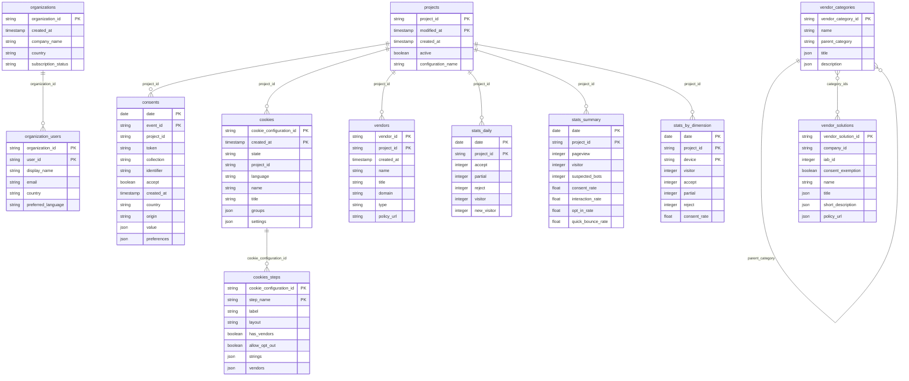

# Axeptio


This connector is currently in **beta**. It uses the [Axeptio API](https://swagger-ui.axeptio.eu/) with API key authentication (Client ID + Client Secret).


***

## Overview

The Axeptio connector pulls consent management data from your Axeptio account into your data warehouse. It covers the full consent lifecycle — individual consent events, banner configurations, vendor catalogs, account structure, and daily analytics.

Data is split into two types:

* **Dimension tables** (SCD Type 2) — capture changes to banner configurations, projects, organizations, vendors, and catalogs over time using append-only insertion.
* **Stats & events tables** — consent events and daily aggregates refreshed with a configurable lookback window using delete-insert.

***

## Prerequisites

* An active **Axeptio account**
* A valid **Client ID** and **Client Secret** (available in your Axeptio account settings)

***

## Setup Instructions



**Enter your API credentials**

Provide your Axeptio **Client ID**, **Client Secret**, and select your **timezone** (used to align consent timestamps with your reporting timezone).



**Select your Projects**

Choose one or more Axeptio projects (websites/apps) to sync. Each selected project will be synchronized independently.



**Select your Prebuilt reports**

Choose which prebuilt reports to activate. You can enable all reports or select only those relevant to your use case. See the [Prebuilt Reports](#prebuilt-reports) section for a description of each table.



**Name your connector**

Give the connector a unique name within your QUANTI: project, then click **Create**.



***

## Prebuilt Reports

The connector provides **12 prebuilt tables** organized into five groups: consent events, banner configuration, account structure, vendor catalog, and daily analytics.

### Data model

<a href="[DBDIAGRAM_URL]" class="button primary" data-icon="table-tree">Prebuilt reports and definition</a>

### Consent Events

| Table | Description |
|---|---|
| `consents` | Individual consent events per project — one row per event. Contains accept/refuse choice, visitor token (pseudonymous), collection type, origin domain, country, and granular preferences. Refreshed daily by delete-insert. |

### Banner Configuration

| Table | Description |
|---|---|
| `cookies` | Cookie consent widget configurations per project — historized on `created_at` (SCD Type 2). Tracks name, state (draft/published), language, groups, strings, and UI settings. |
| `cookies_steps` | Steps of the cookie consent widget — one row per step of a parent `cookies` configuration. Joined to `cookies` on `cookie_configuration_id`. Inherits the same append insert rule. |

### Account Structure

| Table | Description |
|---|---|
| `projects` | Axeptio projects (websites/apps) accessible to the connected account — historized on `modified_at` to track configuration and activation changes over time. |
| `organizations` | Organizations (billing entities) the authenticated user belongs to — historized to track subscription status changes over time. |
| `organization_users` | Users with access to each organization — historized. Useful for access auditing and governance. |

### Vendor Catalog

| Table | Description |
|---|---|
| `vendors` | Custom vendors (third-party trackers) declared manually per project — historized to keep the full change history. Distinct from the global Axeptio catalog. |
| `vendor_categories` | Global catalog of vendor categories used to classify vendor solutions. Hierarchical via `parent_category`. Historized. |
| `vendor_solutions` | Global catalog of Axeptio-referenced vendor solutions, with IAB Global Vendor List ID, consent exemption flag, and multi-language descriptions. Historized. |

### Daily Analytics

Stats tables provide **daily metrics per project**, refreshed by delete-insert on the lookback window.

| Table | Description |
|---|---|
| `stats_daily` | Daily consent volume: accepts, partial consents, refusals, and unique visitors (bots excluded). |
| `stats_summary` | Daily consent KPIs: consent rate, opt-in rate, interaction rate, quick bounce rate, with mobile/desktop split. Also exposes `suspected_bots` (already counted in `visitor`). |
| `stats_by_dimension` | Daily consent stats broken down by device type (desktop, mobile, tablet, smarttv…). Summing devices slightly exceeds the daily total for visitors seen on multiple devices. |


**visitor counts differ between stats tables.** `stats_daily.visitor` **excludes** suspected bots; `stats_summary.visitor` and `stats_by_dimension.visitor` **include** them. Use `stats_summary.visitor - stats_summary.suspected_bots` to get the bot-free figure from `stats_summary`.


***

<a href="[DBDIAGRAM_URL]" class="button primary" data-icon="table-tree">Prebuilt reports and definition</a>

***

## Scheduling

| Setting | Options |
|---|---|
| **Frequency** | Daily (recommended) or Weekly |
| **Lookback window** | 1, 3, 5, 7, 14, 30, or 90 days (default: 5) |
| **Historical load** | Up to 365 days (1, 3, or 6 month quick options) |


Stats and event tables (`consents`, `stats_daily`, `stats_summary`, `stats_by_dimension`) use a **delete-insert** strategy on the lookback window. Dimension tables (`cookies`, `projects`, `organizations`, etc.) use **append-only** insertion — a new row is added each time the record changes.


***

## Troubleshooting

Authentication error on first connection

Double-check that your **Client ID** and **Client Secret** are copied correctly from your Axeptio account settings. Credentials are case-sensitive. If the error persists, regenerate your API credentials in Axeptio and update the connector from its **Settings** tab.

consents table is empty after the first run

The `consents` table requires a `start` and `end` date on the API. On the first run, QUANTI: uses the configured lookback window. If your account has no consent events in that window, the table will be empty. Extend the lookback window or trigger a historical load to pull older data.

organization_users or organizations tables are empty

These tables are user-scoped and only populated if the authenticated account belongs to at least one organization. If you connected with a personal (non-organization) account, these tables will remain empty.

Stats show a discrepancy with the Axeptio dashboard

Axeptio applies late attribution corrections within a short window. Use a lookback of at least 5 days. Also note that `stats_daily.visitor` excludes bots while `stats_summary.visitor` includes them — make sure you are comparing like-for-like figures.

Need help?

Contact QUANTI: support at support@quanti.io or consult our documentation at https://docs.quanti.io

