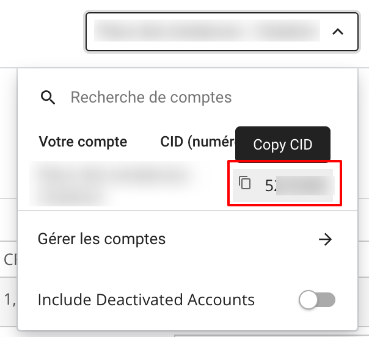

# CJ

***

## <mark style="background-color:blue;">Prerequisites</mark>

To connect CJ to QUANTI, you need an [CJ](https://www.cj.com/?utm_source=quanti.io\&utm_medium=partnership) account.

***

## <mark style="background-color:blue;">Setup instructions</mark>

### Find Advertiser ID

1. Log in to your [CJ account](https://signin.cj.com/login).
2.  In the top-right corner, you can click on a multi-selection field which permit you to pick your different accounts. The advertiser IDs are the CID near each account name.\
    \

    <figure><figcaption>
Access path to find advertiser ID
</figcaption></figure>

3. Make a note of the advertiser ID. You will need it to configure QUANTI:.
4. N.B : With the CJ connector, you will can recover datas from only one advertiser. You have to create several connector if you have several advertiser accounts.

### Find Token

1. To recover the token needed, no other way that to request it to your account manager.
2. Make a note of the API token. You will need it to configure QUANTI:.

### Finish Quanti: configuration

1. In the connector setup form, enter the name of your choice.
2. Enter the advertiser ID you found in Step 1.
3. Enter the token you found in Step 2.
4. Click Save & Test. Quanti: will take it from here and sync your CJ data.

***

## <mark style="background-color:blue;">Pre-built Tables</mark>

* orders : Conversions tables

***

[Pre-built tables and definition ](https://dbdiagram.io/e/68270cd31227bdcb4e9e10aa/68270d411227bdcb4e9e225d):link:
