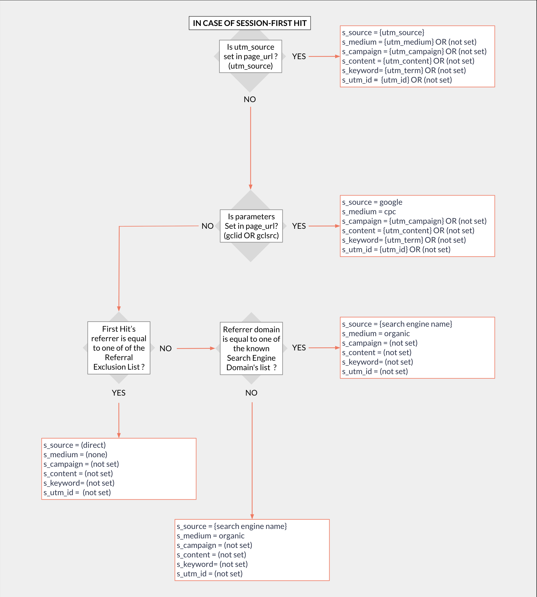

# Google Ads

<a href="https://dbdiagram.io/e/67a6375d263d6cf9a069bf46/67a63980263d6cf9a069f135" class="button primary" data-icon="table-tree">Pre-built tables and definition</a>

***

## Prerequisites

Before connecting Google Ads to QUANTI, ensure you have:

* **Google Ads Account Access**: You need access to a [Google Ads](https://ads.google.com/) account with appropriate permissions
* **Customer ID**: Your Google Ads customer ID (found in the upper right corner of your Google Ads interface)
* **Admin or Standard Access**: Sufficient permissions to authorize third-party applications

### Find Your Customer ID



Log in to your [Google Ads account](https://ads.google.com/nav/login)



In the top right corner of your account, you'll see a 10-digit number (format: XXX-XXX-XXXX)



This is your Google Ads Customer ID - note it down for the setup process



<figure><figcaption></figcaption></figure>

***

## Setup Instructions



#### Authorize Google Connection

* Click on **Connect to Google Ads**
* You will be redirected to Google's authorization page
* Log in with your Google account credentials
* Review and accept the requested permissions to allow QUANTI to access your Google Ads data
* Click **Allow** to grant access



#### Configure Connector

* **Connector Name**: Enter a unique name for this connector (e.g., "Google Ads - Brand Campaign")
* **Dataset ID**: Define the BigQuery dataset ID where data will be stored (will be created automatically if it doesn't exist)
* **Customer ID**: Enter your Google Ads Customer ID (10-digit number without hyphens)



#### Select Accounts

* Review the list of Google Ads accounts accessible with your credentials
* Select the account(s) you want to synchronize
* You can connect multiple accounts by creating separate connectors
* Click **Next**



#### Select Pre-built Tables

* Review the available pre-built tables (see section below for details)
* All tables are selected by default - you can deselect tables you don't need
* Recommended: Keep all tables enabled for comprehensive campaign analysis
* Click **Next**



#### Custom Queries (Optional)

If you need additional data beyond pre-built tables:

* Click **Add Custom Query**
* Enter a **Table Name** for your custom report
* Select the **Report Type** from Google Ads API
* Choose **Fields** to include (refer to [Google Ads API Fields documentation](https://developers.google.com/google-ads/api/fields/v15/overview))
* Configure any **Filters** or **Segments** needed
* Click **Save**
* Repeat for additional custom queries as needed



#### Finish Setup

* Define a sync period and lookback window
* For the first sync, you have the following options:
  * Activate auto-sync for recurring syncs based on your sync settings by clicking the switch button
  * Launch a historical data recovery by choosing your desired dates in the historical data tab
  * Launch a manual sync immediately by clicking the **Sync now** button
* Wait for the sync to complete, then navigate to your data warehouse to verify that tables are populated
* Check the connector dashboard for sync status and any potential errors



***

## Pre-built Tables

### Dimension tables

These tables track the historical evolution of your Google Ads account structure and configuration. They enable audit trails and analysis of how settings changes impact performance over time.

* **Account History**: Account-level configuration and settings including currency, time zone, auto-tagging status, optimization score, and manager account relationships. Tracks whether the account is a test account, payment eligibility status, and URL tracking templates. Essential for multi-account management and configuration audit trails.
* **Campaign History**: Campaign configuration history including status (enabled, paused, removed), serving status, campaign dates, advertising channel type (Search, Display, Video, Shopping, etc.), channel subtypes, optimization scores, experiment settings, payment modes, URL tracking templates, frequency caps, and video brand safety settings. Enables analysis of campaign evolution and A/B test tracking.
* **Ad Group History**: Ad group configuration including status, type (search standard, display standard, etc.), ad rotation mode, optimized targeting settings, display custom bid dimensions, targeting restrictions, URL tracking templates, and experiment base ad group relationships. Tracks how ad group settings change over time for optimization analysis.
* **Ad History**: Individual ad creative history including ad type (text ad, responsive search ad, etc.), status, policy approval and review status, action items for compliance, system-managed ad indicators, device preferences, display URLs, final URLs (desktop, mobile, app), URL suffixes, tracking templates, and URL collections. Critical for creative performance analysis and policy compliance monitoring.
* **Criterion**: Targeting criteria at ad group level including keywords, audiences, placements, topics, and other targeting methods. Contains detailed criterion configuration including type, text, match type (for keywords), bid adjustments, status, quality scores, final URLs, tracking templates, and user list information. Essential for understanding what triggers ad delivery and for optimizing targeting strategies.

### Metric Tables

These are the essential performance tables providing daily metrics at different aggregation levels. They form the foundation for standard campaign performance analysis.

* **Ad Stats**: Daily ad-level advertising performance metrics including impressions, clicks, cost (in micros), conversions, conversion value, interactions, view-through conversions, and Active View metrics (viewable impressions, measurability, viewability percentages). Segmented by device type (desktop, mobile, tablet) and ad network type (Search, Display, YouTube). Essential for analyzing individual ad creative performance and device/network breakdowns. Includes interaction event types to understand engagement patterns.
* **Ad Conversions**: Daily ad-level conversion data broken down by conversion action type. Contains conversion action resource name, category (purchase, lead, signup, etc.), action name, conversion counts, conversion values, all conversions (including cross-device), and view-through conversions. Uses Google Ads platform attribution (default 30-day post-click). Critical for understanding which ads drive specific conversion types and calculating ROI by conversion action. Enables analysis of both online conversion events from Google Ads tags and offline conversions uploaded via offline events.
* **Campaign Stats**: Daily campaign-level performance metrics aggregated across all ad groups and ads. Includes impressions, clicks, cost, conversions, conversion value, interactions, view-through conversions, and Active View metrics. Segmented by device and ad network type. Provides high-level campaign performance overview for quick analysis of campaign delivery, spend tracking, and year-over-year comparisons. Ideal for executive dashboards and campaign-level budget management.
* **Campaign Conversions**: Daily campaign-level conversion metrics broken down by conversion action. Contains the same conversion action details as ad conversions (action name, category, counts, values) but aggregated at campaign level. Enables quick comparison of which campaigns drive the most valuable conversion actions and ROI analysis by campaign. Useful for budget allocation decisions based on conversion performance rather than just clicks or impressions.
* **Search Term Stats**: Actual user search queries that triggered your ads. Contains the exact search terms (not just matched keywords), match type that was used, search term status (added as keyword, excluded, or none), impressions, clicks, cost, conversions, CTR, average CPC, conversion rates, position metrics (absolute top and top impression percentages), and view-through conversions. Critical for search query mining, negative keyword discovery, and understanding user intent vs keyword targeting.
* **Audience Stats**: Performance metrics segmented by audience targeting. Includes audience resource names, user list details, criterion IDs, combined audience information, custom affinity/intent audiences, demographic segments (age, gender, income, parental status), and standard performance metrics. Enables analysis of which audience segments drive the best results and ROI by demographic or behavior-based targeting.
* **Keyword Stats**: Comprehensive keyword-level performance including the keyword text, match type (broad, phrase, exact), approval status, quality score components (quality score, ad relevance, landing page experience, expected CTR), first page CPC estimates, top of page CPC estimates, historical quality scores, search impression share metrics, budget lost impression shares, rank lost impression shares, absolute top impression percentage, top impression percentage, and all standard performance metrics. Essential for keyword optimization, bid management, and quality score improvement.

***

<a href="https://dbdiagram.io/e/67a6375d263d6cf9a069bf46/67a63980263d6cf9a069f135" class="button primary" data-icon="table-tree">Pre-built tables and definition</a>

***

## Troubleshooting

Connection Issues

* Verify that your Google account has proper permissions for the Google Ads account
* Check that the Customer ID is entered correctly (10 digits, no hyphens)
* Ensure your account is not suspended or restricted
* Try disconnecting and reconnecting the Google authorization

Missing Data

* Some metrics may not be available for all campaign types (e.g., Quality Score only applies to Search campaigns)
* Historical data older than 2 years may not be available
* Removed campaigns, ad groups, or ads may not appear in history tables depending on sync settings
* Draft or experiment data may have limited availability

Need Help?

Contact QUANTI support at [support@quanti.io](mailto:support@quanti.io) or consult our comprehensive documentation at [https://docs.quanti.io](https://docs.quanti.io/)

