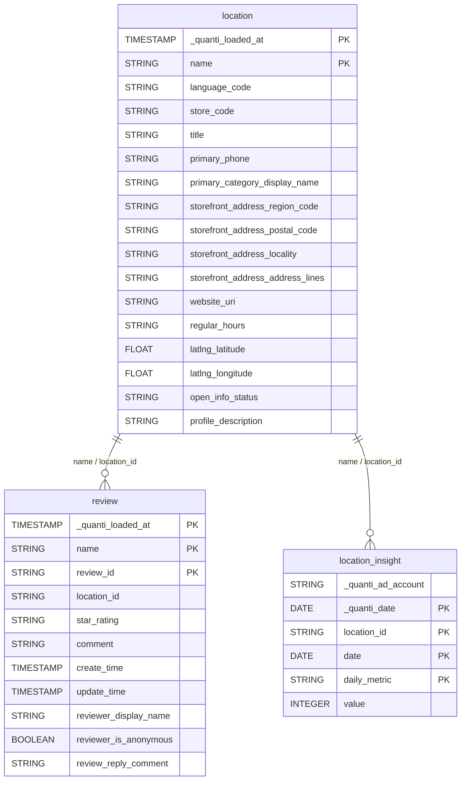

# Google Business Profile

<a href="https://dbdiagram.io/e/6a0c63899f1f8ec47b5182ca/6a0c63e99f1f8ec47b518a1d" class="button primary" data-icon="table-tree">Prebuilt reports and definition</a>

***

## Prerequisites

To connect Google Business Profile to QUANTI, you need:

* A [Google Business Profile](https://business.google.com) account with at least one verified location
* A Google account with **Owner** or **Manager** access to the Business Profile

***

## Setup instructions



#### Authorize your Google account

* Click **Continue with Google**
* You will be redirected to Google's authorization page
* Log in with your Google account credentials
* Review and accept the requested permissions
* You will be redirected back to QUANTI automatically



#### Select your Business Account

Select the Business Account you want to sync. Each Business Account can contain multiple locations.


Only one Business Account can be selected per connector. To sync multiple Business Accounts, create one connector per account.




#### Select prebuilt reports

Review the available prebuilt reports and select the ones you want to activate.



#### Connector information

* **Connector Name**: Name your connector. It must be unique.
* **Dataset ID**: Define the ID of the dataset. It must not exist yet, as it will be created and data will be sent there.



***

## Prebuilt reports

**location**: Business location reference data — address (region, postal code, city, address lines), primary and additional categories, contact details (phone, website), opening hours (regular and special), GPS coordinates, open/closed status, profile description, labels, and service items. One row per location, updated at each sync.

**review**: Customer reviews submitted on Google Maps for each location — star rating (ONE to FIVE), comment text, creation and update timestamps, reviewer display name, anonymity flag, and merchant reply (comment and update time). A new row is inserted at each sync for each review, enabling review history tracking.

**location\_insight**: Daily performance metrics per location and metric type. Each row represents one metric for one location on one day. Dimensions: location\_id, date, daily\_metric. Metric: value.

Available `daily_metric` values include:

* `BUSINESS_IMPRESSIONS_DESKTOP_MAPS` — Impressions on Google Maps (desktop)
* `BUSINESS_IMPRESSIONS_DESKTOP_SEARCH` — Impressions on Google Search (desktop)
* `BUSINESS_IMPRESSIONS_MOBILE_MAPS` — Impressions on Google Maps (mobile)
* `BUSINESS_IMPRESSIONS_MOBILE_SEARCH` — Impressions on Google Search (mobile)
* `BUSINESS_DIRECTION_REQUESTS` — Clicks on "Get directions"
* `CALL_CLICKS` — Clicks on the phone number
* `WEBSITE_CLICKS` — Clicks on the website URL
* `BUSINESS_BOOKINGS` — Bookings made via the profile
* `BUSINESS_FOOD_ORDERS` — Food orders placed via the profile
* `BUSINESS_CONVERSATIONS` — Conversations initiated via the profile

***

<a href="https://dbdiagram.io/e/6a0c63899f1f8ec47b5182ca/6a0c63e99f1f8ec47b518a1d" class="button primary" data-icon="table-tree">Prebuilt reports and definition</a>

***

## Notes

* **Lookback window**: Default lookback is **7 days**. Metrics and reviews are re-synced over the lookback window to capture retroactive updates.
* **Historical data**: Up to **18 months** (540 days) of history can be loaded on initial setup.
* **`location_insight` granularity**: Metrics are stored in a narrow (unpivoted) format — one row per metric per day per location. Use a pivot in your BI tool or a SQL `CASE WHEN` to reshape the data by metric type.
