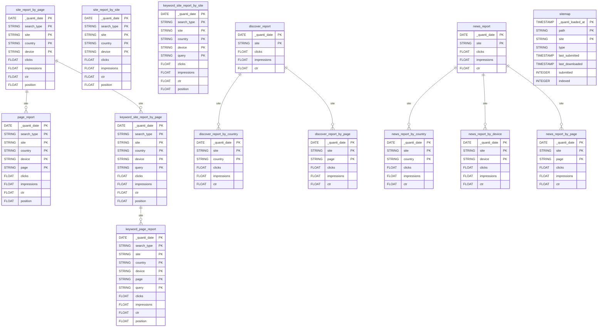

# Google Search Console

<a href="https://dbdiagram.io/e/68555a41f039ec6d36273bf9/685562ddf039ec6d36286cbf" class="button primary" data-icon="table-tree">Prebuilt reports and definition</a>

***

## Prerequisites

To connect Google Search Console to QUANTI, you need access to a [Google Search Console](https://search.google.com/search-console?hl=fr) account with at least one verified property.

***

## Setup Instructions



#### Authorize Google Connection

* Click on **Connect to Google**
* You will be redirected to Google's authorization page
* Log in with your Google account credentials
* Review and accept the requested permissions
* Click **Continue** to grant access



#### Configure Connector

* **Connector Name**: Name your connector. It must be unique.
* **Dataset ID**: Define the ID of the dataset. It must not exist yet, as it will be created and data will be sent there.



#### Select Account(s)

* Choose the Google Search Console property (or properties) you want to sync
* Click **Next**



#### Select Prebuilt reports

* Review the available Prebuilt reports (see section below for details)
* All tables are selected by default — you can deselect tables you don't need
* Click **Next**



#### Finish Setup

* Define a sync period and a lookback window — Click **Save**
* For the first sync, you have the following options:
  * Activate auto-sync for recurring syncs based on your sync settings by clicking the switch button
  * Launch a historical data recovery by choosing your desired dates in the historical data tab
  * Launch a manual sync immediately by clicking the **Sync now** button
* Wait for the sync to complete. Then navigate to your data warehouse to verify that tables are populated
* Check the connector dashboard for sync status and any potential errors



***

## Prebuilt reports

### Search performance

**site\_report\_by\_page** : Site-level search traffic, with metrics aggregated using the `byPage` method. Each record represents one day for a given country, device and search type. Metrics: clicks, impressions, CTR, position.

**site\_report\_by\_site** : Site-level search traffic, with metrics aggregated using the `byProperty` method. Same dimensions as `site_report_by_page`. Metrics: clicks, impressions, CTR, position.


`site_report_by_page` and `site_report_by_site` share the same dimensions but use different aggregation methods (`byPage` vs `byProperty`). Google computes metrics differently between the two — totals may vary slightly for the same date and filters.


**page\_report** : Search traffic per individual page. Each record shows how a specific page appeared in search results on a given day. Dimensions: date, search type, site, country, device, page. Metrics: clicks, impressions, CTR, position.

**keyword\_site\_report\_by\_page** : Keyword-level search traffic at site scope, aggregated by the `byPage` method. Each record shows how the site appeared for a specific search query on a given day. Dimensions: date, search type, site, country, device, query. Metrics: clicks, impressions, CTR, position.

**keyword\_site\_report\_by\_site** : Keyword-level search traffic at site scope, aggregated by the `byProperty` method. Same dimensions as `keyword_site_report_by_page`.


`keyword_site_report_by_page` and `keyword_site_report_by_site` share the same dimensions but use different aggregation methods. The same note on metric discrepancies applies as for the site reports above.


**keyword\_page\_report** : The most granular search table — keyword-level traffic per individual page. Each record shows how a specific page appeared for a specific query on a given day. Dimensions: date, search type, site, country, device, page, query. Metrics: clicks, impressions, CTR, position.

***

### Discover

**discover\_report** : Daily Google Discover performance at site level. Discover is Google's content recommendation feed — this table tracks global engagement on that surface. Dimensions: date, site. Metrics: clicks, impressions, CTR.

**discover\_report\_by\_country** : Google Discover performance broken down by country. Dimensions: date, site, country. Metrics: clicks, impressions, CTR.

**discover\_report\_by\_page** : Google Discover performance broken down by page. Dimensions: date, site, page. Metrics: clicks, impressions, CTR.

***

### News

**news\_report** : Daily Google News performance at site level. Tracks how content appears in the Google News surface. Dimensions: date, site. Metrics: clicks, impressions, CTR.

**news\_report\_by\_country** : Google News performance broken down by country. Dimensions: date, site, country. Metrics: clicks, impressions, CTR.

**news\_report\_by\_device** : Google News performance broken down by device. Dimensions: date, site, device. Metrics: clicks, impressions, CTR.

**news\_report\_by\_page** : Google News performance broken down by page. Dimensions: date, site, page. Metrics: clicks, impressions, CTR.

***

### Sitemap

**sitemap** : Dimension table with sitemap file metadata. Each record represents a sitemap submitted in Google Search Console — path, type, last submission date, last download date, number of submitted URLs and indexed URLs.

***

***

<a href="https://dbdiagram.io/e/68555a41f039ec6d36273bf9/685562ddf039ec6d36286cbf" class="button primary" data-icon="table-tree">Prebuilt reports and definition</a>

***

## Notes

* **Data Availability Delay**: Google Search Console data is typically available with a **2 to 3 day delay**. The most recent days will not be populated immediately after a sync — this is a Google API limitation. It is recommended to configure a **lookback window of at least 3 days** to ensure complete and finalized data is retrieved.
* **No Real-Time or Fresh Data via API**: The Search Analytics API only returns **finalized data**. The "fresh data" available in the Google Search Console web interface (including the 24-hour view) is not exposed through the API and therefore not available in QUANTI.
* **Data May Retroactively Change**: Data for the last few days before finalization can change slightly as Google continues processing. This is expected behavior — the lookback window ensures these days are re-synced and updated automatically.
* **`byPage` vs `byProperty` Aggregation**: Google computes metrics differently depending on the aggregation type. `byPage` and `byProperty` tables for the same date and dimensions may show slightly different numbers for clicks, impressions, and position. Refer to [Google's documentation](https://support.google.com/webmasters/answer/6155685) for details on how each method calculates data.
* **Historical Data Limit**: The Search Analytics API provides data for up to **16 months** of history.
* **API Rate Limits**: Google enforces quotas on API requests. QUANTI automatically manages these limits to ensure reliable data extraction.
