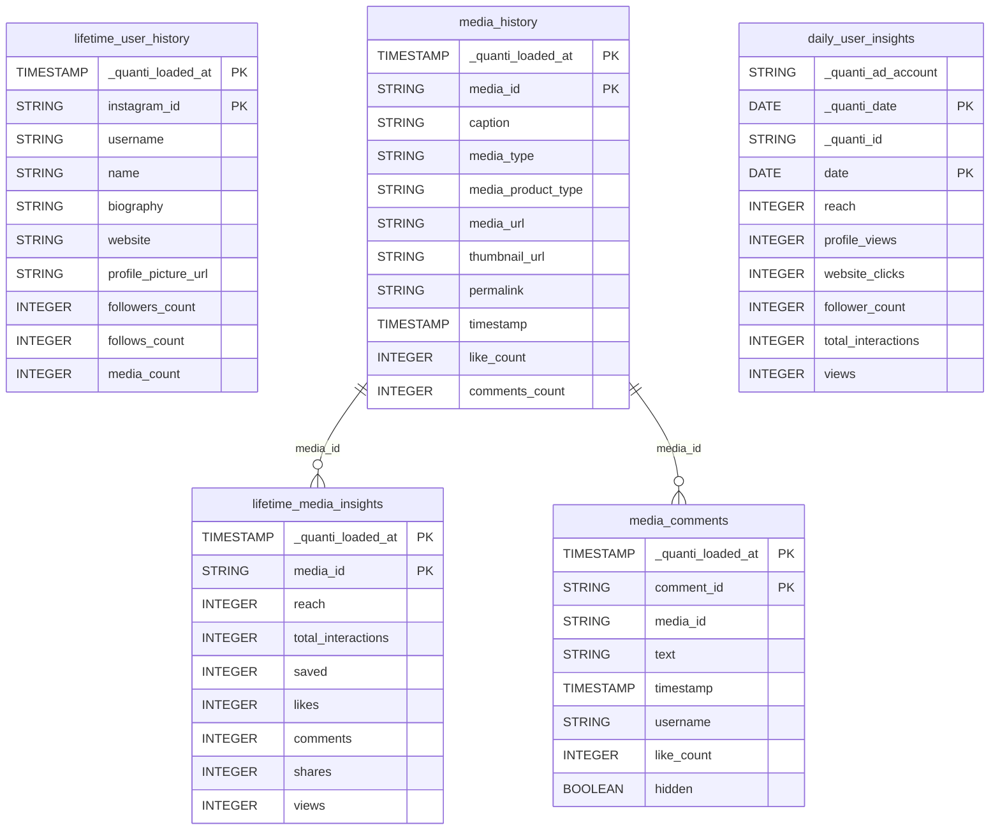

# Instagram Business

<a href="https://dbdiagram.io/e/69443544e4bb1dd3a996a990/69443574e4bb1dd3a996ae40" class="button primary" data-icon="table-tree">Prebuilt reports and definition</a>

***

## Prerequisites

Before connecting Instagram Business to QUANTI, ensure you have:

* **Instagram Business or Creator account**: Your Instagram profile must be converted to a Business or Creator account. Personal accounts are not supported.
* **Facebook Page connection**: Your Instagram account must be linked to a Facebook Page.
* **Facebook Business Manager access**: You need administrator rights on the Facebook Page connected to your Instagram account.
* **Published content**: Your profile should have published media to retrieve media and comment insights.

***

## Setup Instructions



#### Authorize your Facebook connection

* Click **Continue with Facebook** (Instagram Business relies on Facebook's authentication)
* You will be redirected to Facebook's authorization page
* Log in with the Facebook account that manages your Instagram Business Page
* Review and accept the requested permissions for Instagram data access



#### Select your Instagram Business account(s)

* QUANTI lists the Instagram Business accounts linked to the Facebook Pages you manage
* Select the account(s) you want to connect — multiple accounts can be synced through the same connector
* Click **Next**



#### Select pre-built reports

* Review the available pre-built reports (see section below for details)
* All reports are selected by default — deselect any you don't need
* Click **Next**



#### Connector Information

* **Connector Name**: Define a unique name for your connector
* **Dataset ID**: Specify the BigQuery dataset ID where tables will be created
  * The dataset will be created automatically if it doesn't exist
* Click **Next**



#### Finish setup

* Define a sync frequency (daily, weekly, or monthly) and a lookback window (1, 3, 5, 7, 14, or 30 days — default 7 days)
* For the first sync, you have the following options:
  * Activate auto-sync for recurring syncs by clicking the switch button
  * Launch a historical data recovery — quick options of 3, 6, or 12 months, or a custom date range up to 730 days
  * Launch a manual sync immediately by clicking **Sync now**
* Wait for the sync to complete, then check your data warehouse to verify that tables are populated



***

## Pre-built reports

* **lifetime\_user\_history**: Account profile and follower snapshot. Dimensions: instagram\_id, username, name, biography, website, profile\_picture\_url. Metrics: followers\_count, follows\_count, media\_count.
* **media\_history**: History of published media with metadata. Dimensions: media\_id, caption, media\_type (IMAGE, VIDEO, CAROUSEL\_ALBUM), media\_product\_type (FEED, REELS), media\_url, thumbnail\_url, permalink, timestamp. Metrics: like\_count, comments\_count.
* **lifetime\_media\_insights**: Lifetime engagement metrics for each media item. Dimension: media\_id. Metrics: reach, total\_interactions, saved, likes, comments, shares, views.
* **daily\_user\_insights**: Daily account-level insights, one row per day. Dimension: date. Metrics: reach, profile\_views, website\_clicks, follower\_count, total\_interactions, views.
* **media\_comments**: Comments collected on published media. Dimensions: comment\_id, media\_id, text, timestamp, username, hidden. Metric: like\_count.

***

***

<a href="https://dbdiagram.io/e/69443544e4bb1dd3a996a990/69443574e4bb1dd3a996ae40" class="button primary" data-icon="table-tree">Prebuilt reports and definition</a>

***

## Notes

* **Data refresh**: Syncs run daily (default), weekly, or monthly, with a default lookback window of 7 days to capture retroactive metric adjustments.
* **Historical data**: Historical recovery is available up to **730 days** (~24 months). Media insights are only retrievable for media published within the last 2 years, per Instagram Graph API limitations.
* **`views` metric**: Since April 21, 2025, Instagram consolidated `impressions`, `plays`, and `video_views` into a single `views` metric, available for FEED, REELS, and STORY media. `impressions` and `video_views` are no longer collected as they are deprecated on the Graph API.
* **`total_interactions`**: Replaces the deprecated `engagement` metric and aggregates likes, comments, saves, and shares.
* **Metric delay**: Some insights can take up to 48 hours to become available via the Instagram Graph API.
* **Timestamps**: Timestamps returned by the API are normalized to RFC3339 format (e.g. `2024-11-15T10:30:00Z`).
* **Custom reports**: This connector does not support custom queries. Only the pre-built reports above are available.

***

## Troubleshooting

Connection Issues

* Verify that your Instagram account is converted to a Business or Creator account
* Ensure your Instagram account is properly linked to a Facebook Page
* Check that you have administrator rights on the Facebook Page connected to your Instagram account
* Verify that API permissions haven't been revoked in your Facebook account settings

Missing Data

* Media insights are only available for media published within the last 2 years
* Historical recovery beyond 730 days is not supported by the Instagram Graph API
* `impressions` and `video_views` are deprecated and will not appear in any table — use `reach` and `views` instead
* Some metrics may take up to 48 hours to appear after publication

Need Help?

Contact QUANTI support at [support@quanti.io](mailto:support@quanti.io) or consult our comprehensive documentation at [https://docs.quanti.io](https://docs.quanti.io/)

