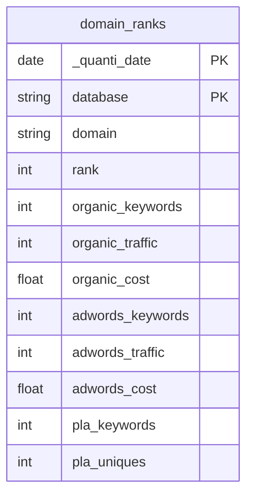
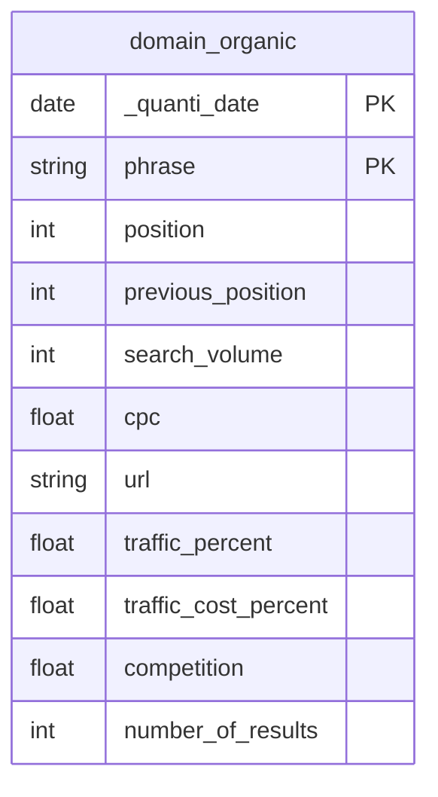
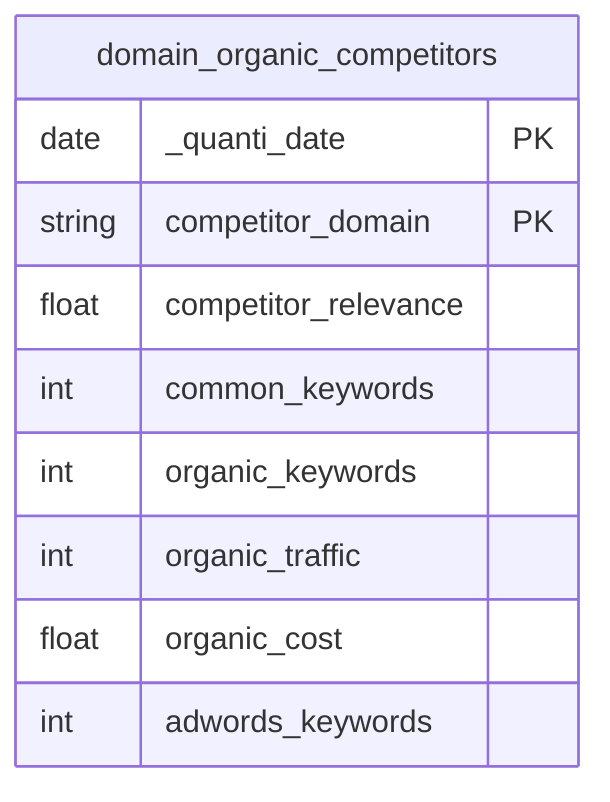

# Semrush


The Semrush connector is currently in **beta**. Reach out to your CSM to enable it for your project.


## Overview

The Semrush connector retrieves SEO visibility data from the [Semrush Analytics API](https://developer.semrush.com/api/): organic keyword rankings, traffic estimates, and competitor analysis — scoped to a single domain.

## Prerequisites

Before setting up the Semrush connector, ensure you have:

* A **Semrush account** with API access enabled
* Your **Semrush API key** — available from _Subscription info → API units_ in your Semrush dashboard
* The **domain to analyze** (without protocol, e.g. `example.com`)

## Setup Instructions



**Authorize your Semrush Connection**

Enter your Semrush credentials to allow QUANTI: to query the API on your behalf:

* **API Key**: Your Semrush API key — found in _Subscription info → API units_
* **Domain**: The domain to analyze, without protocol (e.g. `example.com`) — all reports are scoped to this domain
* **Regional database** _(optional)_: The Semrush regional database code for single-database reports (e.g. `us`, `fr`, `uk` — default: `us`)

Click **Next**



**Choose Reports**

Select the Semrush reports to sync into BigQuery:

* **Domain Overview (All Databases)** — daily visibility snapshot across all regional databases
* **Organic Search Keywords** — daily keyword ranking report with positions, search volume and traffic share
* **Organic Competitors** — daily competitive landscape with shared keywords and traffic estimates


You can activate multiple reports in a single connector. Each report creates its own BigQuery table.


Click **Next**



**Finish Setup**

* Define your connector name and BigQuery dataset
* Save your sync settings
* You can now activate auto-sync or launch a first sync manually



## Data Schema

[View schema on dbdiagram.io](https://dbdiagram.io/e/6a905637698f76ad5cd2a902/6a905647698f76ad5cd2a9d7)

### Domain Overview — `domain_ranks`

Daily snapshot of a domain's Semrush visibility across all regional databases: rank, organic and paid keywords, traffic and cost.

### Organic Search Keywords — `domain_organic`

Daily snapshot of the keywords a domain ranks for in Google's top organic results, with position, search volume, CPC and traffic share.

### Organic Competitors — `domain_organic_competitors`

Daily snapshot of domains competing in organic search, with relevance score and shared keywords.

## Scheduling

* **Frequency**: Daily or Weekly (Daily recommended for tracking position changes)
* **Lookback window**: 1, 3, 5, 7, 14, or 30 days (default: 7 days)
* **Historical data**: Up to 3 years — load by 3, 6, or 12-month increments, or with a custom date range

## Notes

* **One domain per connector**: Each connector instance analyzes a single domain. Create multiple connectors to monitor several domains.
* **API unit consumption**: Each sync consumes Semrush API units. Monitor your usage in _Subscription info → API units_.
* **Regional database**: The `database` field in `domain_ranks` indicates which Semrush regional database the row belongs to. The optional credential restricts single-database reports to a specific region; if left empty, `us` is used.
* **Display limit**: Organic keywords and competitors reports return up to 1,000 rows per sync date.

## Troubleshooting

Authentication error / Invalid API key

* Verify your API key is correct and active in your Semrush account
* Ensure your Semrush subscription includes API access (API units must be > 0)

No data returned

* Check that the domain is entered without protocol (`example.com`, not `https://example.com`)
* Verify the domain exists in the selected Semrush regional database
* Ensure your Semrush plan includes access to the requested report type

Need Help?

Contact QUANTI: support at support@quanti.io or consult our documentation at https://docs.quanti.io

