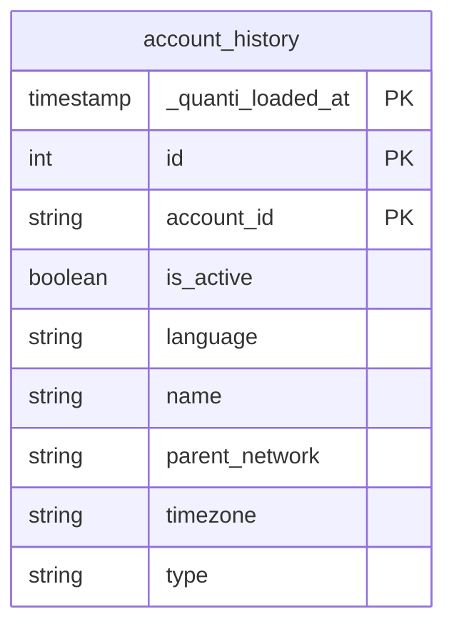
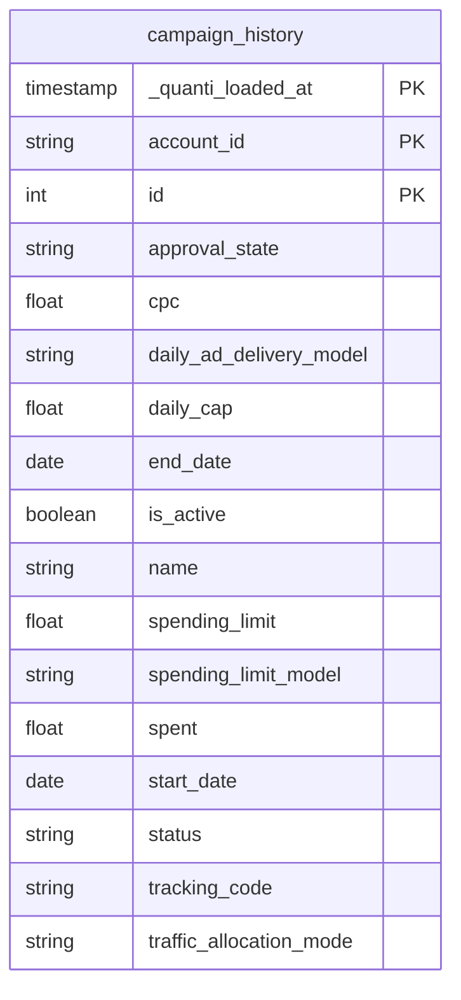
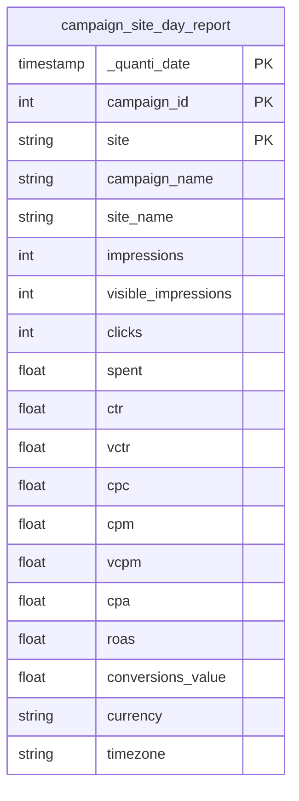
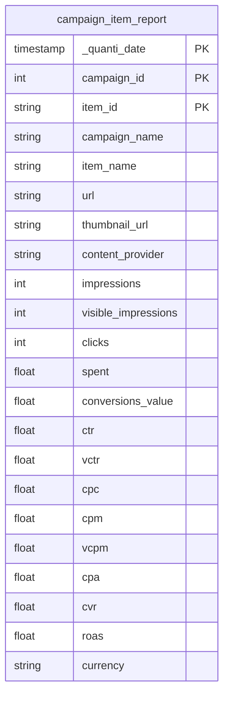
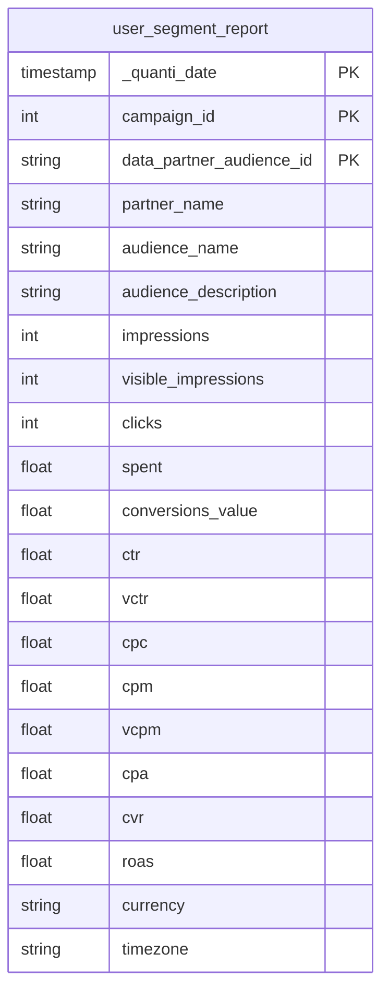

# Taboola

<a href="https://dbdiagram.io/e/68d2990c7c85fb9961f96134/68d299e47c85fb9961f98ba6" class="button primary" data-icon="table-tree">Prebuilt reports and definition  </a>

***

## <mark style="background-color:blue;">Prerequisites</mark>

To connect Taboola to Quanti:, you need to access a [Taboola](https://authentication.taboola.com/authentication/login) account as well as a Client ID and Secret ID, which are only available by contacting your Taboola Account Manager.

***

## <mark style="background-color:blue;">Setup instructions</mark>

1. Connect your Taboola account to permit Quanti: to access to your data
2. Connector information
   1. Connector Name : Name your connector. It must be unique.
   2. Dataset ID : Define the ID of the dataset. It must not exist yet, as it will be created and data will be sent there.
3. Select accounts to sync.
4. Select queries: You can select pre-built queries you want to sync.

***

## <mark style="background-color:blue;">Prebuilt reports</mark>

* **account\_history**: Contains historical records of advertising accounts, including their configurations and activity status.
* **campaign\_history**: Tracks the lifecycle and setup of advertising campaigns over time.
* **campaign\_site\_day\_report**: Provides daily performance insights for campaigns across different sites and time periods.
* **campaign\_item\_report**: Daily performance by promoted item (article), including destination URL, thumbnail and content provider.
* **user\_segment\_report**: Daily campaign performance broken down by 3rd party audience segment (Marketplace Audiences).

***

## <mark style="background-color:blue;">Data Schema</mark>

### Dimensions

#### `account_history`

#### `campaign_history`

### Reports

#### `campaign_site_day_report`

#### `campaign_item_report`

#### `user_segment_report`

***

<a href="https://dbdiagram.io/e/68d2990c7c85fb9961f96134/68d299e47c85fb9961f98ba6" class="button primary" data-icon="table-tree">Prebuilt reports and definition  </a>
