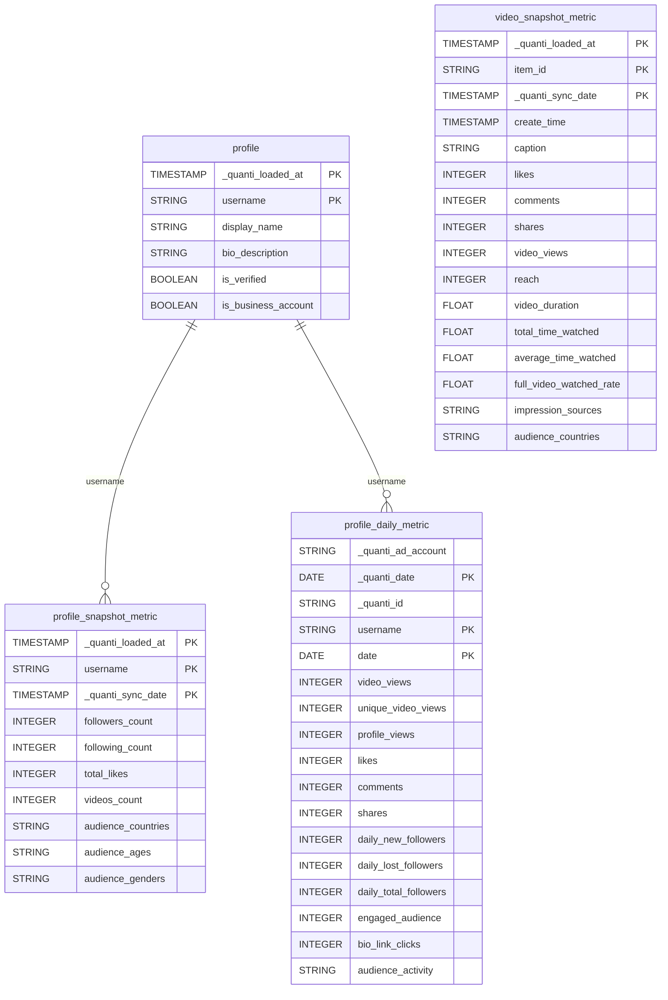

# TikTok Organic

<a href="https://dbdiagram.io/e/69bd5d7d78c6c4bc7a302be3/69bd5ddefb2db18e3bcabd49" class="button primary" data-icon="table-tree">Prebuilt reports and definition</a>

***

## Prerequisites

Before connecting TikTok Organic to QUANTI, ensure you have:

* **TikTok Business account**: Your TikTok profile must be a Business account. Personal and Creator accounts are not supported.
  * To convert: open the TikTok app → Settings → Manage account → Switch to Professional account → Business
* **Single account per connector**: TikTok's API only allows one Business account per connector. To sync multiple accounts, create one connector per account.

***

## Setup Instructions



#### Authorize your TikTok Business account

* Click **Continue with TikTok Business**
* You will be redirected to TikTok's authorization page
* Log in with your TikTok Business account credentials
* Review and approve the requested permissions
* You will be redirected back to QUANTI automatically


Make sure you log in with a **TikTok Business** account. If your account is not a Business account, you will see an error. You can convert your account in the TikTok app under Settings → Manage account → Switch to Professional account → Business.




#### Confirm your account

* QUANTI displays the details of the authenticated account: display name, username, avatar, and account type
* Verify this is the correct account and click **Continue**


Only one TikTok Business account can be connected per connector. To sync a different account, create a new connector.




#### Select pre-built reports

* Review the available pre-built reports (see section below for details)
* All reports are selected by default — deselect any you don't need
* At least one report must be selected to continue
* Click **Continue**



#### Connector Information

* **Connector Name**: A unique name for this connector (default: `TikTok Organic - {display_name}`)
* **Dataset ID**: The BigQuery dataset ID where tables will be created (default: `tiktokorganic_{username}`)
  * Must be lowercase, start with a letter, and use only letters, numbers, and underscores
  * The dataset will be created automatically if it doesn't exist
* Click **Save** to create the connector



#### Finish setup

* For the first sync, you have the following options:
  * Activate auto-sync for recurring syncs (daily or weekly) by clicking the switch button
  * Launch a historical data recovery — maximum **60 days** of history available
  * Launch a manual sync immediately by clicking the **Sync now** button
* Wait for the sync to complete. Then navigate to your data warehouse to verify that tables are populated



***

## Prebuilt reports

### Profile

**profile**: Account profile attributes — static descriptive data about the TikTok Business account. One row per account, updated at each sync. Dimensions: username. Fields: display\_name, bio\_description, profile\_image, profile\_deep\_link, is\_verified, is\_business\_account.

**profile\_snapshot\_metric**: Cumulative account metrics captured at each sync time — a new row is inserted at every sync to historize the evolution of account KPIs. Dimensions: username, \_quanti\_sync\_date. Metrics: followers\_count, following\_count, total\_likes, videos\_count. Also includes audience demographics as JSON arrays: audience\_countries, audience\_cities, audience\_ages, audience\_genders.

**profile\_daily\_metric**: Daily engagement metrics at account level. Each row represents one day for one account. Dimensions: username, date. Metrics: video\_views, unique\_video\_views, profile\_views, likes, comments, shares, daily\_new\_followers, daily\_lost\_followers, daily\_total\_followers, engaged\_audience, bio\_link\_clicks. Business-only metrics (populated only for accounts with a configured business profile): phone\_number\_clicks, lead\_submissions, app\_download\_clicks, email\_clicks, address\_clicks. Also includes audience\_activity (hourly follower activity, stored as JSON array).

***

### Video

**video\_snapshot\_metric**: Video-level metrics captured at each sync time — a new row is inserted per video at every sync to track the evolution of engagement over time. Dimensions: item\_id, \_quanti\_sync\_date. Fields: create\_time, caption, thumbnail\_url, embed\_url, share\_url. Lifetime cumulative metrics: likes, comments, shares, video\_views, reach, video\_duration, total\_time\_watched, average\_time\_watched, full\_video\_watched\_rate. Also includes impression\_sources and audience\_countries (stored as JSON arrays).

***

***

<a href="https://dbdiagram.io/e/69bd5d7d78c6c4bc7a302be3/69bd5ddefb2db18e3bcabd49" class="button primary" data-icon="table-tree">Prebuilt reports and definition</a>

***

## Notes

* **Data refresh**: Syncs run daily (default at 3:00 AM) or weekly. The default lookback window is 5 days to capture retroactive metric adjustments.
* **Historical data**: Historical recovery is limited to a maximum of **60 days**.
* **Metric delay**: Some metrics may have a delay of 24 to 48 hours before being available via TikTok's API.
* **Token management**: TikTok Business API issues long-lived tokens that do not expire automatically. Tokens can be revoked manually by the user in TikTok → Settings → Security → Third-party apps. If a token is revoked, you will need to reconnect the connector.
* **Business-only metrics**: Fields such as `phone_number_clicks`, `lead_submissions`, `app_download_clicks`, `email_clicks`, and `address_clicks` in `profile_daily_metric` are only populated for accounts registered as a TikTok Business account with a configured business profile.
* **Custom reports**: This connector does not support custom queries. Only the pre-built reports above are available.

***

## Troubleshooting

Connection Issues

* Verify that your TikTok account is a Business account (not a Creator or Personal account)
* To convert: TikTok app → Settings → Manage account → Switch to Professional account → Business
* If you see an "Unverified app" warning during authorization, this is expected — click **Continue** to proceed
* If the connection fails, check that you have not revoked the app's permissions in TikTok Settings → Security → Third-party apps

Missing Data

* Historical data is limited to the last 60 days — data older than that cannot be recovered
* Some metrics may not be available immediately after publication (24–48 hour delay)
* Business-only metrics (phone clicks, leads, etc.) will be empty if your account does not have a configured business profile
* The `video_snapshot_metric` table only contains videos that were public at the time of the sync

Need Help?

Contact QUANTI support at [support@quanti.io](mailto:support@quanti.io) or consult our comprehensive documentation at [https://docs.quanti.io](https://docs.quanti.io/)

