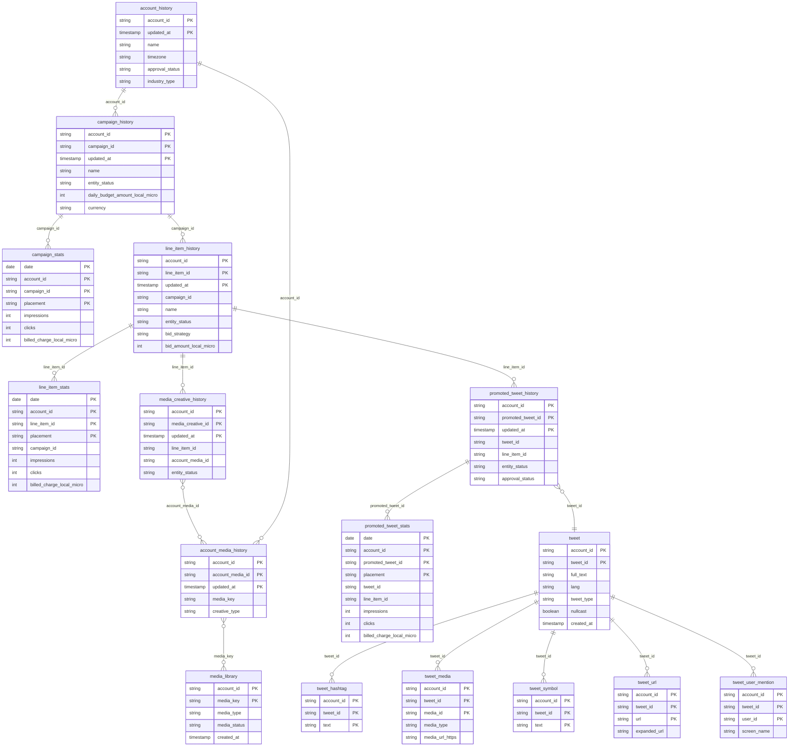

# X Ads


This connector is currently in **beta**. It uses the [X Ads API v12](https://developer.x.com/en/docs/x-ads-api) via OAuth 1.0a.


<a href="https://dbdiagram.io/e/6a9ab9a550ad2c46dc403b31/6a9ab9b95450bea1beef25a1" class="button primary" data-icon="table-tree">Prebuilt reports and definition</a>

***

## Overview

The X Ads connector pulls campaign management data and performance analytics from your X Ads account into your data warehouse. It covers the full advertising hierarchy — from account configuration down to individual promoted tweets — along with tweet content and media assets.

Data is split into two types:

* **History tables** (SCD Type 2) — capture every change to campaigns, ad groups, creatives and account settings over time by appending a new row whenever `updated_at` changes.
* **Stats tables** — daily performance metrics at campaign, line item, and promoted tweet level, refreshed with a configurable lookback window.

***

## Prerequisites

* An active **X Ads account**
* Access to the account as **Account Admin** or higher

No developer app or API keys are required — authentication is handled via OAuth 1.0a directly in the setup flow.

***

## Setup Instructions



**Connect your X account**

Click **Connect with X** and authorize QUANTI: to access your X Ads account. You will be redirected to X to approve the connection, then returned to QUANTI:.



**Select your Ad Accounts**

Choose one or more X Ads accounts to sync. Each selected account will be synchronized independently.



**Select your Prebuilt reports**

Choose which prebuilt reports to activate. You can enable all reports or select only those relevant to your use case. See the [Prebuilt Reports](#prebuilt-reports) section for a description of each table.



**Name your connector**

Give the connector a unique name within your QUANTI: project, then click **Create**.



***

## Prebuilt Reports

The connector provides **16 prebuilt tables** organized into four groups: account & media, campaign structure, performance metrics, and tweet content.

### Data model

👉 [Open interactive diagram on dbdiagram.io](https://dbdiagram.io/e/6a9ab9a550ad2c46dc403b31/6a9ab9b95450bea1beef25a1)

### Account & Media

| Table | Description |
|---|---|
| `account_history` | Account settings and configuration — SCD Type 2 on `updated_at`. Tracks name, timezone, approval status, and industry type. |
| `account_media_history` | Account-level media assets (preroll/interstitial) — SCD Type 2 on `updated_at`. |
| `media_library` | Catalog of all media assets (images, videos, GIFs) in the account, refreshed on each run. Joinable to tweets and creatives via `media_key`. |

### Campaign Structure

| Table | Description |
|---|---|
| `campaign_history` | Campaign settings, budget, and status — SCD Type 2 on `updated_at`. Tracks budget changes, pauses, and schedule edits. |
| `line_item_history` | Ad group targeting, bidding, and status — SCD Type 2 on `updated_at`. Includes bid strategy, placements, and objective. |
| `media_creative_history` | Associations between line items and account media assets — SCD Type 2 on `updated_at`. |
| `promoted_tweet_history` | Promoted tweet associations and their serving/approval status — SCD Type 2 on `updated_at`. |

### Performance Metrics

Stats tables provide **daily metrics** segmented by `placement` (`ALL_ON_TWITTER` or `PUBLISHER_NETWORK`).

| Table | Description |
|---|---|
| `campaign_stats` | Daily metrics at campaign level. Key: `date` + `account_id` + `campaign_id` + `placement`. |
| `line_item_stats` | Daily metrics at ad group level. Key: `date` + `account_id` + `line_item_id` + `placement`. |
| `promoted_tweet_stats` | Daily metrics at promoted tweet level. Key: `date` + `account_id` + `promoted_tweet_id` + `placement`. |

All stats tables share the same metric set:

| Metric | Description |
|---|---|
| `impressions` | Number of times the ad was displayed |
| `engagements` | Total interactions |
| `clicks` | Total clicks |
| `url_clicks` | Clicks on URLs in the ad |
| `card_engagements` | Interactions with the attached card |
| `likes` | Number of likes |
| `replies` | Number of replies |
| `retweets` | Number of retweets |
| `follows` | New followers gained from the ad |
| `profile_visits` | Visits to the advertiser's profile |
| `hashtag_clicks` | Clicks on hashtags in the ad |
| `billed_engagements` | Billable engagement actions |
| `billed_charge_local_micro` | Total spend in local currency (micros — divide by 1,000,000 to get the actual amount) |
| `video_total_views` | MRC video views (≥50% in-view for 2s) |
| `video_3s100pct_views` | 100% in-view views lasting ≥3s |
| `video_views_25` / `_50` / `_75` / `_100` | Views reaching 25%, 50%, 75%, 100% completion |
| `video_content_starts` | Times video content started |
| `video_6s_views` | Views lasting ≥6s |

### Tweet Content

| Table | Description |
|---|---|
| `tweet` | Content and metadata of all tweets (organic and promoted). Entities are denormalized into child tables. |
| `tweet_hashtag` | Hashtags extracted from tweet entities — one row per hashtag per tweet. |
| `tweet_media` | Media assets attached to tweets — one row per media per tweet. |
| `tweet_symbol` | Cashtags extracted from tweet entities — one row per cashtag per tweet. |
| `tweet_url` | URLs extracted from tweet entities — one row per URL per tweet. |
| `tweet_user_mention` | User mentions extracted from tweet entities — one row per mention per tweet. |

***

<a href="https://dbdiagram.io/e/6a9ab9a550ad2c46dc403b31/6a9ab9b95450bea1beef25a1" class="button primary" data-icon="table-tree">Prebuilt reports and definition</a>

***

## Scheduling

| Setting | Options |
|---|---|
| **Frequency** | Daily (recommended) or Weekly |
| **Lookback window** | 1, 3, 7, 14, or 30 days |
| **Historical load** | Up to 730 days (≈2 years) |


Stats tables use a **delete-insert** strategy on the lookback window: each run deletes and reloads the selected period to account for delayed reporting from X. History (dimension) tables use **append-only** insertion based on `updated_at`.


***

## Troubleshooting

OAuth authorization fails or expires

X OAuth 1.0a tokens do not expire automatically, but they can be revoked by the user or by X (e.g. after a password change). If the connector reports an authentication error, reconnect your X account from the connector's **Settings** tab.

Some prebuilt tables are empty after the first run

Certain tables (e.g. `tweet_hashtag`, `tweet_symbol`) only contain data if the corresponding entities exist in your promoted tweets. An empty table for a newly connected account is expected if no such content has been promoted.

Stats show a discrepancy with the X Ads interface

X applies late attribution corrections within a 30-day window. Use a lookback of at least 7 days to capture these adjustments. For month-over-month comparisons, a 30-day lookback is recommended.

Need help?

Contact QUANTI: support at support@quanti.io or consult our documentation at https://docs.quanti.io

