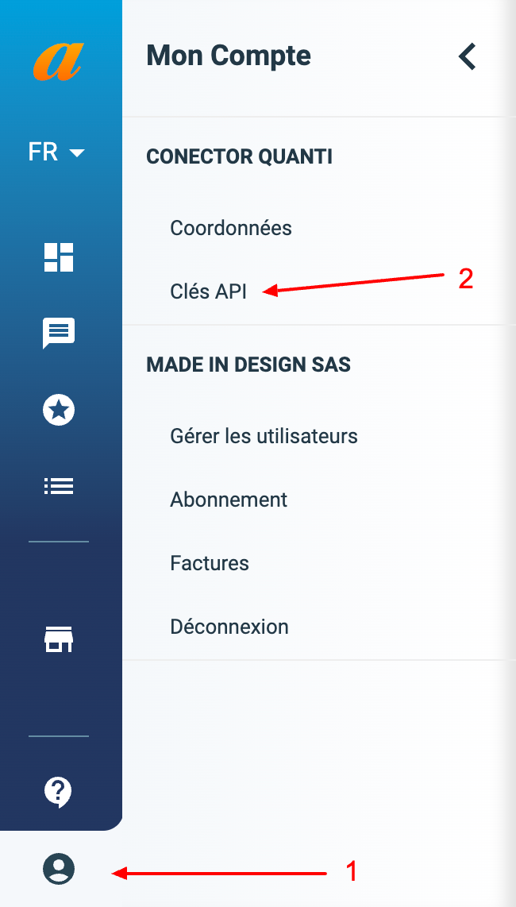

# Affilae

***

## <mark style="background-color:blue;">Prerequisites</mark>

To connect Affilae to QUANTI:, you need an [Affilae](https://affilae.com/fr/logiciel-affiliation/?utm_source=quanti.io\&utm_medium=partnership) account.

***

## <mark style="background-color:blue;">Setup instructions</mark>

### Find API key

1. Log in to your [Affilae account](https://app.affilae.com/fr/login).
2.  In the bottom-left corner, click on "**My account**", then select "**API keys**".\
    \

    <figure><figcaption>
Access path to API key on Affilae interface
</figcaption></figure>

3. You'll find in this section your API key. If the permission level is not appropriated, please make a request to your account manager.
4. keep your API key to finish your configuration in QUANTI:.

### Connector configuration

1. In the connector setup form, enter the **name** of your choice.
2. Enter the **API key** found in Step 1.
3. Click on "**Save & Test**"

***

## <mark style="background-color:blue;">Pre-built Tables</mark>

* **partnerships\_history**: Contains details about advertiser-publisher partnerships, including affiliate profiles, programs, tracking, and status information.
* **commissions**: Records performance metrics for partnerships such as clicks, conversions, commissions, impressions, and revenue by date and affiliate profile.

***

[Pre-built tables and definition ](https://dbdiagram.io/e/682704361227bdcb4e9c9d5b/6827045e1227bdcb4e9ca579):link:


<a href="https://dbdiagram.io/e/682704361227bdcb4e9c9d5b/6827045e1227bdcb4e9ca579" class="button primary" data-icon="table-tree">Pre-built tables and definition  </a>


