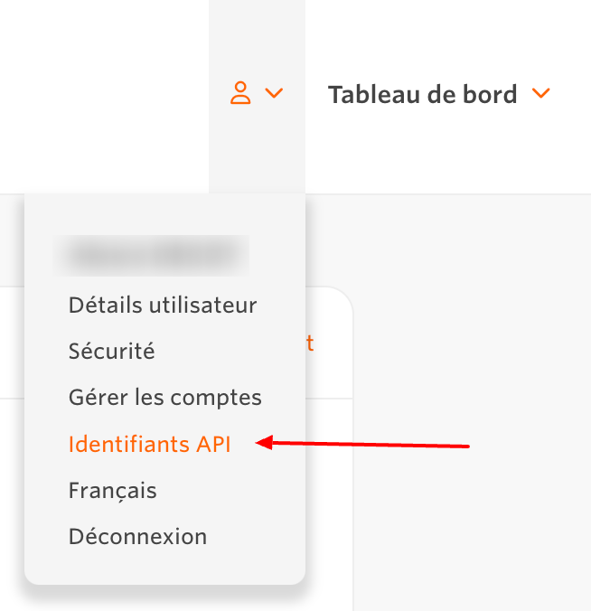
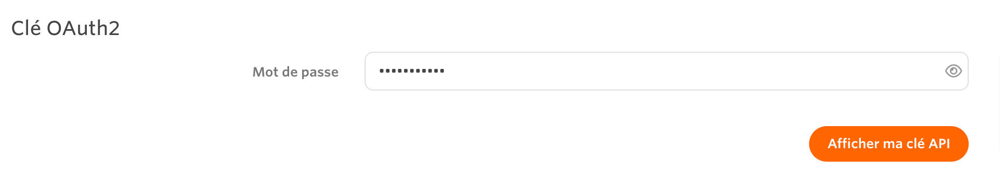
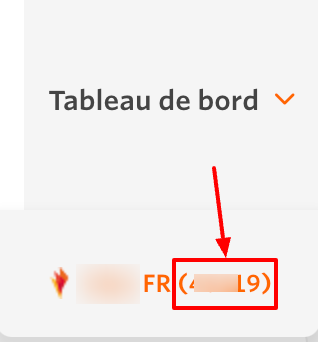

# Awin

***

## <mark style="background-color:blue;">Prerequisites</mark>

To connect Awin to QUANTI, you need an [Awin](https://www.awin.com/fr?utm_source=quanti.io\&utm_medium=partnership) account with API access.

***

## <mark style="background-color:blue;">Setup instructions</mark>

### Find API token

1. Log in to your [Awin account](https://www.awin.com/fr?utm_source=quanti.io\&utm_medium=partnership\&utm_campaign=awin_connector).
2.  In the top-right corner, click your profile name, then select API Credentials.\
    \

    <figure><figcaption>
Access path to API key on Awin interface
</figcaption></figure>

3. In the **Password** field, enter your login password.
4.  Click on  "**Show my API token**"\
    \

    <figure><figcaption></figcaption></figure>

5. Keep and save your API token. It'll be needed to configure your connector in QUANTI:

### Find Advertiser ID

1. In the top-right corner, when you hover Dashboard tab, you can see the list of your accounts
2.  Numbers between brackets are your advertiser IDs needed.\
    \

    <figure><figcaption>
Access path to find Advertiser ID
</figcaption></figure>

3. Make sure to keep the **Advertiser ID** safe, as it’s required to set up your connector in QUANTI:.

### Finish Quanti: configuration

1. In the connector setup form, enter the name of your choice.
2. Enter the API token you found in Step 1.
3. Enter your advertiser IDs you found in Step 2. You can add all of your ids seperated by commas.
4. Click Save & Test. Quanti: will take it from here and sync your Awin data.

***

## <mark style="background-color:blue;">Pre-built Tables</mark>

* **transactions\_import :** Detailed transaction records with commission and sale data.
* **stats\_by\_creative\_import :** Statistics summarized by creative assets.
* **stats\_by\_publisher\_import :** Statistics summarized by publisher.

***

[Pre-built tables and definition ](https://dbdiagram.io/e/682706f31227bdcb4e9d14aa/682707e41227bdcb4e9d3d4d)
