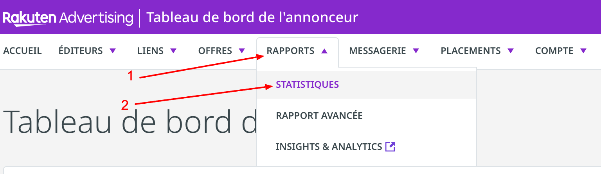
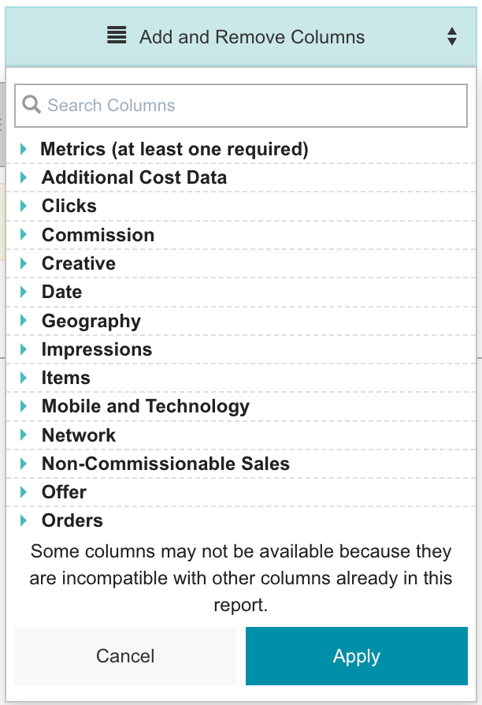
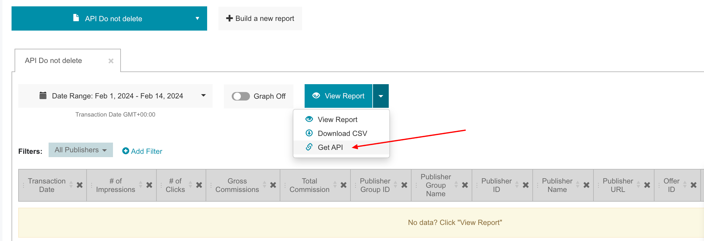
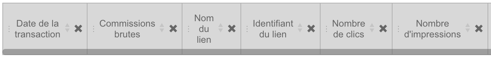

# Rakuten Advertising

***

## <mark style="background-color:blue;">Prerequisites</mark>

To connect Rakuten to QUANTI, you need an [Rakuten Advertising](https://rakutenadvertising.com/fr-fr/?utm_source=quanti.io\&utm_medium=partnership) account. In the last version of this connector, you cannot retrieve datas from any reports. You have to follow steps below including respect fields requested on the rakuten report.

***

## <mark style="background-color:blue;">Setup instructions</mark>

### Create a Rakuten Report and find the generated link

1. Log in to your [Rakuten account](https://auth.rakutenmarketing.com/auth/realms/rakuten-advertising/protocol/openid-connect/auth?client_id=security-admin-console\&redirect_uri=https%3A%2F%2Fauth.rakutenmarketing.com%2Fauth%2Fadmin%2Frakuten-advertising%2Fconsole%2F\&state=0bfc7308-d6d6-411a-a3a2-c858f86852ac\&response_mode=fragment\&response_type=code\&scope=openid\&nonce=37498c3d-5f4c-4dbd-826f-da13d0cb7827\&code_challenge=isEfEnMMx8QHWhWZptlAkdHIxfB3UrcJcjFMuWFf07o\&code_challenge_method=S256).
2.  Click on tab Reporting < Statistics\
    \


    <figure><figcaption><p>Access path to custom report tool</p></figcaption></figure>


3.  Click on the button "+ Build a new report"\
    \


    <figure><figcaption><p>Build a new report</p></figcaption></figure>


4.  Click on button "Add and Remove columns" and add the only and entire list below :\


    * Transaction Date
    * \# of impressions
    * \# of Clicks
    * \# of orders
    * Gross Commissions
    * Total Commissions
    * Sales
    * Order ID
    * Sub-Publihser ID
    * Sub-Publisher Name
    * Sub-Publisher URL
    * Publisher Group ID
    * Publisher Group Name
    * Publisher ID
    * Publisher Name
    * Publisher URL
    * Offer ID
    * Offer Name
    * Link Id
    * Link Name\


    <figure><figcaption><p>"Add and Remove Columns" pop-in</p></figcaption></figure>


5.  Near the blue button "View Report", click on the arrow and "Get API" and copy the url generated.\
    \


    <figure><figcaption><p>Access path to the generated link</p></figcaption></figure>


### Importante information

If you have several Rakuten accounts and want to fill a unique table, you have to create several Rakuten connectors of course and especially respect the list's order and metrics's names. You can change the list order by moving column headings.\
\


<figure><figcaption></figcaption></figure>

### Finish Quanti: configuration

```bash
//ran-reporting.rakutenmarketing.com/en/reports/[<REPORT-KEY>]/filters?
date_range=this-month&include_summary=Y&tz=GMT&date_type=transaction&token=[<API-TOKEN>]
```

1. In the connector setup form, enter the name of your choice.
2. Paste the Report key from the URL generated.
3. Paste the API token from the URL generated.
4. Settings : In most cases, you will need use&#x20;
   1. Date type : transaction
   2. Timezone : UTC
5. Click Save & Test. Quanti: will take it from here and sync your Rakuten data.

***

## <mark style="background-color:blue;">Pre-built Tables</mark>

* Affiliate report : Ad performance tracking with campaign metrics and attribution details

***

[Pre-built tables and definition ](https://dbdiagram.io/e/68371607c07db17e778a23a0/68371711c07db17e778a5f0a):link:[ ](https://dbdiagram.io/e/65c0ca08ac844320ae7740d3/67a5e256263d6cf9a06049b8)

<figure><figcaption></figcaption></figure>

<figure><figcaption><p>Source : <a href="https://dbdiagram.io/e/68371607c07db17e778a23a0/68371711c07db17e778a5f0a">https://dbdiagram.io/e/68371607c07db17e778a23a0/68371711c07db17e778a5f0a</a></p></figcaption></figure>
