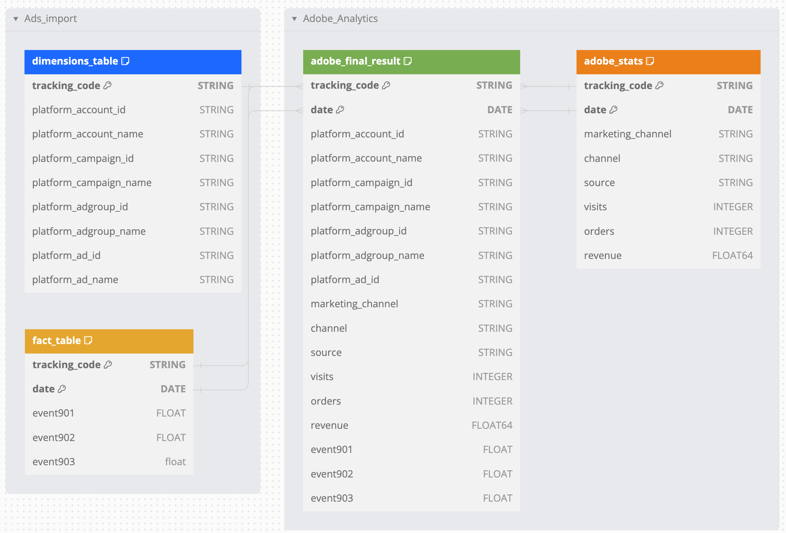

# Adobe Analytics

***

## <mark style="background-color:red;">Prerequisites</mark>

To establish a connection between the QUANTI platform and the Adobe Analytics reverse connector, it is essential to possess an Adobe Experience Cloud account. This account will provide the necessary permissions to access and interact with the Adobe Analytics product.

***

## <mark style="background-color:red;">Setup Instructions</mark>

### Create Your Credentials

1. Access the [Adobe Developer Console](https://developer.adobe.com/console/home) using your Adobe Experience Cloud credentials.
2. Navigate to the Console tab, specifically the APIs and services section, and review the available services.
3.  Locate the Adobe Analytics service and proceed to create a new project.\
    \

    <figure><figcaption>
Create a new project
</figcaption></figure>

* Select OAuth server-to-server.
*   Assign a unique name to your project (For example: Quanti Reverse Connector API) and move to the next step.\
    \

    <figure><figcaption>
Selection page of authentication type
</figcaption></figure>

* Select your organization's name and click on "Save configured API".

4.  Then on the new project page, you will see your API Key (Client ID). Note the API key. You will need it to configure QUANTI:\
    \

    <figure><figcaption>
Access path to the secret token
</figcaption></figure>

5.  Click on OAuth Server-to-Server < 'Retrieve Client Secret'. Note the Client Secret. You will need it to configure QUANTI:\
    \

    <figure><figcaption>
Access path to the client secret
</figcaption></figure>

### Declare your classification

1. Enter Adobe Analytics UI and go to your Adobe Analytics product.
2. Click on the tab Admin > Report Suite > Select your Report Suite > Edit Settings > Conversion > Conversion Classification.
3.  Select Classification Type "Campaign" and add your classification field names.\
    \

    <figure><figcaption>
Classification creation on Adobe Analytics UI
</figcaption></figure>

4. Note the classification field names. You will need them to configure QUANTI:

### Declare your custom metrics

1. Click on the tab Admin > Report Suite > Select your Report Suite > Edit Settings > Conversion > Success Events.
2.  Select events of your choice and add your custom metrics names.\
    \

    <figure><figcaption>
Custom metrics creation on Adobe Analytics UI
</figcaption></figure>

3. Write down events and meanings. You will need them to configure QUANTI:

### Quanti: Data Warehouse configuration

These steps show how to configure data recovery:

1. In the connector setup form, select your data warehouse.
2. Click Next.

### **Create your data source**

1. Click on the tab Admin > Data sources > Select your Report Suite in the top-right corner > Create
2. Now, on the page for creating a new data source, in the first multi-select field, choose: Ad Campaigns, and in the second multi-select field, choose: Generic Pay-Per-Click Service. Click Next.
3. A pop-up will open and ask you to name your data source and provide an email address where notifications will be sent each time data is uploaded.
4. Check the box to give your consent, then click on "Next".&#x20;
5. Check the metrics you wish to import and fill in the fields with any additional metrics you wish to import, then click on "Next".
6. In the selection fields, for each metric listed, select the events you created previously in the "Declare your custom metrics" step. Then click "Next".
7. Check the box labeled "Tracking codes" and click on "Next".
8. In the selection field for Tracking codes, select "Tracking Code".
9. Then click "Next", "Save" and "Close".

### 2 connectors types to set

You will have to set 2 connectors type : Data source Adobe Reverse Connector and Classification Adobe Reverse Connector. They don’t use the same API point and don’t import the same data type. Therefore, we formally present you with the subject, separating it into two distinct connectors

* Data source Adobe Reverse Connector is used to import metrics.
*   Classification Adobe Reverse Connector is used to import dimensions. In Data Warehousing language, we can talk about "Fact table" for data source importing and "Dimensions table" for classification importing. It is very important to understand this point for the rest because Adobe Analytics will match your two imports using the primary keys concept.\
    \

    <figure><figcaption>
Tables diagram representation
</figcaption></figure>

### Create your Data Source Query

These steps show how to create a SQL query which permits to import data into Adobe Analytics UI. The selected fields in your query must coincide with custom metrics that you created above. You can import all custom metrics you want, but you have to respect two mandatory fields: Date and tracking\_code.

* Date field: Make a coincidence between a field with a date data type from your query and the date field expected by the connector.
* Tracking\_code field: Make a coincidence between a string data type field from your query and the tracking\_code expected by the connector. Tracking\_code + date are the unique keys of your query which permit afterwards to match your data source with classification dimensions that we will configure together later in this tutorial. Data type expected :
* date (DATE - YYYY-mm-dd)
* tracking\_code (STRING - Matching with your Classification)
* event1 (FLOAT)
* event2 (FLOAT)
* event3 (FLOAT) All custom events must be of FLOAT type.

### Quanti: Data Source Connnector Configuration

These steps show how to extract data from your table:

1. Build a new SQL request from your table following the last step and give aliases to your queried fields. Your query must only compose of fields expected by Adobe Analytics.
2. In the connector setup form, copy/paste your query.
3. Click Next.
4. Make correspondence between query fields and fields expected by Adobe Analytics.

* Tracking\_code field and date field are expected by Adobe Analytics: You have to indicate which fields are used for them in your query.
* You also have to fill each text input using custom metric names created earlier in your Adobe Analytics UI.

5. Click View details.

### Create Your Classification Query

These steps show how to create a SQL query which permits to import dimensions in Adobe Analytics UI. The selected fields in your query must coincide with classification names that you created above. You have to respect one mandatory field: tracking\_code. Make a coincidence between a string data type field from your query and the tracking\_code expected by the connector. Tracking\_code must be the unique key of your query and permit afterwards to match your classification dimensions with your data source.

### Quanti: Classification Connnector Configuration

These steps show how to extract a classification table from your Data Warehouse:

1. Build a new SQL request from your table following the last step and give aliases to your queried fields. Your query must only compose of fields expected by Adobe Analytics.
2. In the connector setup form, copy/paste your query.
3. Click Next.
4. Make correspondence between query fields and fields expected by Adobe Analytics.

* Key field is expected by Adobe Analytics: You have to indicate which field is used for it in your query.
* You also have to fill each text input using classification names created earlier in Adobe Analytics UI in step 2 above.

5. Click View details.

***

## <mark style="background-color:red;">Use Case</mark>

I want to know the expenses made on my advertising platforms for each of my traffic sources to my site. Therefore, I will need to identify the traffic sent to my site and match it with the metrics imported from the data source to have a clear dispatch of my campaign performances between my sources and campaigns.

To align the metrics you import from external sources into Adobe Analytics (such as impressions, clicks, or spend from your advertising platforms) with internal Adobe Analytics metrics (for example: visits, conversions, or revenue), it is crucial to match them.

<figure><figcaption>
Final full join result of importing datas on Adobe User interface
</figcaption></figure>

Quanti supports you in these transformation procedures with [pre-built transformations](../../transformations/pre-built-tables/) that allow you to merge your data from different sources (campaign data and navigation data) using the concept of  [reconciliation](../../transformations/le-principe-de-reconciliation.md) and the use of [Tracking Template.](../../transformations/tracking-templates.md)
