# Lengow Orders


This connector is currently in **beta**.


<a href="https://dbdiagram.io/e/69df52558089629684a0502f/69df52710f7c9ef2c0005210" class="button primary" data-icon="table-tree">Prebuilt reports and definition</a>

***

## Prerequisites

To connect Lengow to QUANTI, you need:

* A [Lengow](https://www.lengow.com) account with at least one marketplace configured
* Your Lengow **Access Token** and **Secret**, available in your Lengow back office under **Settings** > **API**

***

## Setup instructions



#### Authorize your account

Enter your Lengow API credentials:

* **Access Token**: Your Lengow access token
* **Secret**: Your Lengow secret key

Click **Next** to validate your credentials and load your marketplaces.



#### Select marketplaces

Select the marketplaces you want to sync data from. Each selected marketplace will be used as the account scope for the prebuilt reports.



#### Select prebuilt reports

Review the available prebuilt reports and select the ones you want to activate.



#### Connector information

* **Connector Name**: Name your connector. It must be unique.
* **Dataset ID**: Define the ID of the dataset. It must not exist yet, as it will be created and data will be sent there.



***

## Prebuilt reports

* **marketplace**: Reference catalog of marketplaces connected to the account — allowed actions, carriers, valid statuses, country and currency.
* **order**: Marketplace orders with status, amounts and order lines across all connected channels — product details, pricing, commissions, shipping costs, discounts and payment information.
* **order\_tracking**: Shipment tracking information per order package — carrier, tracking number, relay point, shipped date and delivery by marketplace flag.

```mermaid
erDiagram
    marketplace {
        TIMESTAMP _quanti_loaded_at PK
        INTEGER   account_id PK
        STRING    marketplace_code PK
        STRING    marketplace_name
        STRING    marketplace_country
        STRING    marketplace_currency
        STRING    allowed_actions
        STRING    allowed_carriers
        STRING    valid_statuses
    }
    order {
        STRING    _quanti_ad_account
        DATE      _quanti_date PK
        STRING    _quanti_id
        STRING    _quanti_process_id
        STRING    _quanti_connector_version
        TIMESTAMP _quanti_loaded_at
        INTEGER   account_id PK
        STRING    marketplace PK
        STRING    marketplace_order_id PK
        STRING    marketplace_order_line_id PK
        TIMESTAMP marketplace_order_date
        STRING    lengow_status
        STRING    marketplace_status
        STRING    currency
        FLOAT     total_order
        FLOAT     total_tax
        FLOAT     commission
        FLOAT     shipping
        FLOAT     discount
        STRING    merchant_order_id
        STRING    marketplace_product_id
        STRING    product_title
        INTEGER   line_quantity
        FLOAT     line_amount
        FLOAT     line_shipping
        FLOAT     line_discount
        STRING    line_lengow_status
        TIMESTAMP max_shipping_date
        TIMESTAMP imported_at
        TIMESTAMP updated_at
        BOOLEAN   anonymized
    }
    order_tracking {
        TIMESTAMP _quanti_loaded_at PK
        INTEGER   account_id PK
        STRING    marketplace PK
        STRING    marketplace_order_id PK
        STRING    tracking_number PK
        STRING    carrier
        STRING    method
        STRING    tracking_url
        BOOLEAN   is_delivered_by_marketplace
        FLOAT     parcel_weight
        TIMESTAMP shipped_at
        STRING    relay
        TIMESTAMP updated_at
    }

    marketplace  ||--o{ order          : "marketplace_code / marketplace"
    order        ||--o{ order_tracking : "marketplace_order_id"
```

***

<a href="https://dbdiagram.io/e/69df52558089629684a0502f/69df52710f7c9ef2c0005210" class="button primary" data-icon="table-tree">Prebuilt reports and definition</a>

***

## Notes

* **Lookback window**: Default lookback is **7 days**. Orders updated within the lookback window are re-synced to capture status changes (e.g. shipped, delivered, cancelled).
* **Historical data**: Up to **24 months** of history can be loaded on initial setup, or a custom date range can be defined.
* **Marketplace scope**: Each selected marketplace is synced independently. Add multiple marketplaces to consolidate all your order data in one dataset.
