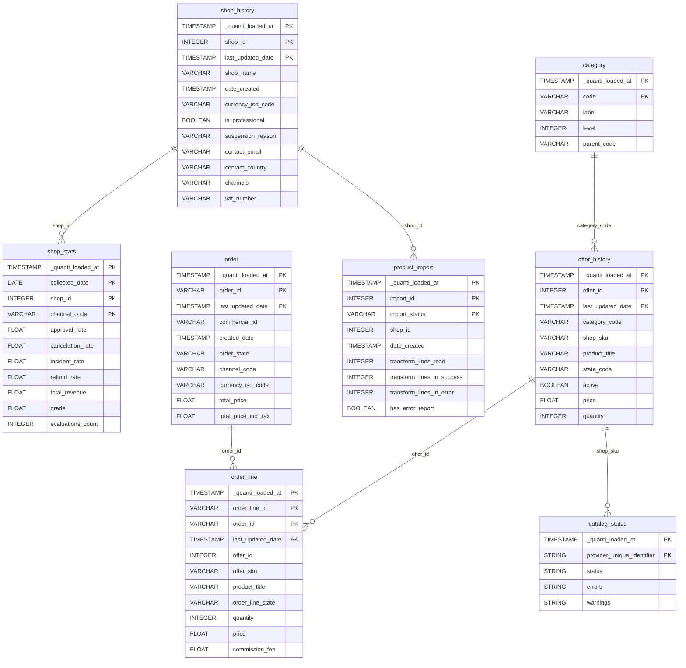

# Mirakl Seller


This connector is currently in **beta**.


<a href="https://dbdiagram.io/e/69d8d8550f7c9ef2c0c6d4ad/69d8d890808962968466e347" class="button primary" data-icon="table-tree">Prebuilt reports and definition</a>

***

## Prerequisites

To connect Mirakl to QUANTI, you need:

* Access to a [Mirakl](https://www.mirakl.com)-powered marketplace as a seller
* Your marketplace instance URL (e.g. `https://your-instance.mirakl.net`)
* A seller API key generated from your Mirakl seller dashboard

***

## Setup instructions



#### Authorize your account

Enter your credentials:

* **Marketplace URL**: The base URL of your Mirakl marketplace instance
* **API Key**: Your seller API key

To retrieve your API key, log in to your Mirakl seller dashboard and navigate to **My Account > API Key**.



#### Select pre-built reports

Review the available pre-built reports and select the ones you want to activate.



#### Connector information

* **Connector Name**: Name your connector. It must be unique.
* **Dataset ID**: Define the ID of the dataset. It must not exist yet, as it will be created and data will be sent there.



***

## Prebuilt reports

* **shop\_history**: History of shop settings, status and configuration — name, currency, lead time, channels, billing, VAT and contact details.
* **shop\_stats**: Daily aggregated shop performance metrics by channel — acceptance rate, cancellation rate, incident rate, refund rate, late shipment rate, revenue, average cart, and seller grade.
* **order**: Orders with status, amounts, payment workflow, customer shipping information and fulfillment details.
* **order\_line**: Order line details per product — pricing, commission, shipping carrier, tracking, refunds and cancellations.
* **offer\_history**: History of offer status, price, stock and inactivity reasons per product, including refused, pending and inactive offers.
* **category**: Marketplace catalog category hierarchy with codes, labels and parent relationships.
* **product\_import**: Product import history with integration statistics — lines read, successes, errors, warnings, and rejected or invalid products.
* **catalog\_status**: Publication status of products from Mirakl Catalog Manager (MCM) — LIVE or NOT\_LIVE for each product (identified by its shop SKU), with the list of blocking errors and warnings as JSON arrays. Requires the MCM module to be enabled on the marketplace instance.

***

<a href="https://dbdiagram.io/e/69d8d8550f7c9ef2c0c6d4ad/69d8d890808962968466e347" class="button primary" data-icon="table-tree">Prebuilt reports and definition</a>

***

## Notes

* **Lookback window**: Default lookback is **7 days**. Orders and offers are re-synced over the lookback window to capture status updates (e.g. an order accepted or shipped after the initial sync).
* **Differential sync for offers**: The `offer_history` table uses a differential sync mode — only offers modified since the last sync are fetched.
* **catalog\_status requires MCM**: The `catalog_status` table is only available if the Mirakl Catalog Manager (MCM) module is enabled on your marketplace instance.
* **Beta status**: This connector is in beta — some features or report fields may evolve.
