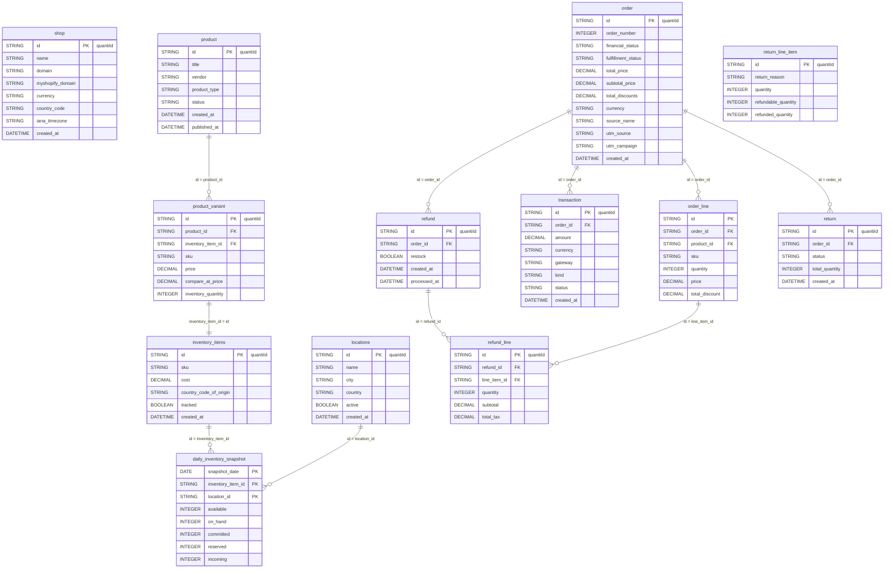

# Shopify


Shopify is an all-in-one e-commerce platform powering millions of stores worldwide. The QUANTI: Shopify connector ingests your orders, products, inventory, transactions, refunds, and returns into BigQuery — giving you a comprehensive analytical view of your store performance.


***

## Prerequisites

* A Shopify store (any plan)
* Admin access to install apps from the Shopify App Store

***

## Authentication

The Shopify connector uses **OAuth2** authentication via the [Shopify App Store](https://apps.shopify.com/quanti?locale=fr). No manual API token or custom app creation is required — the authorization flow is fully handled when you install the QUANTI: app.

***

## Setup Instructions



**Connect your Shopify store**

Click **Continue with Shopify** to open the QUANTI: app listing on the Shopify App Store. Install the app and approve the requested permissions. Once authorized, you will be redirected back to QUANTI: automatically.


**Select your reports**

Choose which data tables to synchronize. You can enable or disable individual reports at any time after setup.



***

## Data Model

<a href="https://dbdiagram.io/e/694439cfe4bb1dd3a9971e40/69443a24e4bb1dd3a99726ad" class="button primary" data-icon="table-tree">Open in dbdiagram</a>

***

## Available Reports

### Shop

Configuration table containing general information about your Shopify store.

#### Dimensions

| Column | Type | Description |
|---|---|---|
| `id` | STRING | Unique store identifier (quantiId) |
| `name` | STRING | Commercial name of the store |
| `email` | STRING | Store owner email address |
| `customer_email` | STRING | Public customer service email |
| `domain` | STRING | Custom primary domain |
| `myshopify_domain` | STRING | Permanent Shopify domain (name.myshopify.com) |
| `address1` | STRING | Headquarters address line 1 |
| `address2` | STRING | Address complement |
| `city` | STRING | City of headquarters |
| `province` | STRING | Region/state of headquarters |
| `province_code` | STRING | 2-letter province ISO code |
| `zip` | STRING | Postal code |
| `country` | STRING | Country of establishment |
| `country_code` | STRING | ISO 3166-1 alpha-2 country code |
| `country_name` | STRING | Readable country name |
| `latitude` | DECIMAL | GPS latitude |
| `longitude` | DECIMAL | GPS longitude |
| `iana_timezone` | STRING | IANA timezone |
| `currency` | STRING | Primary currency (ISO 4217) |
| `enabled_presentment_currencies` | STRING | Enabled display currencies |
| `money_format` | STRING | Price formatting template |
| `money_with_currency_format` | STRING | Formatting template with currency |
| `money_in_emails_format` | STRING | Monetary format used in emails |
| `money_with_currency_in_emails_format` | STRING | Complete monetary format for emails |
| `checkout_api_supported` | BOOLEAN | Checkout API compatibility |
| `eligible_for_payments` | BOOLEAN | Whether store can receive payments |
| `has_discounts` | BOOLEAN | Active discounts present |
| `has_gift_cards` | BOOLEAN | Gift cards enabled |
| `has_storefront` | BOOLEAN | Online storefront exists |
| `password_enabled` | BOOLEAN | Store is password-protected |
| `county_taxes` | BOOLEAN | County taxes applied |
| `auto_configure_tax_inclusivity` | BOOLEAN | Automatic tax inclusion by customer location |
| `force_ssl` | BOOLEAN | HTTPS forced |
| `finances` | BOOLEAN | Financial data accessible |
| `google_apps_domain` | STRING | Associated Google Workspace domain |
| `google_apps_login_enabled` | BOOLEAN | Google Apps login enabled |
| `created_at` | DATETIME | Store creation date |
| `updated_at` | DATETIME | Last settings modification date |

***

### Product

Product catalog with descriptions, categories, and merchandising attributes.

#### Dimensions

| Column | Type | Description |
|---|---|---|
| `id` | STRING | Globally unique product identifier (quantiId) |
| `title` | STRING | Product name displayed to customers |
| `handle` | STRING | URL-friendly unique identifier |
| `vendor` | STRING | Brand or manufacturer name |
| `product_type` | STRING | Custom product categorization |
| `status` | STRING | Product status: ACTIVE, ARCHIVED, DRAFT |
| `description` | STRING | Plain text product description |
| `tags` | STRING | Comma-separated product tags |
| `metafields` | STRING | JSON array of product metafields (up to 250) |
| `created_at` | DATETIME | Product creation date |
| `updated_at` | DATETIME | Last modification date |
| `published_at` | DATETIME | Date published to storefront |

***

### Product Variant

Product variants with SKU, pricing, inventory, and option configurations.

#### Dimensions

| Column | Type | Description |
|---|---|---|
| `id` | STRING | Globally unique variant identifier (quantiId) |
| `product_id` | STRING | Parent product identifier (FK → product) |
| `inventory_item_id` | STRING | Inventory item identifier (FK → inventory\_items) |
| `title` | STRING | Display name combining product and variant options |
| `sku` | STRING | Stock Keeping Unit identifier |
| `inventory_quantity` | INTEGER | Total available quantity across all locations |

#### Metrics

| Column | Type | Description |
|---|---|---|
| `price` | DECIMAL | Current selling price in shop currency |
| `compare_at_price` | DECIMAL | Original price before discount |
| `unit_price` | DECIMAL | Unit price for products sold by weight or volume |

***

### Inventory Items

Physical inventory items with SKU and cost details.

#### Dimensions

| Column | Type | Description |
|---|---|---|
| `id` | STRING | Globally unique inventory item identifier (quantiId) |
| `sku` | STRING | Stock Keeping Unit identifier |
| `cost` | DECIMAL | Unit cost in shop currency |
| `country_code_of_origin` | STRING | ISO 3166-1 alpha-2 country of origin |
| `province_code_of_origin` | STRING | Province/state code of origin |
| `harmonized_system_code` | STRING | HS code for customs classification |
| `tracked` | BOOLEAN | Whether inventory levels are tracked |
| `requires_shipping` | BOOLEAN | Whether item requires physical shipping |
| `created_at` | DATETIME | Item creation timestamp |
| `updated_at` | DATETIME | Last modification timestamp |

***

### Locations

Physical warehouse and store locations for inventory management.

#### Dimensions

| Column | Type | Description |
|---|---|---|
| `id` | STRING | Globally unique location identifier (quantiId) |
| `name` | STRING | Location display name |
| `address1` | STRING | Address line 1 |
| `address2` | STRING | Address line 2 |
| `city` | STRING | City |
| `province` | STRING | State/province/region |
| `country` | STRING | Country |
| `zip` | STRING | Postal code |
| `phone` | STRING | Contact phone number |
| `active` | BOOLEAN | Whether location is active for fulfillment |
| `created_at` | DATETIME | Location creation timestamp |

***

### Order

Central transactional table capturing the complete order lifecycle.

#### Dimensions

| Column | Type | Description |
|---|---|---|
| `id` | STRING | Unique order identifier (quantiId) |
| `order_number` | INTEGER | Customer-facing order number |
| `name` | STRING | Readable order reference |
| `financial_status` | STRING | Payment status: pending, authorized, paid, partially\_refunded, refunded, voided… |
| `fulfillment_status` | STRING | Shipping status: null (not processed), partial, fulfilled, restocked |
| `currency` | STRING | Store currency (ISO 4217) |
| `presentment_currency` | STRING | Currency displayed to customer (ISO 4217) |
| `source_name` | STRING | Order channel: web, pos, iphone, android… |
| `gateway` | STRING | Payment gateway |
| `test` | BOOLEAN | Whether order is a test |
| `confirmed` | BOOLEAN | Whether order is confirmed |
| `tax_included` | BOOLEAN | Whether taxes are included in prices |
| `buyer_accepts_marketing` | BOOLEAN | Customer accepted marketing communications |
| `cancel_reason` | STRING | Cancellation reason: customer, fraud, inventory, declined, other |
| `tags` | STRING | Comma-separated order tags |
| `note` | STRING | Free text from customer or merchant |
| `referring_site` | STRING | Referring website URL |
| `landing_site` | STRING | Entry page URL with UTM parameters |
| `utm_source` | STRING | UTM source (e.g. google, facebook) |
| `utm_medium` | STRING | UTM medium (e.g. cpc, email) |
| `utm_campaign` | STRING | UTM campaign name |
| `utm_content` | STRING | UTM content identifier for A/B testing |
| `utm_term` | STRING | UTM paid search keyword |
| `customer_id` | STRING | Customer identifier |
| `billing_address_city` | STRING | Billing city |
| `billing_address_country` | STRING | Billing country |
| `billing_address_country_code` | STRING | Billing country code (ISO 3166-1 alpha-2) |
| `shipping_address_city` | STRING | Shipping city |
| `shipping_address_country` | STRING | Shipping country |
| `shipping_address_country_code` | STRING | Shipping country code (ISO 3166-1 alpha-2) |
| `created_at` | DATETIME | Order creation date |
| `updated_at` | DATETIME | Last modification date |
| `processed_at` | DATETIME | Payment processing date |
| `closed_at` | DATETIME | Order closure date |
| `cancelled_at` | DATETIME | Cancellation date |

#### Metrics

| Column | Type | Description |
|---|---|---|
| `total_price` | DECIMAL | Total order amount |
| `subtotal_price` | DECIMAL | Product subtotal before discounts (excl. taxes and shipping) |
| `total_tax` | DECIMAL | Total tax amount |
| `total_discounts` | DECIMAL | Total discount amount applied at checkout |
| `total_line_items_price` | DECIMAL | Sum of line item prices before discounts (GMV) |
| `total_shipping` | DECIMAL | Total shipping amount |

***

### Order Line

Transactional table detailing each product or variant purchased in an order.

#### Dimensions

| Column | Type | Description |
|---|---|---|
| `id` | STRING | Unique order line identifier |
| `order_id` | STRING | Parent order identifier (FK → order) |
| `product_id` | STRING | Product identifier (FK → product; may be null if product deleted) |
| `variant_id` | STRING | Specific variant purchased |
| `title` | STRING | Product name at time of purchase (snapshot) |
| `variant_title` | STRING | Variant title |
| `sku` | STRING | Stock Keeping Unit code |
| `vendor` | STRING | Vendor/brand name |
| `quantity` | INTEGER | Ordered quantity |
| `price` | DECIMAL | Unit price before discounts in store currency |
| `unit_cost` | DECIMAL | Unit cost |
| `unit_cost_currency` | STRING | Unit cost currency |
| `price_set` | STRING | Unit price in store and customer currency (JSON) |
| `total_discount` | DECIMAL | Total line discount amount in store currency |
| `total_discount_set` | STRING | Discount amount in multi-currency (JSON) |
| `fulfillable_quantity` | INTEGER | Quantity remaining to be shipped |
| `grams` | INTEGER | Item weight in grams |
| `requires_shipping` | BOOLEAN | Whether item requires physical shipping |
| `taxable` | BOOLEAN | Whether item is taxable |
| `tax_lines` | STRING | JSON array of applied taxes per jurisdiction |
| `discount_allocations` | STRING | JSON array of discounts broken down by promo code |
| `properties` | STRING | JSON array of name/value customization pairs |

***

### Transaction

Payment transactions with authorization and settlement details.

#### Dimensions

| Column | Type | Description |
|---|---|---|
| `id` | STRING | Unique transaction identifier (quantiId) |
| `order_id` | STRING | Parent order identifier (FK → order) |
| `currency` | STRING | Transaction currency (ISO 4217) |
| `gateway` | STRING | Payment gateway used |
| `kind` | STRING | Transaction type: authorization, capture, sale, void, refund |
| `status` | STRING | Transaction status: pending, success, failure, error |
| `created_at` | DATETIME | Transaction creation date |

#### Metrics

| Column | Type | Description |
|---|---|---|
| `amount` | DECIMAL | Transaction amount in order currency |

***

### Refund

Refund events with order adjustments and financial details.

#### Dimensions

| Column | Type | Description |
|---|---|---|
| `id` | STRING | Unique refund identifier (quantiId) |
| `order_id` | STRING | Parent order identifier (FK → order) |
| `note` | STRING | Optional refund note |
| `restock` | BOOLEAN | Whether refunded items were restocked |
| `created_at` | DATETIME | Refund creation date |
| `processed_at` | DATETIME | Refund processing timestamp |

***

### Refund Line

Refund line items with product details and amounts.

#### Dimensions

| Column | Type | Description |
|---|---|---|
| `id` | STRING | Unique refund line identifier (quantiId) |
| `refund_id` | STRING | Parent refund identifier (FK → refund) |
| `line_item_id` | STRING | Original order line item (FK → order\_line) |
| `quantity` | INTEGER | Quantity of items refunded |

#### Metrics

| Column | Type | Description |
|---|---|---|
| `subtotal` | DECIMAL | Refunded amount excluding taxes |
| `total_tax` | DECIMAL | Refunded tax amount |

***

### Return

Return requests with workflow status and financial outcome details.

#### Dimensions

| Column | Type | Description |
|---|---|---|
| `id` | STRING | Globally unique return identifier (quantiId) |
| `order_id` | STRING | Parent order identifier (FK → order) |
| `name` | STRING | Return reference number |
| `status` | STRING | Return status: REQUESTED, OPEN, CLOSED, DECLINED, CANCELLED |
| `total_quantity` | INTEGER | Total number of items being returned |
| `created_at` | DATETIME | Return creation date |

***

### Return Line Item

Individual returned items with customer notes and standardized return reasons.

#### Dimensions

| Column | Type | Description |
|---|---|---|
| `id` | STRING | Globally unique return line identifier (quantiId) |
| `return_reason` | STRING | Standardized reason code from ReturnReason enum |
| `return_reason_note` | STRING | Additional details about return reason (max 255 chars) |
| `customer_note` | STRING | Customer's explanation for returning the item (max 300 chars) |
| `quantity` | INTEGER | Total quantity being returned |
| `refundable_quantity` | INTEGER | Quantity eligible for refund |
| `refunded_quantity` | INTEGER | Quantity already refunded |
| `processable_quantity` | INTEGER | Quantity that can be processed |
| `processed_quantity` | INTEGER | Quantity already processed |
| `unprocessed_quantity` | INTEGER | Quantity not yet processed |

***

### Daily Inventory Snapshot

Historical fact table tracking daily inventory levels across multiple states for each item and location.

#### Dimensions

| Column | Type | Description |
|---|---|---|
| `snapshot_date` | DATE | Date of the inventory snapshot (quantiId — composite PK) |
| `inventory_item_id` | STRING | Inventory item identifier (FK → inventory\_items) |
| `location_id` | STRING | Location identifier (FK → locations) |
| `updated_at` | DATETIME | Last update timestamp from Shopify |

#### Metrics

| Column | Type | Description |
|---|---|---|
| `available` | INTEGER | Quantity available for sale |
| `on_hand` | INTEGER | Total physical stock quantity |
| `committed` | INTEGER | Quantity committed to pending orders |
| `reserved` | INTEGER | Quantity reserved in carts and draft orders |
| `incoming` | INTEGER | Quantity in transit from suppliers |
| `damaged` | INTEGER | Quantity marked as damaged |
| `quality_control` | INTEGER | Quantity undergoing quality inspection |
| `safety_stock` | INTEGER | Minimum stock level threshold |

***

## Scheduling

| Setting | Default | Options |
|---|---|---|
| **Frequency** | Daily | Hourly (every 3h, 6h, or 12h), Daily, Weekly, Monthly |
| **Sync time** | 3:00 AM | Configurable |
| **Lookback window** | 1 day | — |
| **Historical load** | — | 3, 6, or 12 months, or custom date range |

***

## Notes

* **Product deletions**: The `product_id` field in `order_line` may be null if the product was deleted after the order was placed. Use `title` and `sku` for historical analysis in such cases.
* **Multi-currency**: Orders include both `currency` (store currency) and `presentment_currency` (customer's currency). Use `price_set` and `total_discount_set` in `order_line` for multi-currency analysis.
* **Returns vs Refunds**: `return` tracks the return workflow (request → approval), while `refund` tracks the financial event. A return may or may not result in a refund.
* **Inventory snapshots**: `daily_inventory_snapshot` uses a **snapshot append** strategy — one row per `(snapshot_date, inventory_item_id, location_id)` per day. Always filter on a specific `snapshot_date` to avoid double-counting stock.
