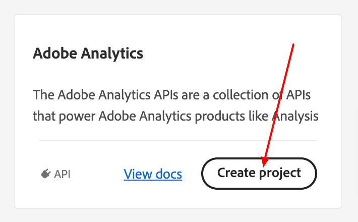
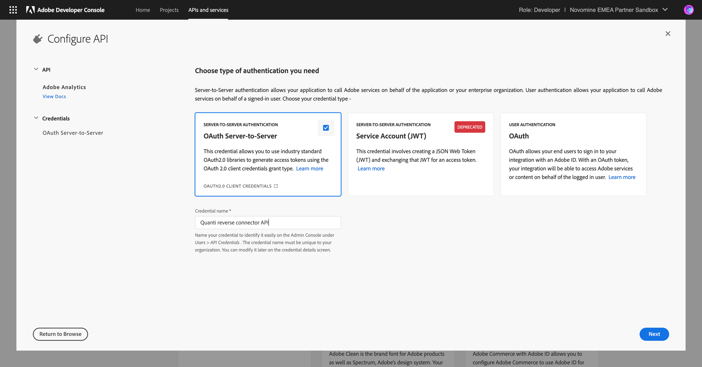
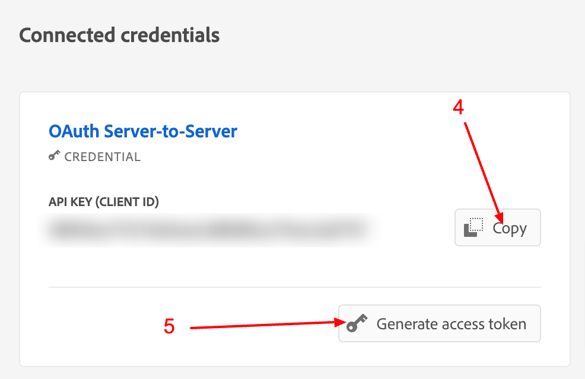
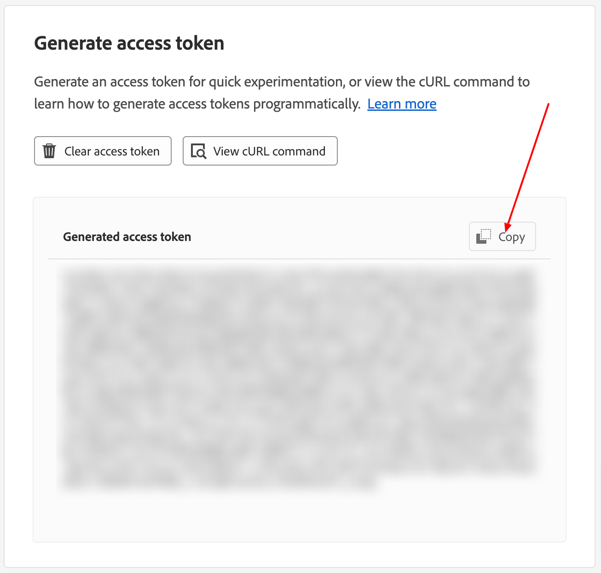
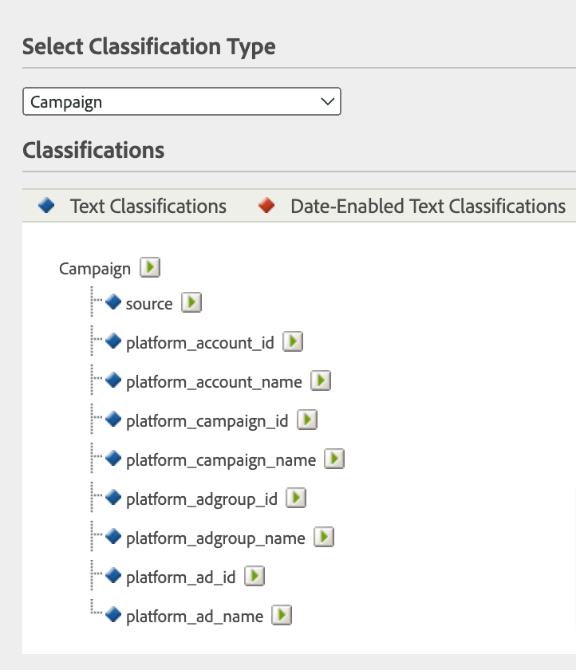
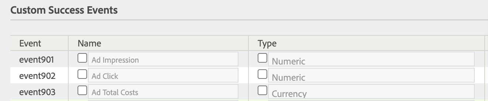
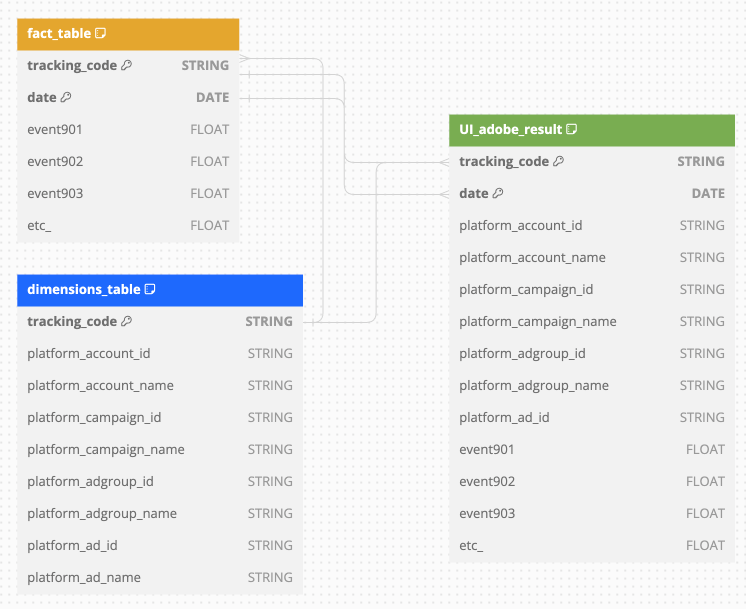

*Last update : 2024-02-16*

Please refer to our setup guide to integrate the Adobe Analytic reverse-connector.

* * * * *

Prerequisites
----------------------------------------------------------------------------------------------------------------------------------------------------

To establish a connection between the QUANTI platform and the Adobe Analytics reverse connector, it is essential to possess an [Adobe Experience Cloud](https://auth.services.adobe.com/fr_FR/index.html?callback=https%3A%2F%2Fims-na1.adobelogin.com%2Fims%2Fadobeid%2Fexc_app%2FAdobeID%2Ftoken%3Fredirect_uri%3Dhttps%253A%252F%252Fexperience.adobe.com%252F%2523old_hash%253Dold_hash%253D%252523%25252Fhome%2526from_ims%253Dtrue%253Fclient_id%253Dexc_app%2526api%253Dauthorize%2526scope%253Dab.manage%252Caccount_cluster.read%252Cadditional_info%252Cadditional_info.job_function%252Cadditional_info.projectedProductContext%252Cadditional_info.roles%252CAdobeID%252Cadobeio.appregistry.read%252Cadobeio_api%252Caudiencemanager_api%252Ccreative_cloud%252Cmps%252Copenid%252Corg.read%252Cpps.read%252Cread_organizations%252Cread_pc%252Cread_pc.acp%252Cread_pc.dma_tartan%252Csession%26state%3D%257B%2522jslibver%2522%253A%2522v2-v0.31.0-2-g1e8a8a8%2522%252C%2522nonce%2522%253A%25224095378053344712%2522%257D%26code_challenge_method%3Dplain%26use_ms_for_expiry%3Dtrue&client_id=exc_app&scope=ab.manage%2Caccount_cluster.read%2Cadditional_info%2Cadditional_info.job_function%2Cadditional_info.projectedProductContext%2Cadditional_info.roles%2CAdobeID%2Cadobeio.appregistry.read%2Cadobeio_api%2Caudiencemanager_api%2Ccreative_cloud%2Cmps%2Copenid%2Corg.read%2Cpps.read%2Cread_organizations%2Cread_pc%2Cread_pc.acp%2Cread_pc.dma_tartan%2Csession&state=%7B%22jslibver%22%3A%22v2-v0.31.0-2-g1e8a8a8%22%2C%22nonce%22%3A%224095378053344712%22%7D&relay=af0c4815-d155-4a28-b618-00263c9291ca&locale=fr_FR&flow_type=token&dctx_id=v%3A2%2Cs%2Cf%2Cb8e64530-b013-11ee-a6c1-e721bdec0171&idp_flow_type=login&response_type=token&profile_filter=%7B%22findFirst%22%3Atrue%2C+%22fallbackToAA%22%3Atrue%2C+%22preferForwardProfile%22%3Atrue%2C+%22searchEntireCluster%22%3Atrue%7D%3B+isOwnedByOrg%28%27F3EB54D95880B1D60A495EDD%40AdobeOrg%27%29&code_challenge_method=plain&redirect_uri=https%3A%2F%2Fexperience.adobe.com%2F%23old_hash%3Dold_hash%3D%2523%252Fhome%26from_ims%3Dtrue%3Fclient_id%3Dexc_app%26api%3Dauthorize%26scope%3Dab.manage%2Caccount_cluster.read%2Cadditional_info%2Cadditional_info.job_function%2Cadditional_info.projectedProductContext%2Cadditional_info.roles%2CAdobeID%2Cadobeio.appregistry.read%2Cadobeio_api%2Caudiencemanager_api%2Ccreative_cloud%2Cmps%2Copenid%2Corg.read%2Cpps.read%2Cread_organizations%2Cread_pc%2Cread_pc.acp%2Cread_pc.dma_tartan%2Csession&use_ms_for_expiry=true#/) account. This account will provide the necessary permissions to access and interact with the Adobe Analytics product.

* * * * *

Setup Instructions
-------------------------------------------------------------------------------------------------------------------------------------------------------------

### Create Your Credentials

1.  Access the Adobe Experience Cloud using your Adobe Experience Cloud credentials.
2.  Navigate to the Console tab, specifically the APIs and services section, and review the available services.
3.  Locate the Adobe Analytics service and proceed to create a new project.
 
- Select OAuth server-to-server.
- Assign a unique name to your project (For example: Quanti Reverse Connector API) and move to the next step.
 
- Select your organization's name and click on "Save configured API".
4.  Then on the new project page, you will see your API Key (Client ID). Note the API key. You will need it to configure QUANTI:
 
5.  Click on the tab “Generate access token” and note the API key. You will need it to configure QUANTI:
 

### Declare your classification

1.  Enter Adobe Analytics UI and go to your Adobe Analytics product.
2.  Click on the tab Admin > Report Suite > Select your Report Suite > Edit Settings > Conversion > Conversion Classification.
3.  Select Classification Type "Campaign" and add your classification field names.
 
4.  Note the classification field names. You will need them to configure QUANTI:

### Declare your custom metrics

1.  Click on the tab Admin > Report Suite > Select your Report Suite > Edit Settings > Conversion > Success Events.
2.  Select events of your choice and add your custom metrics names.
 
3.  Write down events and matches. You will need them to configure QUANTI:

### Quanti: Data Warehouse configuration

These steps show how to configure data recovery:
1.  In the connector setup form, select your data warehouse, name your dataset and table from which to recover data.
2.  Click Next.

### 2 connectors types to set

You will have to set 2 connectors type : Data source Adobe Reverse Connector and Classification Adobe Reverse Connector. They don’t use the same API point and don’t import the same data type. Therefore, we formally present you with the subject, separating it into two distinct connectors
- Data source Adobe Reverse Connector is used to import metrics.
- Classification Adobe Reverse Connector is used to import dimensions.
In Data Warehousing language, we can talk about "Fact table" for data source importing and "Dimensions table" for classification importing. It is very important to understand this point for the rest because Adobe Analytics will match your two imports using the primary keys concept.
 

### Create your Data Source Query

These steps show how to create a SQL query which permits to import data into Adobe Analytics UI. The selected fields in your query must coincide with custom metrics that you created above. You can import all custom metrics you want, but you have to respect two mandatory fields: Date and tracking_code.
- Date field: Make a coincidence between a field with a date data type from your query and the date field expected by the connector.
- Tracking_code field: Make a coincidence between a string data type field from your query and the tracking_code expected by the connector. Tracking_code + date are the unique keys of your query which permit afterwards to match your data source with classification dimensions that we will configure together later in this tutorial.
Tracking_code + date are the unique keys of your query which permit afterwards to match your data source with classification dimensions that we will configure together later in this tutorial.
Data type expected :
- date (DATE - YYYY-mm-dd)
- tracking_code (STRING - Matching with your Classification)
- event1 (FLOAT)
- event2 (FLOAT)
- event3 (FLOAT)
All custom events must be of FLOAT type.

### Quanti: Data Source Connnector Configuration

These steps show how to extract data from your table:
1.  Build a new SQL request from your table following the last step and give aliases to your queried fields. Your query must only compose of fields expected by Adobe Analytics.
2.  In the connector setup form, copy/paste your query.
3.  Click Next.
4.  Make correspondence between query fields and fields expected by Adobe Analytics.
- Tracking_code field and date field are expected by Adobe Analytics: You have to indicate which fields are used for them in your query.
- You also have to fill each text input using custom metric names created earlier in your Adobe Analytics UI.
5.  Click View details.

### Create Your Classification Query

These steps show how to create a SQL query which permits to import dimensions in Adobe Analytics UI. The selected fields in your query must coincide with classification names that you created above. You have to respect one mandatory field: tracking_code. Make a coincidence between a string data type field from your query and the tracking_code expected by the connector. Tracking_code must be the unique key of your query and permit afterwards to match your classification dimensions with your data source.

### Quanti: Classification Connnector Configuration

These steps show how to extract a classification table from your Data Warehouse:
1.  Build a new SQL request from your table following the last step and give aliases to your queried fields. Your query must only compose of fields expected by Adobe Analytics.
2.  In the connector setup form, copy/paste your query.
3.  Click Next.
4.  Make correspondence between query fields and fields expected by Adobe Analytics.
- Tracking_code field is expected by Adobe Analytics: You have to indicate which field is used for it in your query.
- You also have to fill each text input using classification names created earlier in Adobe Analytics UI in step 2 above.
5.  Click View details.
