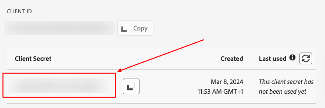

*Last update : 2024-02-16*

Follow our setup guide to interger the reverse-connector Adobe Analytics

* * * * *

Prerequisites
----------------------------------------------------------------------------------------------------------------------------------------------------

To connect QUANTI to the reverse-connector Adobe Analytics, you need an [Adobe Experience Cloud](https://auth.services.adobe.com/fr_FR/index.html?callback=https%3A%2F%2Fims-na1.adobelogin.com%2Fims%2Fadobeid%2Fexc_app%2FAdobeID%2Ftoken%3Fredirect_uri%3Dhttps%253A%252F%252Fexperience.adobe.com%252F%2523old_hash%253Dold_hash%253D%252523%25252Fhome%2526from_ims%253Dtrue%253Fclient_id%253Dexc_app%2526api%253Dauthorize%2526scope%253Dab.manage%252Caccount_cluster.read%252Cadditional_info%252Cadditional_info.job_function%252Cadditional_info.projectedProductContext%252Cadditional_info.roles%252CAdobeID%252Cadobeio.appregistry.read%252Cadobeio_api%252Caudiencemanager_api%252Ccreative_cloud%252Cmps%252Copenid%252Corg.read%252Cpps.read%252Cread_organizations%252Cread_pc%252Cread_pc.acp%252Cread_pc.dma_tartan%252Csession%26state%3D%257B%2522jslibver%2522%253A%2522v2-v0.31.0-2-g1e8a8a8%2522%252C%2522nonce%2522%253A%25224095378053344712%2522%257D%26code_challenge_method%3Dplain%26use_ms_for_expiry%3Dtrue&client_id=exc_app&scope=ab.manage%2Caccount_cluster.read%2Cadditional_info%2Cadditional_info.job_function%2Cadditional_info.projectedProductContext%2Cadditional_info.roles%2CAdobeID%2Cadobeio.appregistry.read%2Cadobeio_api%2Caudiencemanager_api%2Ccreative_cloud%2Cmps%2Copenid%2Corg.read%2Cpps.read%2Cread_organizations%2Cread_pc%2Cread_pc.acp%2Cread_pc.dma_tartan%2Csession&state=%7B%22jslibver%22%3A%22v2-v0.31.0-2-g1e8a8a8%22%2C%22nonce%22%3A%224095378053344712%22%7D&relay=af0c4815-d155-4a28-b618-00263c9291ca&locale=fr_FR&flow_type=token&dctx_id=v%3A2%2Cs%2Cf%2Cb8e64530-b013-11ee-a6c1-e721bdec0171&idp_flow_type=login&response_type=token&profile_filter=%7B%22findFirst%22%3Atrue%2C+%22fallbackToAA%22%3Atrue%2C+%22preferForwardProfile%22%3Atrue%2C+%22searchEntireCluster%22%3Atrue%7D%3B+isOwnedByOrg%28%27F3EB54D95880B1D60A495EDD%40AdobeOrg%27%29&code_challenge_method=plain&redirect_uri=https%3A%2F%2Fexperience.adobe.com%2F%23old_hash%3Dold_hash%3D%2523%252Fhome%26from_ims%3Dtrue%3Fclient_id%3Dexc_app%26api%3Dauthorize%26scope%3Dab.manage%2Caccount_cluster.read%2Cadditional_info%2Cadditional_info.job_function%2Cadditional_info.projectedProductContext%2Cadditional_info.roles%2CAdobeID%2Cadobeio.appregistry.read%2Cadobeio_api%2Caudiencemanager_api%2Ccreative_cloud%2Cmps%2Copenid%2Corg.read%2Cpps.read%2Cread_organizations%2Cread_pc%2Cread_pc.acp%2Cread_pc.dma_tartan%2Csession&use_ms_for_expiry=true#/) account which permit you to access to Adobe Analytics product.

* * * * *

Setup instructions
-------------------------------------------------------------------------------------------------------------------------------------------------------------

### Create your credentials

1.  Log in to [Adobe Experience Cloud](https://developer.adobe.com/) with your Adobe Experience Cloud IDs.
2.  Click on tab Console < APIs and services and look the services list.
3.  Search the Adobe Analytics service and create a new projet.
 
- Select OAuth server-to-server
- Give a distinctive name to your projet (Ex: Quanti Reverse connector API) and click Next.
 
- Select your organisation name and click on "Save configured API".
4.  Next, you arrive on your new project page. You will see your API Key (Client ID). Make a note of the API key. You will need it to configure QUANTI:.
 
5.  Click on tab "Generate access token" and make a note  of the API key. You will need it to configure QUANTI:.
 

### Declare your classification

1.  Log in to [Adobe Analytics UI](https://experience.adobe.com/) and go on your Adobe Analytics product.
2.  Click on tab Admin < Report Suite < Select your Report Suite < Edit Settings < Conversion < Conversion Classification
3.  Select Classification Type "Campaign" and add your classification fields names.
 
4.  Make a note of classification fields names. You will need it to configure QUANTI:

### Declare your custom metrics

1.  Click on tab Admin < Report Suite < Select your Report Suite < Edit Settings < Conversion < Success Events
2.  Select events of your choice and add your custom metrics name
 
3.  Make a note of events and correspondances. You will need it to configure QUANTI:

### Quanti: Data Warehouse configuration

This step consist to configure datas recovering
1.  In the connector setup form, select your data warehouse, name your dataset and table where recover datas
3.  Click Next.

### 2 connectors types to set

You going have to set 2 connectors type : Data source Adobe Reverse Connector and Classification Adobe Reverse Connector.
They don't use the same API point and don't import the same data type. That's why we presente you the subject separating it in two distinct connectors.
- Data source Adobe Reverse Connector is used to import metrics.
- Classification Adobe Reverse Connector is used to import dimensions.
In Data Warehousing language, we can talk about "Fact table" for data source importing and "Dimensions table" for classification importing. It is very important to understand this point for the rest because Adobe Analytics will match your two imports using the primary keys concept.
 

### Create your Data Source Query

This step consist to create a SQL query which permit to import datas in Adobe analytics UI. The selected fields in your query must coincidence with custom metrics that you created above. You can import all custom metrics you want but you have to respect 2 mandatory fields : Date and tracking_code.
- Date field : Make coincidence a field with a date data type field from your query with the date field waited by the connector.
- Tracking_code field : Make coincidence a string data type field from your query with the tracking_code waited by the connector.
Tracking_code + date are the unique keys of your query which permit afterwards to match your data source with classification dimensions that we will configure together later in this tutorial.
Data type waited :
- date (DATE - YYYY-mm-dd)
- tracking_code (STRING - Matching with your Classification)
- event1 (FLOAT)
- event2 (FLOAT)
- event3 (FLOAT)
All custom events must be FLOAT type.

### Quanti: Data Source connnector configuration

This step consist to extract datas from your table.
1.  Build a new SQL request from your table following the last step and give alias to your fields queried. Your query must be compose only waited fields by Adobe Analytics. 
2.  In the connector setup form, copy/ paste your query.
3.  Click Next.
4.  Make correspondance between query fields and fields waited by Adobe Analytics.
- Tracking_code field and date field are waited by Adobe Analytics : You have to indicate which fields are used for it in your query.
- You also have to fill each text input using custom metrics names created earlier in your Adobe Analytics UI.
5.  Click View details.

### Create your Classification Query

This step consist to create a SQL query which permit to import dimensions in Adobe analytics UI. The selected fields in your query must coincidence with classification name that you created above. You have to respect one mandatory field : tracking_code. Make coincidence a string data type field from your query with the tracking_code waited by the connector.
Tracking_code must be the unique key of your query and permit afterwards to match your classification dimensions with your data source.

### Quanti: Classification connnector configuration

This step consist to extract classification table from your Data Warehouse.
1.  Build a new SQL request from your table following the last step and give alias to your fields queried. Your query must be compose only waited fields by Adobe Analytics. 
2.  In the connector setup form, copy/ paste your query.
3.  Click Next.
4.  Make correspondance between query fields and fields waited by Adobe Analytics.
- Tracking_code field is waited by Adobe Analytics : You have to indicate which field is used for it in your query.
- You also have to fill each text input using classification names created earlier in Adobe Analytics UI in the step 2 above.
5.  Click View details.
