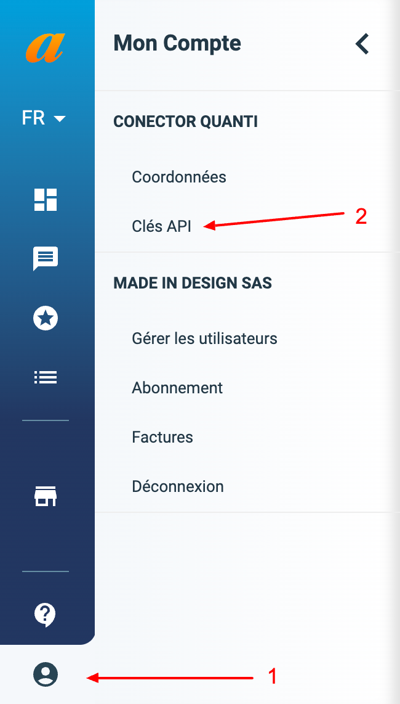

Follow our setup guide to connect Affilae to QUANTI:

* * * * *

Prerequisites
----------------------------------------------------------------------------------------------------------------------------------------------------

To connect Affilae to QUANTI, you need an [Affilae](https://affilae.com/fr/logiciel-affiliation/) account.

* * * * *

Setup instructions
-------------------------------------------------------------------------------------------------------------------------------------------------------------

### Find API key

1.  Log in to your [Affilae account](https://app.affilae.com/fr/login).
2.  In the bottom-left corner, click My account, then select API keys.
{{ $image := .Resources.Get "affilae1.png" }}{{ with $image }}{{ end }}

4.  You will can find your API key but it may you do not have the permission level good enough. In this case, you have to make a request to your account manager.
5.  Make a note of the API key. You will need it to configure QUANTI:.

### Finish Quanti: configuration

1.  In the connector setup form, enter the name of your choice.
2.  Enter the API key you found in Step 1.
3.  Click Save & Test. Quanti: will take it from here and sync your Affilae data.

### [Tables](https://dbdiagram.io/d/[Affilae-Connector]-Data-Model-65115bb9ffbf5169f06f0c24)

  <iframe src="https://dbdiagram.io/d/[Affilae-Connector]-Data-Model-65115bb9ffbf5169f06f0c24" style="position: absolute; top: 0; left: 0; width: 100%; height: 100%; border:0;" allowfullscreen title="YouTube Video"></iframe>

