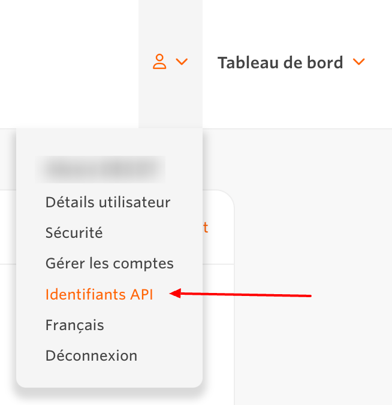
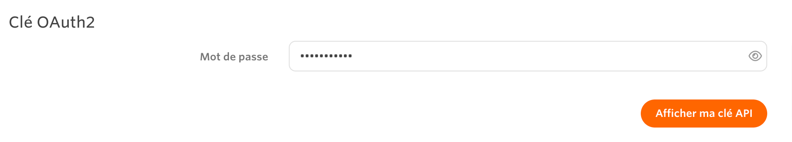
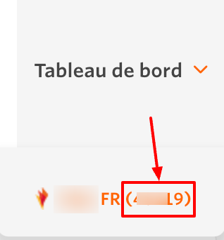

*Last update : 2024-02-16*

Follow our setup guide to connect Awin to QUANTI:

* * * * *

Prerequisites
----------------------------------------------------------------------------------------------------------------------------------------------------

To connect Awin to QUANTI, you need an [Awin](https://www.awin.com/) account with API access.

* * * * *

Setup instructions
-------------------------------------------------------------------------------------------------------------------------------------------------------------

### Find API token

1.  Log in to your [Awin account](https://ui.awin.com/idp/en/awin/login).
2.  In the top-right corner, click your profile name, then select API Credentials.
 
3.  In the Password field, enter your login password.
4.  Click Show my API token.
 
5.  Make a note of the API token. You will need it to configure QUANTI:.

### Find Advertiser ID

1.  In the top-right corner, when you hover Dashboard tab, you can see the list of your accounts
2.  Numbers between brackets are your advertiser IDs needed.
 
3.  Make a note of the Advertiser ID. You will need it to configure QUANTI:.

### Finish Quanti: configuration

1.  In the connector setup form, enter the name of your choice.
2.  Enter the API token you found in Step 1.
3.  Enter your advertiser IDs you found in Step 2. You can add all of your ids seperated by commas.
4.  Click Save & Test. Quanti: will take it from here and sync your Awin data.

### Tables

To zoom, open the ERD in a new window : <a href='https://dbdiagram.io/e/6511611dffbf5169f06f6e48/65ce1602ac844320ae38c247' target='_blank'>ERD</a>
<iframe width='100%' height="400" src='https://dbdiagram.io/e/6511611dffbf5169f06f6e48/65ce1602ac844320ae38c247'> </iframe>