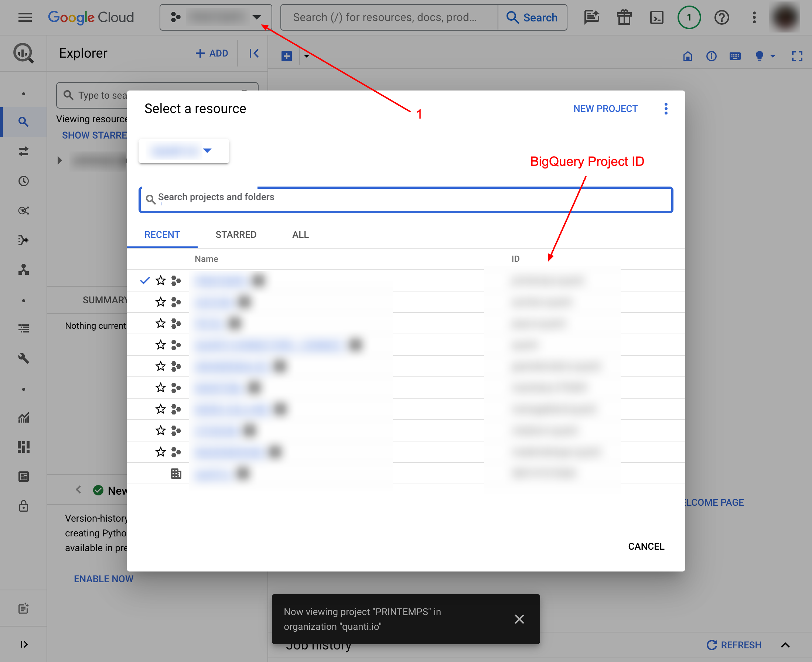

*Last update : 2024-02-16*

Follow our setup guide to connect QUANTI: to BigQuery

* * * * *

Prerequisites
----------------------------------------------------------------------------------------------------------------------------------------------------

To connect QUANTI: to BigQuery, you need an [Google Cloud Platform](https://cloud.google.com/gcp) account.

* * * * *

Setup instructions
-------------------------------------------------------------------------------------------------------------------------------------------------------------

### Quanti: configuration

1.  In the connector setup form, enter a distinctive name of your choice.
2.  Select your sector category and company size.
3.  Enter your BigQuery projet ID. You can find it by clicking in the selection field on the header of your BigQuery UI.
 
4.  Select your Data Location. The physical place where QUANTI: will use to deposit your datas.
5.  Click Next.

### Service Account configuration

In this step, copy the service account email adresse provided by QUANTI: and follow the steps bellow:
1.  Go on IAM & Admin product on BigQuery UI. Click on icon Menu < IAM & Admin < IAM
 
2.  Click on GRANT ACCESS button.
 
3.  Copy/ paste the service account email adresse, assign roles bellow and click Save :
- Browser
- Bigquery Admin
- Storage Admin
 
4.  In QUANTI: UI, click Next Button to launch the connections tests.