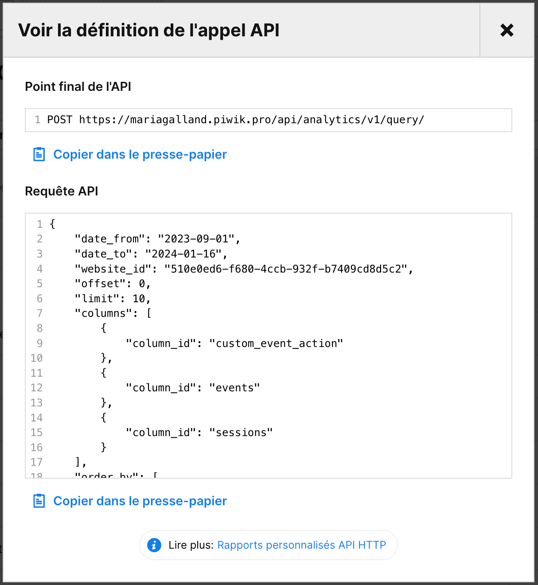

*Last update : 2024-02-16*

Follow our setup guide to connect Piwikpro to QUANTI:

* * * * *

Prerequisites
----------------------------------------------------------------------------------------------------------------------------------------------------

To connect Piwikpro to QUANTI, you need an [Piwikpro](https://piwikpro.fr/) account.

* * * * *

Setup instructions
-------------------------------------------------------------------------------------------------------------------------------------------------------------

### Find your domain

1.  The expected information in this field is the domain displayed on your search bar when you are connected to your Piwik Account.

### Find your API credentials

1.  Go on your profile parameters : Menu < Profile < API Keys.
 
2.  Create a new API Key clicking on the blue button "Create a Key".
3.  Give it a name and make a note of the API credentials. You will need it to configure QUANTI:.
 

### Find your Website ID

1.  You can find your Website ID in the url when you are connected to your Piwikpro account and you are naviguating on Piwikpro Analytics.
2.  This is the information contained between term '/analytics/' and '/dashboard/' in the url. Example : "5678h0td6-f434-4ggt-932j-b8767cd8d5d2".
https://clientname.piwik.pro/analytics/#/**5678h0td6-f434-4ggt-932j-b8767cd8d5d2**/dashboards/c5asdbf3-7340-47a8-a7e3-edcfd56652fa/

### Quanti: configuration

1.  In the connector setup form, enter the name of your choice.
2.  Enter the domain you found in Step 1.
3.  Enter the credentials you find in Step 2.
4.  Enter you Website ID you find in Step 3. You can add several IDs separating by commas and clicking on "+".

### Create a Custom request

This connector Piwikpro don't offer standard reports. You have to create your own reports. To help you in this step, we recommand to use "Personalized report" tool on Piwikpro Analytics UI.
 
1.  Create a new report.
2.  Select your fields (Dimensions and metrics).
 
3.  Save your report.
4.  In the filters bar, click on the button '...' (3 dots) and click on "See API call"
 
5.  A pop-in opens : make a note of the fields's name. You will need it to configure your custom request on QUANTI:.
 
6.  On QUANTI: UI, click on the button "Create".
7.  Name your custom request : It will be use to name your table on your Warehouse.
8.  Copy/ Paste your dimensions and metrics from your Piwikpro personalized report. You can add several fields separating by commas and clicking on "add +".
9.  Repeat operation as many time it's necessary.

### Quanti: configuration

Click Save & Test. Quanti: will take it from here and sync your Piwikpro data.

### Tables

To zoom, open the ERD in a new window : <a href='https://dbdiagram.io/e/65c4a93aac844320aeb8b15e/65ce1957ac844320ae390da2' target='_blank'>ERD</a>
<iframe width='100%' height="400" src='https://dbdiagram.io/e/65c4a93aac844320aeb8b15e/65ce1957ac844320ae390da2'> </iframe>
