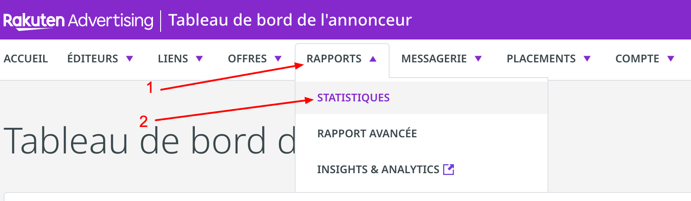
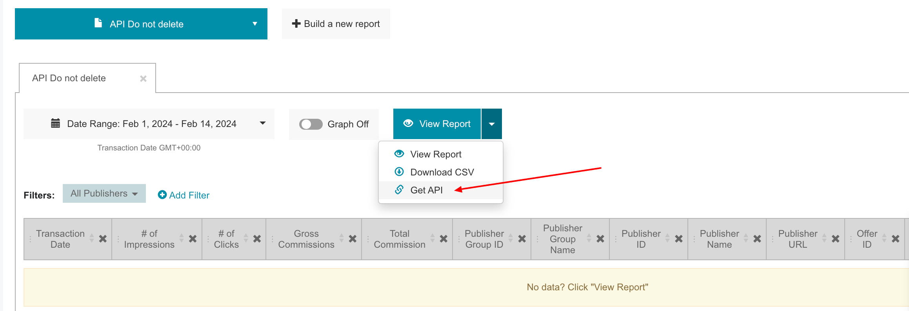
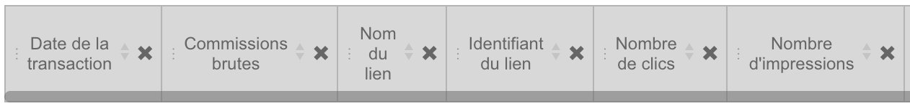

Follow our setup guide to connect Rakuten to QUANTI:

* * * * *

Prerequisites
----------------------------------------------------------------------------------------------------------------------------------------------------

To connect Rakuten to QUANTI, you need an [Rakuten Advertising](https://rakutenadvertising.com/fr-fr/) account.
In the last version of this connector, you cannot retrieve datas from any reports. You have to follow steps below including respect fields requested on the rakuten report.
* * * * *

Setup instructions
-------------------------------------------------------------------------------------------------------------------------------------------------------------

### Create a Rakuten Report and find the generated link

1.  Log in to your [Rakuten account](https://auth.rakutenmarketing.com/auth/realms/rakuten-advertising/protocol/openid-connect/auth?client_id=security-admin-console&redirect_uri=https%3A%2F%2Fauth.rakutenmarketing.com%2Fauth%2Fadmin%2Frakuten-advertising%2Fconsole%2F&state=0bfc7308-d6d6-411a-a3a2-c858f86852ac&response_mode=fragment&response_type=code&scope=openid&nonce=37498c3d-5f4c-4dbd-826f-da13d0cb7827&code_challenge=isEfEnMMx8QHWhWZptlAkdHIxfB3UrcJcjFMuWFf07o&code_challenge_method=S256).
2.  Click on tab Reporting < Statistics
 
3.  Click on the button "+ Build a new report"
 
4.  Click on button "Add and Remove columns" and add the only and entire list below :
 
    - Transaction Date
    - \# of impressions
    - \# of Clicks
    - \# of orders
    - Gross Commissions
    - Total Commissions
    - Sales
    - Order ID
    - Sub-Publihser ID
    - Sub-Publisher Name
    - Sub-Publisher URL
    - Publisher Group ID
    - Publisher Group Name
    - Publisher ID
    - Publisher Name
    - Publisher URL
    - Offer ID
    - Offer Name
    - Link Id
    - Link Name
5. Near the blue button "View Report", click on the arrow and "Get API" and copy the url generated.
 

### Importante information

If you have several Rakuten accounts and want to fill a unique table, you have to create several Rakuten connectors of course and especially respect the list's order and metrics's names. You can change the list order by moving column headings.
 

### Finish Quanti: configuration

1.  In the connector setup form, enter the name of your choice.
2.  Paste the url generated you found on step 1.
4.  Click Save & Test. Quanti: will take it from here and sync your Rakuten data.

### Tables

Link trought the complete document : [ERD](https://dbdiagram.io/e/65c21107ac844320ae8d4a3a/65ce1bf4ac844320ae394e5d)
<iframe width="400" height="315" src='https://dbdiagram.io/e/65c21107ac844320ae8d4a3a/65ce1bf4ac844320ae394e5d'> </iframe>