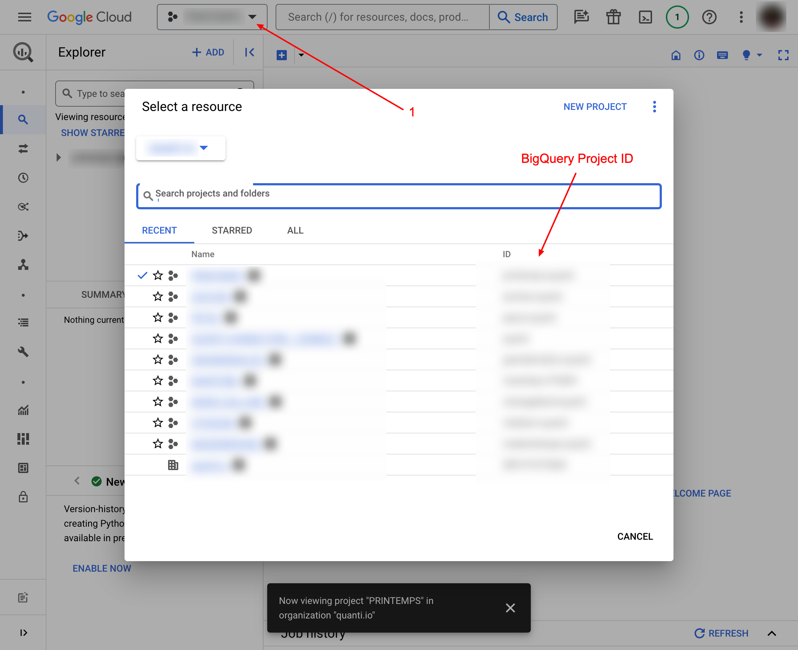
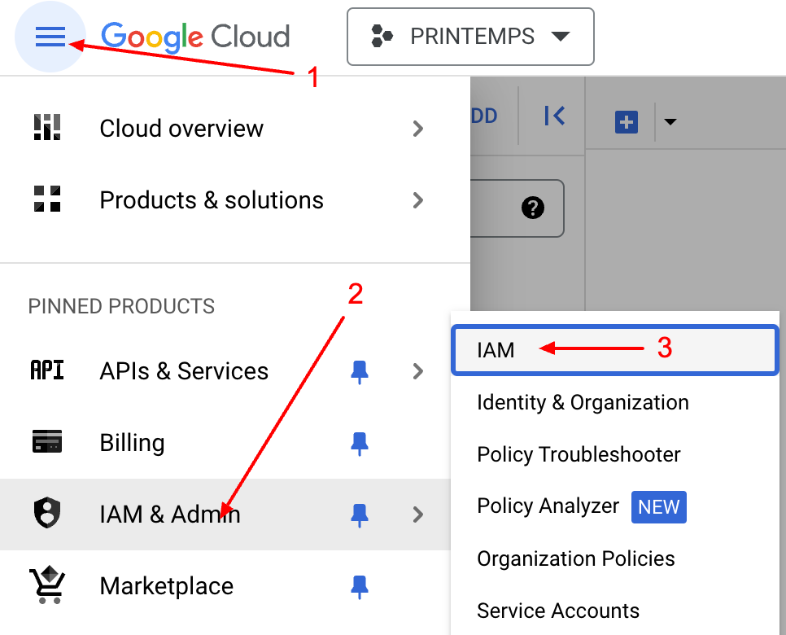

# Manage rights on GCP

***

As part of creating a project unmanaged by Quanti (i.e., a project for which you already have a data warehouse), it is necessary to authorize a service account that will deposit the data into your data warehouse.


Quanti: only needs access to your GCP to deposit the data you requested. The service account we will use will be granted only the necessary level of permissions to use the BigQuery service.


## Prerequisites

To connect QUANTI: to Google Cloud Plaform (GCP), you need an [GCP](https://cloud.google.com/gcp) account.

***

## Setup instructions

### 1. Project creation

When creating a new unmanaged project, you are asked to specify the Google Cloud Platform project ID. You can find it by clicking in the selection field on the header of your Google Cloud Platform interface. Enter your projet ID in the designated field on Quanti: UI.

<figure><figcaption>
Project ID from BigQuery Interface
</figcaption></figure>

### 2. Service Account configuration

When the creation is done, you will redirect on the dashboard projet. In your arrival, a pop-in will opens and give instructions to continue : "Add the Service Account to your IAM Project".

1.  Go on IAM & Admin product on GCP interface. Click on icon Menu < IAM & Admin < IAM\
    \

    <figure><figcaption>
Access to the BigQuery IAM interface
</figcaption></figure>

2.  Click GRANT ACCESS button.\
    \

    <figure><figcaption>
"Grant Access" button from BigQuery interface
</figcaption></figure>

3. Copy/ paste the service account email adresse, assign roles requested and click Save :
4. In QUANTI: interface, click on Check button to launch the connections tests.
