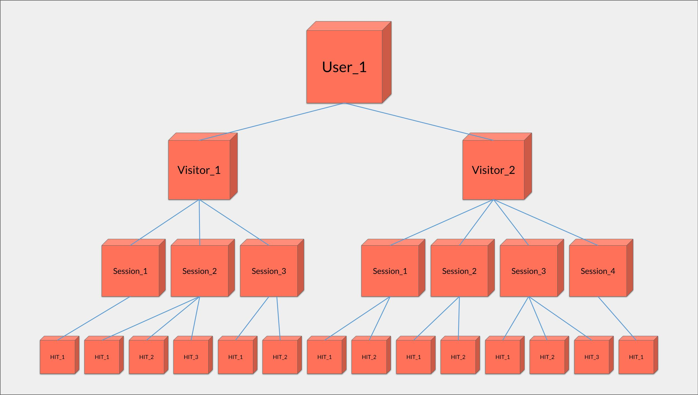

# Table raw\_hits

***

## <mark style="background-color:purple;">Syncing</mark>

Hits appear in the raw\_hits table once the session to which they belong has expired, which occurs after a 30-minute period of inactivity following the last hit.

***

## <mark style="background-color:purple;">Tables Diagram (ERD)</mark>


Tag Tracker Tables Diagram


***

## <mark style="background-color:purple;">Fields definition</mark>

### datetime

Date and time the hit was recorded. Automatically created by Quanti: but overridable if is needed like in a server-side setup.

### hit\_id

Unique hit identifier. Automatically created by Quanti:. It can't be editable.

### session\_id

Unique session identifier (can be also called visit). A session is a set of events from the same visitor. It ends when the tag does not record any events for 30 minutes. Session\_id is automatically created by Quanti: from the value of a cookie placed on the user's browser by the tag. A visitor can make multiple sessions. It can be overridable if is needed like in a server-side setup.

### visitor\_id

Unique visitor identifier. Automatically created by Quanti: from the value of a cookie placed on the user's browser by the tag. One visitor = one browser. A visitor can make multiple hits and sessions. It can be overridable if is needed like in a server-side setup.

### user\_id

Unique user identifier which is an individual who has logged into their personal account. This identifier has to be specify in the tag and typically based on a hashed version of the user's email address (using SHA256, for example).


A user (identified by a user\_id) can have several devices, and therefore several browsers (identified by several visitors\_id). They can have multiple sessions (identified by multiple session\_id) during which they navigate from page to page and record multiple events, event and page\_view (identified by multiple hit\_id).


<figure><figcaption>
Explanation of the Different Types of Identifiers
</figcaption></figure>

### device\_type

The type of device automatically recovered by the tag the hit was recorded. 3 possible choices: desktop, mobile, or tablet. It can be overridable if is needed like in a server-side setup.

### url

The current URL of the page automatically recovered by the tag the hit was recorded but overridable if is needed like in a server-side setup.

### conversion\_id

Unique conversion identifier. This identifier is generally generated by the site and it has to be specify in the tag. It makes possible to identify each conversion. This field is logically populated only on the hit that recorded the conversion.

### conversion\_value

Monetary value of the conversion generated by the site and specify in the tag. This field is logically populated only on the hit that recorded the conversion.

### conversion\_type

The type of the conversion generated by the site and specify in the tag. It can be a lead, a purchase, a secondary conversion, etc. This field is logically populated only on the hit that recorded the conversion.

### consent

The value of consent expressed by the user upon arrival on the site and retained throughout their navigation. It generated by the site and specify in the tag. This field can be used to do statistics on the consent users by filling it with a list of vendors or typologies of cookies accepted by the user.

### event

The type of event. This can be an 'event' or a 'pageView' depending on what was specified in the tag when the hit was recorded.

event\_category

event\_action

event\_label

event\_value

account\_id

referrer

user\_agent

product\_ids
