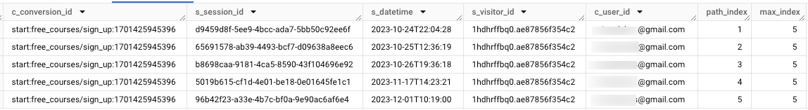

# advanced\_attribution

***

## <mark style="background-color:purple;">Syncing</mark>

The advanced attribution table is a view. Its data comes directly from the others tables and depends directly on their synchronization frequency. Thus, new conversions will appear on this table once the session has expired, i.e. after a period of inactivity of **30 minutes** after the last hit.

***

## <mark style="background-color:purple;">Tables Diagram (ERD)</mark>


Tag Tracker Tables Diagram


***

## Description

### Technical Definition of a conversion

From a technical perspective for Quanti, a conversion is a hit where the value of the `conversion_id` parameter is not `null`, `undefined`, or _empty_. One of these conditions must be satisfied to add a new row in the advanced attribution table.

### Primary keys explanations

The advanced attribution table's primary keys are `hit_id` and `s_session_id` :&#x20;

* We have made the decision to insert a field named `hit_id` into the table, which precisely identifies the hit that registered the conversion from `raw_hits`. This ensures the table's integrity by addressing a potential issue with the uniqueness of `conversion_id`. `hit_id` is technically more precise than the `conversion_id`.
* The `s_session_id` is the second primary key of the table and allows linking a session to a conversion. Multiple sessions can participate in the same conversion, and the same session can participate in multiple conversions.

In this table, a single `conversion_id` can be used across multiple rows because it may have been generated by a series of sessions (One row in the table = one session for a given conversion). Similarly, a `session_id` can also be used on multiple rows because it might have originated several conversions. However, what is essentially maintained is the presence of a unique `session_id` per conversion.

### Attibution rules

We have 2 ways to catch up on sessions and assess their contribution to achieving a conversion :

* By **visitor\_id** : We log all previous sessions that have the same `visitor_id` as the session during which the conversion occurred.
* By **user\_id** : We log all previous sessions that have the same `user_id` as the session during which the conversion occurred.

The values `null`, `undefined`, or _empty_ for `visitor_id` and `user_id` are obviously excluded from the attribution calculation rules.

### The paths

Now that you've understood that the table consists of a list of sessions that contributed to achieving conversion(s), it's crucial to know how you can distinguish them from a chronological perspective and especially how you are going to analyze the paths taken by your visitors and calculate the contribution of each session. There is evidently the "s\_datetime" field which gives the exact date and time of the session's start, but we have made the task easier for you by implementing two fields:

* `max_index`: Indicates the total number of contributive sessions related to a conversion. The value of this field is the same for each session (row) within a conversion.
* `path_index`: indicates the chronological position of the session among all the contributory sessions leading to a conversion.

For a conversion tracking multiple contributive sessions, you will therefore have in `path_index` numbers ranging from 1 to the number representing the total number of sessions. Then, on each line in `max_index`, you will find the maximum number that represents the total number of sessions.

<figure><figcaption>
Example of filling in the <code>path_index</code> and <code>max_index</code> fields
</figcaption></figure>

## <mark style="background-color:purple;">Fields definition</mark>
